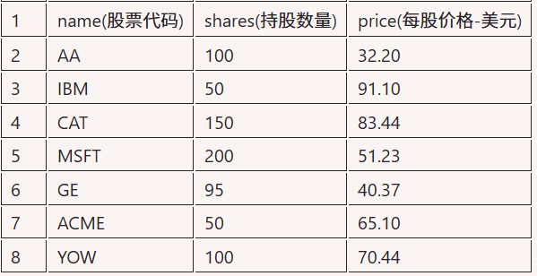

# Portfolio Project Introduction

This file [portfolio.py](./code/portfolio/portfolio.py) contains a function that reads a CSV file of
"name,shares,price" data into a list of dictionaries. The file
[report.py](./code/portfolio/report.py) uses this function. We'll make some modifications
in exercises below.

## portfolio.csv

[portfolio.csv](./code/portfolio/portfolio.csv)



## portfolio.py

[portfolio.py](./code/portfolio/portfolio.py)

```python
from pathlib import Path
from typing import Any


def read_portfolio(file_name: str = "portfolio.csv") -> list[dict[str, Any]]:
    """
    Read a CSV file of name, shares, price data into a list of dicts.
    """
    portfolio = []

    # python交换环境中没有__file__
    if "__file__" in globals():
        file_path = Path(__file__).parent / file_name
    else:
        file_path = Path(file_name)

    with open(file_path, encoding="utf-8") as f:
        # 忽略第一行头部信息, isinstance(f,Iterable) -> True
        next(f)
        for line in f:
            name, shares, price = (item.strip() for item in line.split(","))
            portfolio.append(dict(name=name, shares=shares, price=price))

    return portfolio


if __name__ == "__main__":
    results = read_portfolio()
    [print(r) for r in results]
```
输出:
```python
{'name': 'AA', 'shares': '100', 'price': '32.20'}
{'name': 'IBM', 'shares': '50', 'price': '91.10'}
{'name': 'CAT', 'shares': '150', 'price': '83.44'}
{'name': 'MSFT', 'shares': '200', 'price': '51.23'}
{'name': 'GE', 'shares': '95', 'price': '40.37'}
{'name': 'ACME', 'shares': '50', 'price': '65.10'}
{'name': 'YOW', 'shares': '100', 'price': '70.44'}
```

---

## report.py

Ben has decided to write some Python code to manage his stock
portfolio. The file "portfolio.csv" is a CSV file containing some
information about his stock holdings (name, number of shares,
price). The following program reads this file, sorts it, and prints
out a small report.

The module `portfolio.py` contains code for reading the data
and returning it back as a list of dictionaries. Take a few
moments to run the program and look at the code.

Upon showing this program to his co-workers, Ben is immediately
accosted by his decision to directly use Python data structures
such as dicts and lists. "You should really use some classes
or something man" noted Peter.

- accosted /əˈkɑːstɪd/ v. 被搭话；被贸然上前交谈（指被某人突然接近并主动搭话，通常带有一种出其不意、甚至略带挑衅或对抗的意味。在上下文中，“Ben is immediately accosted by his decision to directly use Python data structures such as dicts and lists.” 的意思是：Ben 因为直接使用 Python 数据结构（如字典和列表）而被同事上前质问/理论。

Your task in this project is to explore this central question:
**Should you use custom classes to provide a kind of data abstraction
layer or is it perfectly fine to use dictionaries and lists?**
If classes are used, what should they look like?

Most of your work will take place in the `portfolio.py` file. You
will make a few minor code modifications here, but the code in
this file should keep its original organization (i.e., you'll keep
the `make_report()` and `main()` functions).

[report.py](./code/portfolio/report.py)

```python
import portfolio

WIDTH = 15

def make_report(portfolio: list):
    """
    Print a report
    """
    portfolio.sort(key=lambda h: h["shares"] * h["price"], reverse=True)
    print(" " + "-" * (WIDTH * 4 + 3))
    print(
        f"|{'name':^{WIDTH}}|{'shares':^{WIDTH}}|{'price':^{WIDTH}}|{'value':^{WIDTH}}|"
    )
    print("|" + ("-" * WIDTH + "|") * 4)

    total_value = 0
    for holding in portfolio:
        value = holding["shares"] * holding["price"]
        total_value += value
        name, shares, price = holding["name"], holding["shares"], holding["price"]
        print(
            f"|{name:^{WIDTH}s}|{shares:^{WIDTH}d}|{price:^{WIDTH}.2f}|{value:^{WIDTH}.2f}|"
        )
    print(" " + "-" * (WIDTH * 4 + 3))
    print(f"\nTotal value: {total_value:.2f}")


def main():
    port = portfolio.read_portfolio()
    make_report(port)


if __name__ == "__main__":
    main()
```

输出
```sh
 ---------------------------------------------------------------
|     name      |    shares     |     price     |     value     |
|---------------|---------------|---------------|---------------|
|      CAT      |      150      |     83.44     |   12516.00    |
|     MSFT      |      200      |     51.23     |   10246.00    |
|      YOW      |      100      |     70.44     |    7044.00    |
|      IBM      |      50       |     91.10     |    4555.00    |
|      GE       |      95       |     40.37     |    3835.15    |
|     ACME      |      50       |     65.10     |    3255.00    |
|      AA       |      100      |     32.20     |    3220.00    |
 ---------------------------------------------------------------

Total value: 44671.15
```

# Exercise 1: Classes vs. Dicts

In the above code, a dictionary is used to represent a single record of
data. For example, in the line:

```python
holding = { 'name': name, 'shares': shares, 'price': price }
```

Instead of using a dictionary, what if you used a class instance?
What core features would you give this new class?

You first task is as follows:

1. Define a class to replace the holding dictionary.
2. Write a new version of `read_portfolio()` that uses this class.
3. Modify `report.py` as necessary to work with instances.

Are there any parts of the `report.py` program that could be better
organized as features of this newly defined class instead? For example,
should the class have any methods added to it?

Some thoughts:
1. Gives the concept of stock holding a name (Holding)
2. Potentially useful if one were to include it in type hints
3. Less "fiddly" syntax. `h.name` vs `h['name']`
4. Could also include common functionality (e.g. value computation)

- fiddly /ˈfɪd.li/ adj. 需要精细操作的；繁琐的；需要费心处理的（指某个操作需要小心、精确地处理，或者因为细节琐碎而让人感到麻烦。

[exercise_01.py](./code/portfolio/exercise_01.py)

```python
@dataclass
class Holding:
    name: str
    shares: int
    price: Decimal

    # method or property
    @property
    def value(self):
        return self.shares * self.price
```

```python
def read_portfolio(file_name: str = "portfolio.csv") -> list[Holding]:
    """
    Read a CSV file of name, shares, price data into a list of dicts.
    """
    portfolio: list[Holding] = []

    # python交换环境中没有__file__
    if "__file__" in globals():
        file_path = Path(__file__).parent / file_name
    else:
        file_path = Path(file_name)

    with open(file_path, encoding="utf-8") as f:
        # 忽略第一行头部信息, isinstance(f,Iterable) -> True
        next(f)
        for line in f:
            name, shares, price = (item.strip() for item in line.split(","))
            portfolio.append(
                Holding(name=name, shares=int(shares), price=Decimal(price))
            )

    return portfolio


def make_report(portfolio: list[Holding]):
    """
    Print a report
    """
    # value is method
    # portfolio.sort(key=lambda h: h.value(), reverse=True)
    # call_value = methodcaller("value")
    # portfolio.sort(key=call_value, reverse=True)

    # value is property
    portfolio.sort(key=lambda h: h.value, reverse=True)

    print(" " + "-" * (WIDTH * 4 + 3))
    print(
        f"|{'name':^{WIDTH}}|{'shares':^{WIDTH}}|{'price':^{WIDTH}}|{'value':^{WIDTH}}|"
    )
    print("|" + ("-" * WIDTH + "|") * 4)

    total_value = 0
    for holding in portfolio:
        value = holding.value
        total_value += value
        print(
            f"|{holding.name:^{WIDTH}s}|{holding.shares:^{WIDTH}d}|{holding.price:^{WIDTH}.2f}|{value:^{WIDTH}.2f}|"
        )
    print(" " + "-" * (WIDTH * 4 + 3))
    print(f"\nTotal value: {total_value:.2f}")
```


# Exercise 2: Classes vs. Containers

In this code, a Python list is being used to represent a "Portfolio"
of stock holdings. Does it make any sense to use a custom Portfolio
class for this instead? If so, what would that class look like and
what features should it support?

Your task is as follows:

1. Define a Portfolio class that takes the place of a Python list.
2. Write a new version of `read_portfolio()` that creates this class.
3. Modify report.py as necessary to work with the data.

Are there any parts of the `report.py` program could be better
organized as features of the `Portfolio` class instead? Note:
we're going to keep the `make_report()` function separate. That
should NOT turn into a method.

数据容器
```python
# container
from dataclasses import dataclass
@dataclass
class Portfolio:
    holdings: list[Holding]
    # What goes here? Any benefit over a list?
```

封装成类，隐藏属性[exercise_02.py](./code/portfolio/exercise_02.py)

```python
class Portfolio:
    def __init__(self, holdings: list[Holding]):
        self._holdings = holdings

    def __iter__(self):  # 用于支持sorted
        return iter(self._holdings)
    @property
    def total_value(self):
        "封装为属性"
        return sum(h.shares * h.price for h in self)

def make_report(portfolio: Portfolio):
    ...
    for holding in sorted(portfolio, key=lambda h: h.value, reverse=True):
        ...
```

---

> 属性`total_value`的分析

What is the boundary between a property and method? One danger
with properties that perform computation is that it might be
unclear to a user that accessing some attribute like `port.total_value`
is actually performing a for-loop over all of the data each time.
This can be a way to accidentally introduce a lot of extra computation.
As an example, consider this loop that prints out the portion of
each holding as a percent:
```python
for h in portfolio:
    print(f'{h.name} : {h.value*100/portfolio.total_value}%')
```
`portfolio.total_value` in that loop is not an attribute, but it's a computation over the data involving its own for-loop.

为了避免混淆，因为`total_value`是一个计算过程，所以改为方法

```python
class Portfolio:
    def __init__(self, holdings: list[Holding]):
        self._holdings = holdings

    def __iter__(self):  # 用于支持sorted
        return iter(self._holdings)

    def total_value(self):
        "change from property to method"
        return sum(h.shares * h.price for h in self)
```

---

`sorted`内置函数的操作Portfile

```python
>>> port = read_portfolio()
>>> port
<__main__.Portfolio object at 0x7f4848b54e10>
>>> # total_value属性
>>> port.total_value
Decimal('44671.15')
>>> # 排序
>>> from typing import Iterable
>>> isinstance(port,Iterable)
True
>>> holdings: list[Holding] = sorted(port,key=lambda h: h.value,reverse=True)
```

# Exercise 3: Data Abstraction

A core tenant of data abstraction is that applications are written to
a specific programming interface and that internal implementation details
don't matter so much. Think about all of the different ways that
fractions were implemented in [Project 1 fractions](./fractions.md).

Suppose that you wanted to change the internal representation of data
inside your Portfolio class to use pandas. Pandas has a helpful function
for reading a CSV file:

```python
import pandas
data = pandas.read_csv('portfolio.csv')
```

What modifications would you make to the Portfolio class to use pandas dataframe as an internal data representation format?
Can you use the modified Portfolio class with the `report.py` program *WITHOUT* making any changes to the code in that file?
Note: For this exercise, it make might sense to make a separate class `PandasPortfolio`. Keep in mind that an instance of this class would be provided to the `make_report()` function in `report.py`.

```python
class Portfolio:、
    def __iter__(self):
        ...

    def total_value(self):
        ...


class PandasPortfolio:
    ...
    # Same interface as Portfolio,but internal data stored in pandas
    def __iter__(self):
        ...

    def total_value(self):
        ...
```

为了规范接口鸭子类型，我在[exercise_02.py](./code/portfolio/exercise_02.py)中添加了，并且为`make_portfolio`方法参数添加了类型。因为在[exercise_03.py](./code/portfolio/exercise_03.py)中，我们会复用`make_portfolio`方法

使用static duck typing来解决

```python
class SupportPortfolio(Protocol):
    def __iter__(self) -> Iterator[Holding]: ...

    def total_value(self) -> Decimal: ...

def make_report(portfolio: SupportPortfolio):
    ...
```

底层基于pandas的具体实现[exercise_03](./code/portfolio/exercise_03.py)

```python
class PandasPortfolio:
    def __init__(self, df: pandas.DataFrame):
        self._df = df
        self._df["price"] = df["price"].map(lambda x: Decimal(str(x)))
        self._df["value"] = df["shares"] * df["price"]

    def __iter__(self):
        for _, row in self._df.iterrows():
            yield Holding(
                name=row["name"], shares=row["shares"], price=Decimal(str(row["price"]))
            )

    def total_value(self):
        return self._df["value"].sum()


def read_portfolio(file_name="portfolio.csv"):
    if "__file__" in globals():
        file_path = Path(__file__).parent / file_name
    else:
        file_path = Path(file_name)
    return pandas.read_csv(file_path, skipinitialspace=True)
```

