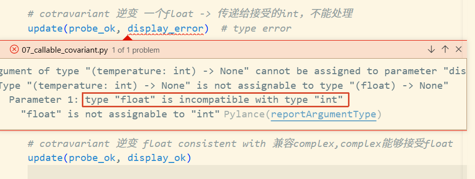

# Types Are Defined by Supported Operations

> Function has `annotations`

[type_define_by_support_opt.py](./code/type_define_by_support_opt.py)这里声明为Sequence类型，但是它不支持`__mul__`操作


# consistent-with

在Python中除了类型直接关系除了`subtype-of`父子类关系(**Nominal Typing**)之外，还有`consistent-with`一致性关系(**Ducking Typing**)。

[numic.py](./code/numic.py)

```python
# int consistent with complex
def real_imag(x: complex):
    print(x.real, x.imag)

>>> real_imag(1 + 2j)
1.0 2.0
>>> real_imag(1)
1 0
>>> print(issubclass(type(1), type(1 + 2j)))
False
```

# Type Hinting Generics In Standard Collections

[pep-0585](https://peps.python.org/pep-0585/)

| Collection                 | Type Hint Equivalent (deprecated) |
| -------------------------- | --------------------------------- |
| `tuple`                    | `typing.Tuple`                    |
| `list`                     | `typing.List`                     |
| `dict`                     | `typing.Dict`                     |
| `set`                      | `typing.Set`                      |
| `frozenset`                | `typing.FrozenSet`                |
| `collections.deque`        | `typing.Deque`                    |
| `collections.abc.Sequence` | `typing.Sequence`                 |

# `TypeAlias`

[Python Doc: aliases](https://typing.python.org/en/latest/spec/aliases.html)类型别名

[03_typealias.py](./code/03_typealias.py)

```python
FromTo = tuple[str,str]

# 显示声明TypeAlias in Python 3.10
from typing import TypeAlias
FromTo: TypeAlias = tuple[str,str]

# 使用type in python 3.12
type FromTo = tuple[str,str]
```

```python
from collections.abc import Iterable
from typing import TypeAlias

# type FromTo = tuple[str, str]
FromTo: TypeAlias = tuple[str, str]


def zip_replace(text: str, changes: Iterable[FromTo]) -> str:
    for from_, to in changes:
        text = text.replace(from_, to)
    return text


l33t = [("a", "4"), ("e", "3"), ("l", "1"), ("o", "0"), ("s", "5"), ("t", "7")]
print(zip_replace("hello world", l33t))
```

# 参数泛型与`TypeVar`

> Parameterized Generics and TypeVars

定义一个类型变量

```python
from typing import TypeVar
# T is a type variable
# that will be bound to a specific type with each usage.
T = TypeVar('T')
```

[04_param_generic.py](./code/04_param_generic.py)


使得参数的类型能够被映射到返回值类型上

## Restricted TypeVar

> 限制类型参数

```python
# T = TypeVar('T',int,float,str)
T = TypeVar('T',int,float)
```

此时严格限制类型，没有声明`str`


## Bounded TypeVar

1. `bound=Hashable` 设置了一个上界，意思是：HashableT 这个类型变量，只能被满足 Hashable 协议的类或它的子类所替代。Hashable 在这里是"你能在这个类型变量上安全调用的最大公约数"——类型检查器保证你至少能对它做哈希操作。
2. 记住传入的具体类型，并在返回值里复现它。返回类型和输入类型绑定了——传 list[int] 返回 int，传 list[str] 返回 str。类型检查器不需要你手动转型，就能精确推断出返回值的类型。

对应Java的写法就是`<T extends Hashable> T mode(List<T> data)`

```python
from typing import TypeVar
from collections import Counter
from collections.abc import Iterable, Hashable

# 等价Java <T extends Hashable> T mode(List<T> data)
HashableT = TypeVar('HashableT', bound=Hashable)

def mode(data: Iterable[HashableT]) -> HashableT:
    pairs = Counter(data).most_common(1)
    if not pairs:
        raise ValueError('no mode for empty data')
    return pairs[0][0]
```

```python
# tuple is hashable
# As long as the inferred type is consistent with the boundary
a = mode([i for i in range(10)])
```

只要输入的类型与（consistent with the boundary）一致，那么就可以返回这个类型


```python
# ❌ list 是不可哈希的，类型检查器会报错
b = mode([[1, 2], [3, 4], [1, 2]])
```

不满足上界的条件


# Protocol-Static Duck Typing

**Protocol: Structural subtyping (Static Duck Typing)**

`A protocol type` is defined by specifying one or more methods, and the type checker verifies that those methods are implemented where that `protocol type is required`.

[06_Protocol_duck_typing.py](./code/06_Protocol_duck_typing.py)

```python
from collections.abc import Iterable
from typing import Protocol, TypeVar

class SupportLessThan(Protocol):
    # / 前面的参数只能按位置传入
    def __lt__(self, other, /) -> bool: ...

LT = TypeVar("LT", bound=SupportLessThan)

def top(series: Iterable[LT], n: int) -> list[LT]:
    ordered = sorted(series, reverse=True)
    return ordered[:n]
```

> A type `T` is **consistent-with** a protocol `P` if T implements all the methods defined in `P`, with matching type signatures.

只要满足实现了`__lt__`方法，就可以作为参数传入

```sh
>>> top([4,1,5],2)
[5, 4]
>>> fruits = "mango pear apple kiwi banana".split()
>>> fruits_with_len = [(len(fruit), fruit) for fruit in fruits]
>>> fruits_with_len
[(5, 'mango'), (4, 'pear'), (5, 'apple'), (4, 'kiwi'), (6, 'banana')]
>>> top(fruits_with_len,2)
[(6, 'banana'), (5, 'mango')]
```

# Callable

```python
# python 3.9 已经废弃
from typing import Callable
# 现代用法
from collections.abc import Callable
# 一般的写法
Callable[[Arg1, Arg2], ReturnType]

# 省略全部参数
Callable[..., ReturnType]
```

Callable 对返回类型是**协变(Covariance)**的——返回类型的子类型关系会正向传递到 Callable 自身。但注意：Callable 对参数类型是逆变(contravariant)的——参数类型的子类型关系会反向传递。

- contravariant /ˌkɑːntrəˈveriənt/ 逆变的。指子类型关系反转——如果 A 是 B 的子类型，那么 Container[B] 反而是 Container[A] 的子类型。

- 协变 (Covariance /koʊˈveriəns/) 描述的是：如果一个泛型容器在某个类型参数上是协变的，那么类型参数的子类型关系会保持同向传递到泛型容器自身

[07_callable_covariant.py](./code/07_callable_covariant.py)

```python
from collections.abc import Callable
# 从 Python 3.9 开始，typing.Callable 被标记为已弃用
# from typing import Callable

def update(probe: Callable[[], float], display: Callable[[float], None]):
    temperature = probe()
    # ...something else ...
    display(temperature)

# covariant 协变 int 可以传递给 float
def probe_ok() -> int:
    return 42

def display_error(temperature: int):
    print(hex(temperature))


def display_ok(temperature: complex):
    print(temperature)


# cotravariant 逆变 一个float -> 传递给接受的int，不能处理
update(probe_ok, display_error)  # type error
# cotravariant 逆变 float consistent with 兼容complex,complex能够接受float
update(probe_ok, display_ok)
```



# 参考

- 《Fluent Python: Chapter 8: Type Hints in Functions》
- [Python Doc: aliases](https://typing.python.org/en/latest/spec/aliases.html)
