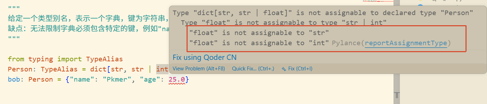
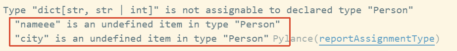
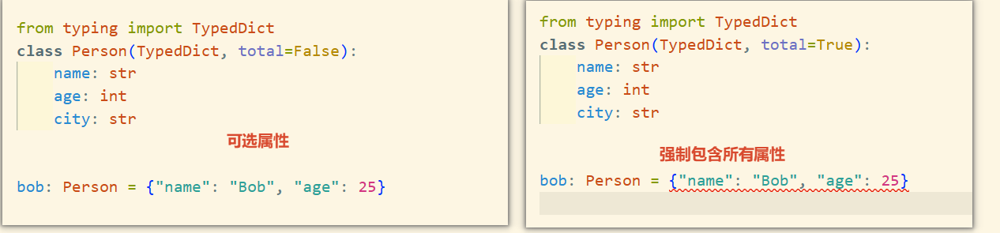

# `dict` Geneic Mapping

```python
from typing import TypeAlias
Person: TypeAlias = dict[str, str | int]
bob: Person = {"name": "Pkmer", "age": 25}
```

优点: 这样定义能够限制`值的类型提示`



**缺点**： 但是这种情况`不能限制key的类型提示`，因为key现在可以是任何形式的字符串，比如将`name`改为`nameeee`。此时`TypedDict`就派上用场了

# TypedDict限制key的类型提示

```python
from typing import TypedDict
class Person(TypedDict):
    name: str
    age: int

bob: Person = {"nameee": "Bob", "age": 25, "city": "ShenZhen, China"}
```

可以看到现在`TypedDict`限制了key的类型提示，`nameee`和`city`都不属于`Person`的属性。



# `total`传给元类的关键字参数

1. 默认total为True，表示必须包含所有属性
2. 设置total为False，表示可以不包含所有属性

```python
from typing import TypedDict
class Person(TypedDict, total=True):
    name: str
    age: int
    city: str

>>> Person.__total__
True
```



> 元类相关知识
>
> `total=True`是传给元类的关键字参数，不是继承

```python
# 实际上Python的解释器
Person = TypedDict.__class__(    # TypedDict 的元类
    "Person",
    (TypedDict,),                # 父类元组
    {"name": str, "age": int},   # 类体命名空间
    total=True                   # ← 关键字参数
)
```

# `__required_keys__`与`__optional_keys__`

> Added in Python 3.9
> `TypedDict`类对象有`__required_keys__`与`__optional_keys__`属性，分别表示必填与可选的key。

```python
>>> from typing import TypedDict
>>> class Point2D(TypedDict,total=False):
...     x: float
...     y: float
>>> class Point3D(Point2D): # Default total=True
...     z: float
>>> Point3D.__required_keys__
frozenset({'z'})
>>> Point3D.__optional_keys__
frozenset({'y', 'x'})
```

## Required | NotRequired

直接影响到`__required_keys__`和`__optional_keys__`

```python
>>> from typing import TypedDict, Required
... class Person(TypedDict, total=False):
...     name: Required[str]
...     age: Required[int]
...     city: str
...
>>> Person.__required_keys__
frozenset({'age', 'name'})
>>> Person.__optional_keys__
frozenset({'city'})
```

```python
>>> from typing import TypedDict,NotRequired
>>> class Person(TypedDict):
...     name: str
...     age:  int
...     city: NotRequired[str]

>>> Person.__required_keys__
frozenset({'age', 'name'})
>>> Person.__optional_keys__
frozenset({'city'})
```

## LangChain的源码分析

> 类型标注是答案，泛型是填空题。

具体类型：

```python
class _InputAgentState(TypedDict):  # noqa: PYI049
    """Input state schema for the agent."""

    messages: Required[Annotated[list[AnyMessage | dict[str, Any]], add_messages]]
```

泛型:

```python
# 定义泛型
InputT = TypeVar("InputT", bound=StateLike, default=StateT)

StateLike: TypeAlias = TypedDictLikeV1 | TypedDictLikeV2 | DataclassLike | BaseModel

class TypedDictLikeV1(Protocol):
    """Protocol to represent types that behave like TypedDicts

    Version 1: using `ClassVar` for keys."""

    __required_keys__: ClassVar[frozenset[str]]
    __optional_keys__: ClassVar[frozenset[str]]


class TypedDictLikeV2(Protocol):
    """Protocol to represent types that behave like TypedDicts

    Version 2: not using `ClassVar` for keys."""

    __required_keys__: frozenset[str]
    __optional_keys__: frozenset[str]


class DataclassLike(Protocol):
    """Protocol to represent types that behave like dataclasses.

    Inspired by the private _DataclassT from dataclasses that uses a similar protocol as a bound."""

    __dataclass_fields__: ClassVar[dict[str, Field[Any]]]


StateLike: TypeAlias = TypedDictLikeV1 | TypedDictLikeV2 | DataclassLike | BaseModel
```

关于：dataclass

```python
>>> from dataclasses import dataclass
>>> @dataclass
... class A:
...     x: int
...
>>> A.__dataclass_fields__
{'x': Field(name='x',type=<class 'int'>,default=<dataclasses._MISSING_TYPE object at 0x0000025E1BB0EA50>,default_factory=<dataclasses._MISSING_TYPE object at 0x0000025E1BB0EA50>,init=True,repr=True,hash=None,compare=True,metadata=mappingproxy({}),kw_only=False,_field_type=_FIELD)}
```

# 参考

- [Python官网：typing.TypedDict](https://docs.python.org/3.13/library/typing.html#typing.TypedDict)
- [Youtube: TypedDict is Awesome in Python](https://www.youtube.com/watch?v=RItoKMONirE)
