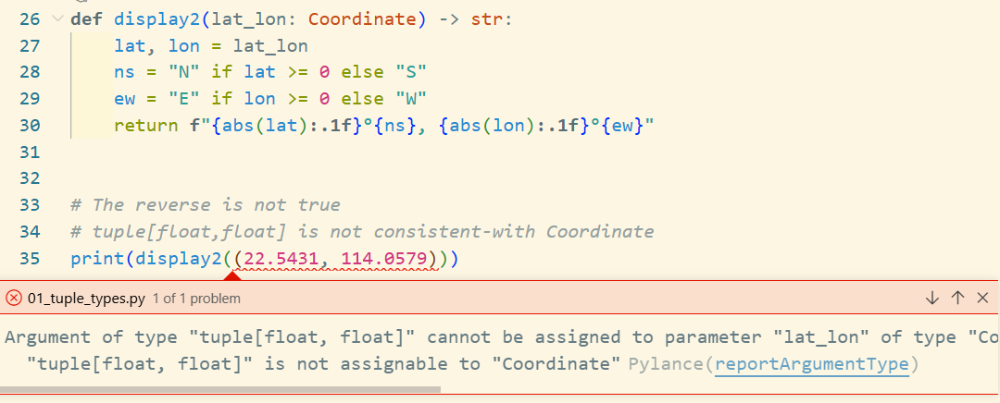

# Tuple Types

[01_tuple_types.py](./code/01_tuple_types.py)

Tuple从语义上的三种角度：

1. Tuple作为record
2. Tuple作为record具有命名属性
3. Tuple作为不可变的序列

## Tuple as Records

```python
def display1(lat_lon: tuple[float, float]) -> str:
    lat, lon = lat_lon
    ns = "N" if lat >= 0 else "S"
    ew = "E" if lon >= 0 else "W"
    return f"{abs(lat):.1f}°{ns}, {abs(lon):.1f}°{ew}"


# Tuple as records
print(display1((-32.234, -64.123)))
```

## Tuple as Records with named fields

```python
from typing import NamedTuple

class Coordinate(NamedTuple):
    lat: float
    lon: float

# NamedTuple consistent-with tuple[float,float]
print(display1(Coordinate(22.5431, 114.0579)))
```

`Coordinate`是兼容`tuple[float,float]`的，具有一致性，但是反过来却不是

```python
def display2(lat_lon: Coordinate) -> str:
    lat, lon = lat_lon
    ns = "N" if lat >= 0 else "S"
    ew = "E" if lon >= 0 else "W"
    return f"{abs(lat):.1f}°{ns}, {abs(lon):.1f}°{ew}"


# The reverse is not true
# tuple[float,float] is not consistent-with Coordinate
print(display2((22.5431, 114.0579)))
```



## Tuple as Immutable Sequence

`tuple[str,...]`,这里的`...`表示数量`>=1`

> 下面使用切片的分row计算方式很巧妙`[sequence[i::rows] for i in range(rows)]`

```python
from typing import Optional
from collections.abc import Sequence

fruits = "苹果 香蕉 葡萄 橘子 樱桃 柠檬 石榴 椰子 榴莲 甘蔗 山楂 蓝莓".split()

def columnize(sequence: Sequence[str], columns: Optional[int] = None) -> list[tuple[str, ...]]:
    if columns is None or columns < 1:
        columns = round(len(sequence) ** 0.5)
    rows, reminder = divmod(len(sequence), columns)
    rows += bool(reminder)
    # 切片并不会数组越界
    return [tuple(sequence[i::rows]) for i in range(rows)]
```

```sh
>>> table = columnize(fruits)
>>> table
[('苹果', '樱桃', '榴莲'), ('香蕉', '柠檬', '甘蔗'), ('葡萄', '石榴', '山楂'), ('橘子', '椰子', '蓝莓')]
>>> for row in table:
...     print(''.join(f"{word:10}" for word in row))
...
苹果        樱桃        榴莲
香蕉        柠檬        甘蔗
葡萄        石榴        山楂
橘子        椰子        蓝莓
```

# collections.namedtuple

这是旧的用法，现在使用`from typing import NamedTuple`,但是还是简单介绍一下。

```python
>>> import collections
>>> Card = collections.namedtuple("Card","rank suit")
>>> Card = collections.namedtuple("Card",["rank","suit"]) # The same
>>> Card('Q','diamonds')
Card(rank='Q', suit='diamonds')
>>> Card('Q','diamonds')._asdict() # to dict
{'rank': 'Q', 'suit': 'diamonds'}
```

# List tuple to dict

```python
>>> lt = [('a',123), ('b', 42), ('size', 99)]
>>> dict(lt)
{'a': 123, 'b': 42, 'size': 99}
```


# 参考

- 《Fluent Python: Chapter 8: Type Hints In Functions》
