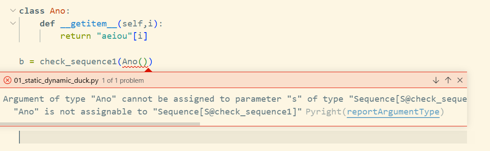
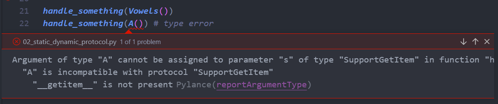
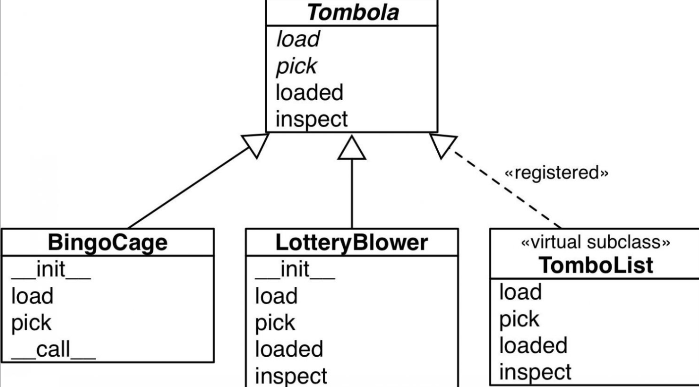
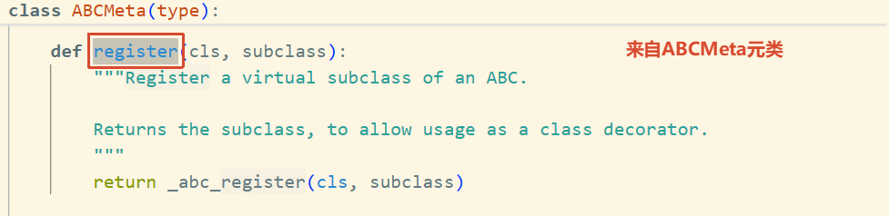
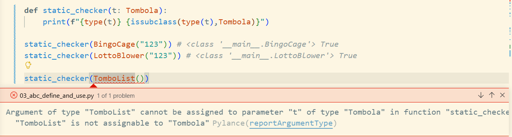

abc名义子类型 (Nominal Subtyping) vs protocol结构化子类型 (Structural Subtyping)


# abc模块

`abc` 是"怎么造 ABC"的工具，`collections.abc` 是"已经造好的 ABC"。你写框架时用 `abc` 定义自己的抽象基类，做类型检查时用 `collections.abc` 引用现成的类型标准。

1. 这个模块`collections.abc`里存放的是 Python 官方已经定义好的、各种容器类型的抽象基类，比如 Sequence、MutableMapping、Iterable、Set、Callable 等。这些 ABC 都使用 abc 模块的机制来构建，但它们本身是一套"类型分类标签"。
2. 这个模块`abc`用来创建抽象基类的底层工具模块。它提供了 `ABC` 基类和 `@abstractmethod` 装饰器


> Pyright 对 collections.abc的类有硬编码规则：按名义子类型（nominal）检查，不走结构化匹配（structural）


[code/01_static_duck.py](./code/01_static_duck.py)

```python
from collections.abc import Sequence
from typing import TypeVar, overload

class Vowels(Sequence[str]):
    @overload
    def __getitem__(self, index: int, /) -> str: ...
    @overload
    def __getitem__(self, index: slice, /) -> Sequence[str]: ...
    def __getitem__(self, index, /) -> Sequence[str] | str:
        return "aeiou"[index]

    def __len__(self):
        return 5

# 名义结构化要求必须是继承关系
S = TypeVar("S")
def check_sequence1(s: Sequence[S]):
    # 迭代器支持 __iter__
    for item in s:
        print(item, end="", flush=True)
    print()
    # __contains__ 支持
    print("a" in s)
    import random

    return s[0] if random.random() > 0.3 else s[0:2]


a = check_sequence1(Vowels())  # a: str | Sequence[str]
```




# Protocol

对象协议(object protocol)说白了就是一套方法清单：你想让对象扮演某个角色，它就得提供这些方法,

> `__getitem__`就能够代替`__contains__`,`__iter__`,是因为python底层基于`__getitem__`实现了这个两个方法，所以默认支持。


## Static Protocol
Static **Structural subtyping**(static duck typing)

Protocol的类，不要求子类显示继承，静态检查器会根据传进来的参数进行结构比较。`Vowels`结构符合，有`__getitem__`方法，通过。但是`A`没有这个方法，结构不通过，报错。

```python
from typing import Protocol,Any

# Protocol 要求结构一样，静态检查器比如vscode的插件Pylance会检测到
class SupportGetItem(Protocol):
    def __getitem__(self, index: int, /) -> Any: ...


# Structural typing(Static duck typing)
def handle_something(s: SupportGetItem):
    for item in s:
        print(item, end=" ", flush=True)
    return "Yes,a in 's' " if "a" in s else "not include a" 


class Vowels:
    def __getitem__(self, index: int,/):
        return "aeiou"[index]

class A: pass

handle_something(Vowels())
handle_something(A()) # type error
```




## 动态类型

Runtime 的时候才进行检测，这也是python动态灵活的原因。

```python
>>> vs = iter(Vowels())
>>> list(vs)
['a', 'e', 'i', 'o', 'u']
>>> 'a' in Vowels()
True
>>> iter(A())
Traceback (most recent call last):
  File "<stdin>", line 1, in <module>
    iter(A())
    ~~~~^^^^^
TypeError: 'A' object is not iterable
```

---


# Protocol设计规范

协议通常只定义单个方法，很少超过两三个。

## 资料

`__subclasshook__` 是 ABCMeta 元类提供的一个钩子方法，它在 isinstance(obj, SomeABC) 或 issubclass(SomeClass, SomeABC) 被调用时自动触发。它的核心作用是：让一个类在完全不继承 ABC 的情况下，也能被 isinstance 和 issubclass 认可为该 ABC 的子类型。 这是鸭子类型在 ABC 层面的实现入口。

```python
class Iterable(metaclass=ABCMeta):

    __slots__ = ()

    @abstractmethod
    def __iter__(self):
        while False:
            yield None
    # 处理鸭子类型
    @classmethod
    def __subclasshook__(cls, C):
        if cls is Iterable:
            return _check_methods(C, "__iter__")
        return NotImplemented

    __class_getitem__ = classmethod(GenericAlias)
```

实验

```
>>> class A:
...     def __iter__(self):
...         ...
...
>>> from collections.abc import Iterable
>>> issubclass(A,Iterable)
True
```


# 定义和使用ABC

## 定义

@abstractmethod 只是标记，ABCMeta 才是执法者

```sh
>>> import abc
>>> class A:
...     @abc.abstractmethod
...     def xxx(): ...
...
>>> A()
<__main__.A object at 0x7f2989d9da90>
>> class B(abc.ABC):
...     @abc.abstractmethod
...     def xxx(): ...
...
>>> B()
Traceback (most recent call last):
  File "<python-input-5>", line 1, in <module>
    B()
    ~^^
TypeError: Can't instantiate abstract class B without an implementation for abstract method 'xxx'
```
- A 是一个普通类，没有继承 abc.ABC，它的元类是默认的 type。type 在实例化时不检查任何方法的 __isabstractmethod__ 标记——它根本不知道 @abstractmethod 是什么，也不关心。所以 A() 顺利通过，返回一个实例。@abstractmethod 在这里完全是个装饰器，只是给 xxx 方法挂了一个 __isabstractmethod__ = True 的属性标签，没有任何执行效果。

- B 继承了 abc.ABC，元类被设为 ABCMeta。当 B() 被调用时，ABCMeta.__call__ 会扫描类中所有标记为 __isabstractmethod__ 的方法，发现 xxx 是抽象方法且没有被具体实现覆盖，于是抛出 TypeError，阻止实例化。

## 实现

[03_abc_define_and_use.py](./code/03_abc_define_and_use.py)



父类：

```python
import abc

class Tombola(abc.ABC):

    @abc.abstractmethod
    def load(self, iterable):
        """Add items from an iterable"""

    @abc.abstractmethod
    def pick(self):
        """Remove item at random, returning it
        This method should raise `LookupError` when the instance is empty
        """

    def loaded(self):
        """Return `True` if there's at least 1 item, `False` otherwise"""
        return bool(self.inspect())

    def inspect(self):
        """Return a sorted tuple with the items currently inside"""
        items = []

        while True:
            try:
                items.append(self.pick())
            except LookupError:
                break

        self.load(items)  # 恢复数据
        return tuple(items)
```

在这个子类中除了实现父类的抽象方法之外，还实现了自定义的方法,这里我实现了`__getitem__`来迭代器的方式(python内部会自己创建`__iter__`,主要根据`__getitem__`)

```python
import random

class BingoCage(Tombola):

    def __init__(self,items):
        self._randomizer = random.SystemRandom() 
        self._items = []
        self.load(items)
        
    def load(self, iterable):
        self._items.extend(iterable)
        self._randomizer.shuffle(self._items)
        
    def pick(self):
        try:
            return self._items.pop()
        except IndexError:
            raise LookupError('Pick from empty BingoCage')
    
    def __call__(self):
        return self.pick()
    
    def __getitem__(self, key):
        """
        迭代器测试
        Examples:
        >>> a = BingoCage([1,2,3,])
        >>> list(a)
        [2, 1, 3]
        >>> list(a)
        []
        """
        try:
            return self()
        except LookupError:
            raise StopIteration
```

覆盖父类的方法

```python
class LottoBlower(Tombola):
    def __init__(self,iterable) -> None:
        self._balls = list(iterable)
        
    def load(self, iterable):
        self._balls.extend(iterable)
        
    def pick(self):
        try:
            pos = random.randrange(len(self._balls))
        except ValueError:
            raise LookupError("Pick from empty LottoBlower")
        return self._balls[pos]
    
    def loaded(self):
        """覆盖父类笨重的方法"""
        return bool(self._balls)

    def inspect(self):
        return tuple(self._balls)
```

虚拟子类,满足`isinstance`和`issubclass`方法，返回`True`

```python
@Tombola.register
class TomboList(list):
    # 这个方法复用这是优秀
    load = list.extend

    def pick(self):
        if self:
            pos = random.randrange(len(self))
            return self.pop(pos)
        else:
            raise LookupError("Pop from empty TomboList")

    def loaded(self):
        return bool(self)

    def inspect(self):
        return tuple(self)
```


# Virtual Subclass

> virtual subclass 的核心作用：
> 
>**让一个类在不继承某个 ABC 的情况下，被 isinstance 和 issubclass 认可为该 ABC 的子类**。

假设你写了一个框架，定义了一个抽象基类 Tombola。现在你发现标准库或第三方库里的某个类（比如 TombolaList）在行为上完全满足 Tombola 的接口——它有 pick()、load() 这些方法——但它的作者根本没听说过你的 Tombola，自然也不可能写 class TombolaList(Tombola) 来继承你。

这时候你有两个选择：

强迫所有用户在使用 TombolaList 时写一个包装类，手动继承 Tombola 并转发所有方法——繁琐。

直接告诉 Python："虽然 TombolaList 没有继承 Tombola，但它行为上完全满足要求，请把它当成 Tombola 的子类来对待。"

## register



### 装饰器的方式

用 @Tombola.register 将 TomboList 注册为了 Tombola 的虚拟子类，
1. `issubclass(TomboList, Tombola)` 在运行时也确实返回 True
2. 但**静态类型检查器（如 Pylance/Pyright）无法识别这种动态注册关系**。


[03_abc_define_and_use.py](./code/03_abc_define_and_use.py)

```python
@Tombola.register
class TomboList(list):
    # def load(self, iterable):...
    load = list.extend
    def pick(self): ...


def static_checker(t: Tombola):
    print(f"{type(t)} {issubclass(type(t),Tombola)}")
    
static_checker(TomboList())
```



上面通过`@Tombola.register`动态的将`TomboList`注册为`Tombola`的子类。同时`Tombola`因为继承了`list`,也是`MutableSequence`的子类。因为`MutableSequence`动态注册了`list`

[CPython: _collections_abc.py](https://github.com/python/cpython/blob/f4f102027a9b0edc72a048f17b696aa92d2e6893/Lib/_collections_abc.py#L1105)

```python
MutableSequence.register(list)
```

验证

```python
>>> issubclass(TomboList,Tombola)
True
>>> issubclass(TomboList,list)
True
>>> from collections import abc
>>> issubclass(list,abc.MutableSequence)
True
>>> issubclass(TomboList,abc.MutableSequence)
True
```


### 方法调用

```sh
>>> class B:
...     pass
... 
>>> issubclass(B,Tombola)
False
>>> Tombola.register(B)
<class '__main__.B'>
>>> issubclass(B,Tombola)
True
```

# Structural Typing(结构化类型)

> **Structural typing** is about **looking at the structure of an object's public interface to determine its type**: an object is consistent-with a type if it implements the methods defined in the type.
>
> **Dynamic and static duck** typing are two approaches to structural typing.
>
> It turns out that **some ABCs also support structural typing**.

## ABC结构化类型

`issubclass`,`isinstance`成立的，关键方法： `__subclasshook__(cls, C)`

[04_structural_typing_with_abc.py](./code/04_structural_typing_with_abc.py)

```python
from collections import abc
class Struggle:
    def __len__(self):
        return 9

>>> from collections import abc
>>> issubclass(Struggle,abc.Sized)
True
>>> isinstance(Struggle(),abc.Sized)
True
```

- 动态检测Struggle：issubclass为true,是因为abc.Sized实现了一个特殊的方法`__subclasshook__`

[CPython: _collections_abc.py](https://github.com/python/cpython/blob/f4f102027a9b0edc72a048f17b696aa92d2e6893/Lib/_collections_abc.py#L403)

```python
class Sized(metaclass=ABCMeta):

    __slots__ = ()

    @abstractmethod
    def __len__(self):
        return 0

    @classmethod
    def __subclasshook__(cls, C):
        if cls is Sized:
            return _check_methods(C, "__len__")
        return NotImplemented

def _check_methods(C, *methods):
    mro = C.__mro__
    for method in methods:
        for B in mro:
            if method in B.__dict__:
                if B.__dict__[method] is None:
                    return NotImplemented
                break
        else:
            return NotImplemented
    return True
```

- 静态没报错的原因是存根使用了Protocol（static ducking typing）结构上匹配

```python
@runtime_checkable
class Sized(Protocol, metaclass=ABCMeta):
    @abstractmethod
    def __len__(self) -> int: ...
```

## `__subclasshook__`实验

在这个实验中`__subclasshook__`我们总是返回True,让任何类都是其B的子类。

要让钩子`__subclasshook__`生效，需要满足两个条件：
1. 类继承`abc.ABC`
2. 方法标记为`@classmethod`

```sh
>>> class A: ...
...
>>> from collections import abc
>>> # 要想使用__subclasshook__ 需要父类是abc
>>> class B(abc.ABC):
...     # 需要声明为类方法
...     @classmethod
...     def __subclasshook__(cls,C):
...         print(f"{cls=} {C=}")
...         # 总是返回True
...         return True
...
>>> issubclass(A,B)
cls=<class '__main__.B'> C=<class '__main__.A'>
True
>>> # 确认过一次,__subclasshook__不再进行调用，所以接下来
>>> # 都没有看到过print的方法被调用输出
>>> isinstance(A(),B) 
True
>>> issubclass(A,B)
True
>>> # 但是换成其他类，又会进行输出
>>> issubclass(list,B)
cls=<class '__main__.B'> C=<class 'list'>
True
>>> issubclass(list,B)
True
```

## 实现自己的MySized

借助`__mro__`遍历各个类的`__dict__`

```python
import abc
class MySized(abc.ABC):
    @classmethod
    def __subclasshook__(cls,C):
        print(C.__mro__)
        if cls is MySized:
            if any("__len__" in B.__dict__ for B in C.__mro__):
                print(f"检测到 `__len__` 存在 f{C}")
                return True
        return NotImplemented
```

```python
>>> issubclass(Struggle,MySized)
(<class '__main__.Struggle'>, <class 'object'>)
检测到 `__len__` 存在 f<class '__main__.Struggle'>
True
>>> isinstance(Struggle(),MySized)
True
```


# Todo

1. 总结random
2. 总结pyi与源码的关系