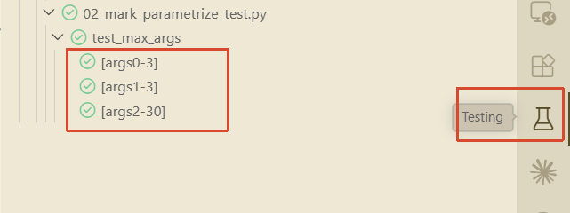

**pytest 的核心四件套：**

1. `@pytest.fixture` —— 准备数据
2. `@pytest.mark.parametrize` —— 批量测试
3. `with pytest.raises()` —— 验证异常
4. `assert` —— 做断言

# vscode配置

点击烧瓶之后，会生成配置文件`settings.json`,其中`-s`是我手动加上的，为了输出`print`

```json
{
    "python.testing.pytestArgs": [
        ".",
        "-s"
    ],
    "python.testing.unittestEnabled": false,
    "python.testing.pytestEnabled": true,
}
```


# 文件命名

pytest 默认只识别：

1. 文件名以 `test_` 开头，或
2. 文件名以 `_test.py` 结尾

比如：`01_fixture.py` 两者都不符合，VS Code 和 pytest 默认会跳过这个文件。改成`test_01_fixture.py`，或`01_fixture_test.py`就能检测到。


# 使用

## fixture

```python
import pytest

@pytest.fixture
def fruits():
    return 'banana kiwi mango apple watermelon'.split()

def test_something(fruits):
    """fruits会自动注入"""
    print(fruits)
    assert len(fruits) == 5
```

## mark.parametriz

```python
import pytest

@pytest.mark.parametrize("args,expect",[
    ([1, 3], 3),
    ([3, 1], 3),
    ([30, 10, 20], 30),
])
def test_max_args(args,expect):
    print(f"\n{args=} {expect=}",end="",flush=True)
    result = max(args)
    assert result == expect
```

```sh
01-deep-core/06-python-test/02_mark_parametrize_test.py 
args=[1, 3] expect=3.
args=[3, 1] expect=3.
args=[30, 10, 20] expect=30.
```



# 案例测试

[@overload的测试](../02-generic-and-typing-hints/Overloaded-Signatures.md#overloaded-signatures)