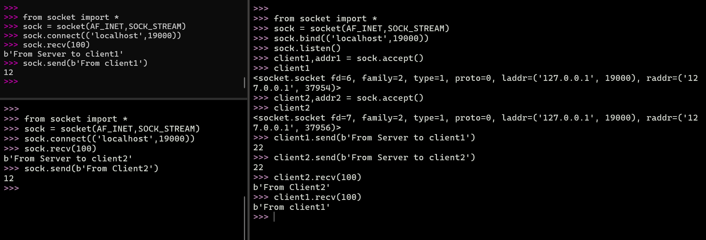

# socket基本通信



## Server End

```python
>>> from socket import *
>>> sock = socket(AF_INET,SOCK_STREAM)
>>> sock.bind(('localhost',19000))
>>> sock.listen()
>>> client1,addr1 = sock.accept()
>>> client1
<socket.socket fd=6, family=2, type=1, proto=0, laddr=('127.0.0.1', 19000), raddr=('127.0.0.1', 37954)>
>>> client2,addr2 = sock.accept()
>>> client2
<socket.socket fd=7, family=2, type=1, proto=0, laddr=('127.0.0.1', 19000), raddr=('127.0.0.1', 37956)>
>>> client1.send(b'From Server to client1')
22
>>> client2.send(b'From Server to client2')
22
>>> client2.recv(100)
b'From Client2'
>>> client1.recv(100)
b'From client1'
```

## Client End

```python
>>> from socket import *
>>> sock = socket(AF_INET,SOCK_STREAM)
>>> sock.connect(('localhost',19000))
>>> sock.recv(100)
b'From Server to client1'
>>> sock.send(b'From client1')
12
```