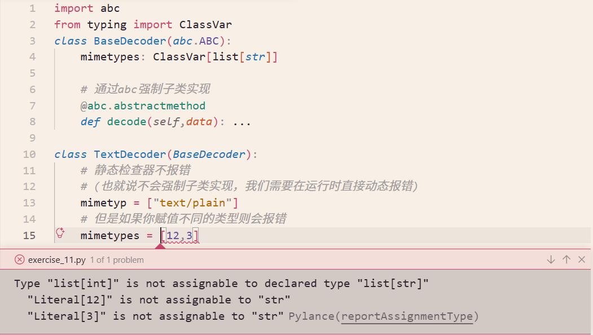

# getattr访问特性

[exercise_01.py](./code/exercise_01.py)

```python
class Account:
    def __init__(self, owner, balance=0):
        self.owner = owner
        self.balance = balance
        self.transactions = []

    def deposit(self, amount):  # 修改状态
        self.balance += amount
        self.transactions.append(f"Deposit: +{amount}")

    def withdraw(self, amount):  # 修改状态
        if amount > self.balance:
            raise ValueError("Insufficient funds")
        self.balance -= amount
        self.transactions.append(f"Withdraw: -{amount}")

    def inquiry(self):  # 只读，不修改状态
        """查询当前余额"""
        return self.balance

    def statement(self):  # 只读，不修改状态
        """查询交易记录"""
        return self.transactions.copy()
```

属性访问，方法也可以被当做属性进行访问，此时叫高阶函数，作为函数作为数据存在一样

```python
>>> a = Account('Guido',1000.0)
>>> # 绑定了实例的函数
>>> a.withdraw
<bound method Account.withdraw of <__main__.Account object at 0x7fe3f0d1da90>>
>>> getattr(a,'withdraw')
<bound method Account.withdraw of <__main__.Account object at 0x7fe3f0d1da90>>
>>> # 设置默认值
>>> getattr(a,'xxx',lambda: None)()
```

# 继承

```python
class EvilAccount(Account):

    # 重写覆盖 相当于Java的@override
    def inquire(self):
        if random.randint(0, 4) == 1:
            return self.balance * 1.10
        else:
            # 报错不能这样写
            # return super().balance
            # super()的含义不是像Java父类一样
            # super()是解决mro方法查找机制的
            return super().inquiry()
```

继承内置类`list`

```python
>>> class Stack(list):
...     # pythonic 哲学显式大于隐式
...     # 不推荐这样系诶
...     # push = list.append
...
...     # 推荐这样的模版代码
...     def push(self,item):
...         self.append(item)
...
>>> s.push(1)
>>> s.push(2)
>>> s.push(3)
>>> s.pop()
3
>>> s.pop()
2
>>> s.pop()
1
```


# 实例属性

```python
class A:
    def __init__(self,x,y):
        print(self)
        self.x = x
        self.__y = y

clas B(A):
    def getx(self):
        return self.x
    
    def gety(self):
        return self.__y
```

1. 虽然B没有直接定义`__init__`方法，但是从输出来看`__init__`的`self`代表的是B,继承不同于Java的继承，严格来说是一种混合
2. 下面的报错提示可以看到python在编译的时候，将`self.__y`处理成了`self._B__y`

```sh
>>> b = B(1,3)
<__main__.B object at 0x7f58bdd35e80>
>>> vars(b)
{'x': 1, '_A__y': 3}
>>> b.getx()
1
>>> b.gety()
Traceback (most recent call last):
  File "<python-input-20>", line 1, in <module>
    b.gety()
    ~~~~~~^^
  File "<python-input-16>", line 5, in gety
    return self.__y
           ^^^^^^^^
AttributeError: 'B' object has no attribute '_B__y'. Did you mean: '_A__y'?
```


验证： Python编译`__xxx`会以类名进行添加

```python
 class A:
     def __init__(self,x,y):
        print(self)
        self.x = x
        self.__y = y

 class B(A):
     def __init__(self,x,y):
        super().__init__(x*2,y*2)
        self.x = x
        self.__y = y
     def getx(self):
        print(self.x)

     def gety(self):
        # Python编译B类时，看到self.__y在类内部，
        # 于是自动修饰成self._B__y
        print(self.__y)
```


```sh
>>> # 实例化B的时候，A中定义的__init__ self是B
>>> b = B(1,3)
<__main__.B object at 0x7f58bdd35e80>
>>> # Python编译后生成的__双下滑y的情况，并没有像x那样产生覆盖
>>> vars(b)
{'x': 1, '_A__y': 6, '_B__y': 3}
>>> b.getx()
1
>>> b.gety()
3
# Python编译B类时，看到self.__y在类内部，于是自动修饰成self._B__y
>>> b.__y
Traceback (most recent call last):
  File "<python-input-33>", line 1, in <module>
    b.__y
AttributeError: 'B' object has no attribute '__y'
>>> b._B__y
3
>>> b._A__y
6
```

# `class.__name__`

[exercise_02.py](./code/exercise_02.py)

```python
class A:
    def __repr__(self) -> str:
        return f"{type(self).__name__} ..."

    __str__ = __repr__


class B(A):
    pass
```

```sh
>>> A()
A ...
>>> B()
B ...
```

# 组合

[exercise_03.py](./code/exercise_03.py)

```python
# 直接依赖list
class Stack:
    def __init__(self):
        self._items = list()

# 这个比上面更加好，应为可以反转依赖其他符合要求的容器
class Stack:
    def __init__(self,*,container=None):
        self._items = container if container else []
```

```python
from array import array
from collections import deque
from collections.abc import MutableSequence
from typing import Optional


class Stack:
    def __init__(self, *, container: Optional[MutableSequence] = None):
        self._items = container if container else []

    def push(self, item):
        self._items.append(item)

    def pop(self):
        return self._items.pop()


def test_cotainer(container=None):
    s = Stack(container=container)
    s.push(1)
    s.push(2)
    s.push(3)
    r = [s.pop() for _ in range(3)]
    assert r == [3, 2, 1]
    print("Good Test")


if __name__ == "__main__":
    # 切换三种不同的容器
    test_cotainer()
    test_cotainer(array("i"))
    test_cotainer(deque())
```

## 数据抽象与隐藏细节

Stack只暴露接口push,pop等，内部细节对用户实现隐藏，我们改变实现思路和策略，用户是无感知的。

使用链表元组进行实现

[exercise_04.py](./code/exercise_04.py)


```python
class Stack:
    def __init__(self):
        self._items: tuple = ()
        self._size = 0

    def push(self, item):
        self._items = (item, self._items)
        self._size += 1

    def pop(self):
        if self._size <= 0:
            raise LookupError(f"pop from empty {type(self).__name__}")
        item, self._items = self._items
        self._size -= 1
        return item

    def __len__(self):
        return self._size


def test_link_tuple():
    s = Stack()
    s.push(1)
    s.push(2)
    s.push(3)

    r = [s.pop() for _ in range(3)]
    assert r == [3, 2, 1]

    try:
        s.pop()
        print("Error!!! Why I'm here")
    except Exception as e:
        assert type(e) == LookupError
    print("Good test")


if __name__ == "__main__":
    test_link_tuple()
```

# 通过函数避免继承

如果一个类，只有一个定制的方法就用继承在子类中来实现的话，那么就变成了Java那种臃肿的代码，此时用高阶函数来实现就会清爽得多。

[待优化的代码](./code/exercise_05.py)

```python
from dataclasses import dataclass
from decimal import Decimal


@dataclass
class Record:
    name: str
    shares: int
    price: Decimal


class DataParser:
    def parse(self, lines):
        for line in lines:
            row = line.split(",")
            # 需要子类实现的
            yield self.make_record(row)

    def make_record(self, row):
        # NotImplementedError
        # 就是专门为"子类必须实现的方法"设计的。
        raise NotImplementedError("Subclasses must override make_record()")


class PortfolioDataParser(DataParser):
    """子类专门进行实现"""

    def make_record(self, row):
        return Record(name=row[0], shares=int(row[1]), price=Decimal(row[2]))


def get_lines(filename="portfolio.csv"):
    with open(filename, mode="rt", encoding="utf-8") as f:
        yield from f


if __name__ == "__main__":
    parser = PortfolioDataParser()
    for r in parser.parse(get_lines()):
        print(f"{r.name:>10}|{r.shares:>10}|{r.price:>10}|")

"""
$ uv run exercise_05.py 
        AA|       100|     32.20|
       IBM|        50|     91.10|
       CAT|       150|     83.44|
      MSFT|       200|     51.23|
        GE|        95|     40.37|
      ACME|        50|     65.10|
       YOW|       100|     70.44|
"""
```

[使用高阶函数优化的代码](./code/exercise_05_plus.py)

```python
from dataclasses import dataclass
from decimal import Decimal
from typing import Callable


@dataclass
class Record:
    name: str
    shares: int
    price: Decimal


def parse(lines, make_record: Callable):
    for line in lines:
        row = line.split(",")
        # 需要子类实现的
        yield make_record(row)


def make_record(row):
    return Record(name=row[0], shares=int(row[1]), price=Decimal(row[2]))


def get_lines(filename="portfolio.csv"):
    with open(filename, mode="rt", encoding="utf-8") as f:
        yield from f


if __name__ == "__main__":
    for r in parse(get_lines(), make_record):
        print(f"{r.name:>10}|{r.shares:>10}|{r.price:>10}|")

"""
$ uv run exercise_05_plus.py 
        AA|       100|     32.20|
       IBM|        50|     91.10|
       CAT|       150|     83.44|
      MSFT|       200|     51.23|
        GE|        95|     40.37|
      ACME|        50|     65.10|
       YOW|       100|     70.44|
"""
```


# UserDict

## 使用背景
直接继承内置的类型的危险性：有的方法直接操作底层，从而不走python的api.
此时UserDict就排上用场了

[exercise_06.py](./code/exercise_06.py)

```python
class udict(dict):
    def __setitem__(self, key, value):
        if isinstance(key, str):
            key = key.upper()
        super().__setitem__(key, value)
```

```sh
>>> # 正确看起来像那么一回事
>>> u = udict()
>>> u['name']='Pkmer'
>>> u['number']=666
>>> u
{'NAME': 'Pkmer', 'NUMBER': 666}
```

```sh
>>> # 无论是创造对象的时候，还是使用update发现并没有生效
>>> u = udict(name='Pkmer')
>>> u.update(number=666)
>>> u
{'name': 'Pkmer', 'number': 666}
```

> 原因
> Python的内置类型的实现方式与普通的Python类不同--内置类型用C语言实现，其调用的大多数方法也都是C语言实现的，比如update，直接操作底层的数据结构了，不经过应用层的python类。


## collections特殊类面向用户继承

处于上面问题的分析，Python在collections模块提供了`UserDict`,`UserList`,`UserString`来分别创建`dict`,`list`,`str`的安全子类。

```python
from collections import UserDict
class mudict(UserDict):
    def __setitem__(self, key, value):
        key = key.upper() if isinstance(key, str) else key
        super().__setitem__(key, value)
```

```sh
>>> mu = mudict(name='Pkmer')
>>> mu.update(number=666)
NameError: name '深圳' is not defined
>>> mu['city']='深圳'
>>> mu
{'NAME': 'Pkmer', 'NUMBER': 666, 'CITY': '深圳'}
```

# 类变量

1. 类本身也是一个对象，它可以携带状态
2. 类变量也可以通过实例访问，**如果实例本身没有匹配的特性，实例上的特性查找将检查相关的类**

```sh
>>> class A:
...     x = 2
...
>>> class B(A):
...     pass
...
>>> b = B()
>>> vars(b)
{}
>>> b.x
2
>>> b.x = 3
>>> vars(b)
{'x': 3}
>>> print(f"{b.x=} {B.x=} {A.x=}")
b.x=3 B.x=2 A.x=2
```

Colors相当于是一个命名空间，存储所有的颜色值

```python
>>> class Colors:
...     RED = 1
...     GREEN = 2
...     BLUE = 3
```

## typing.ClassVar类型



```python
import abc
from typing import ClassVar
class BaseDecoder(abc.ABC):
    mimetypes: ClassVar[list[str]]

    # 通过abc强制子类实现
    @abc.abstractmethod
    def decode(self,data): ...

class TextDecoder(BaseDecoder):
    # 静态检查器不报错
    # (也就说不会强制子类实现，我们需要在运行时直接动态报错)
    mimetyp = ["text/plain"]
    # 但是如果你赋值不同的类型则会报错
    mimetypes = [12,3]

    def decode(self, data):
        pass
```

在运行的时候只能动态检查，确保子类有这个`mimetypes`. [__init_subclass__](#有监督的继承)

```python
import abc
from typing import ClassVar


class BaseDecoder(abc.ABC):
    mimetypes: ClassVar[list[str]]

    def __init_subclass__(cls):
        # 防御性编程
        if "mimetypes" not in vars(cls):
            raise TypeError(f"{cls.__name__} must define 'mimetypes' class variable")

    # 通过abc强制子类实现
    @abc.abstractmethod
    def decode(self, data): ...


class TextDecoder(BaseDecoder):
    mimetyp = ["text/plain"]

    def decode(self, data):
        pass
```

```sh
# 运行的报错
    ...
    raise TypeError(f"{cls.__name__} must define 'mimetypes' class variable")
TypeError: TextDecoder must define 'mimetypes' class variable
```


## 类型提示

1. 注意这里的关于self.xxx的类型提示声明的地方与类变量在同一个位置，很容易搞混。但是

```python
class Account:
    # 类型提示
    # 只有类型提示（没有默认值）
    owner: str  # ← 限制 self.owner 的类型
    _balance: Decimal  # ← 限制 self._balance 的类型

    # 类型提示 + 默认值
    nums_count: int = 0  # ← 这是真正的类变量！

    def __init__(self, owner, balance: float):
        self.owner = owner
        self._balance = balance  # error: float is not assignable to Decimal
        Account.nums_count = "xxx"  # error: Literal['xxx'] is not assignable to 'int'
```

对比Java和Python. Python没有默认值，所以只声明类型提示，针对的是self.attr的，如果有默认值，那么就是类变量。

```java
jshell> import java.math.BigDecimal

jshell> class JA{
   ...>     static int a;
   ...>     static String b;
   ...>     static BigDecimal c = new BigDecimal("8.9");
   ...> }
|  modified class JA

jshell> JA.a
$12 ==> 0

jshell> JA.b
$13 ==> null

jshell> JA.c
$14 ==> 8.9
```

```python
>>> from decimal import Decimal
>>>
>>> class PA:
...     a: int
...     b: str
...     c: Decimal = Decimal('8.9')
...
>>> PA.a
Traceback (most recent call last):
  File "<python-input-3>", line 1, in <module>
    PA.a
AttributeError: type object 'PA' has no attribute 'a'
>>> PA.b
Traceback (most recent call last):
  File "<python-input-4>", line 1, in <module>
    PA.b
AttributeError: type object 'PA' has no attribute 'b'
>>> PA.c
Decimal('8.9')
```

类提示的作用，静态检查，也可以动态防御性编程

```python
>>> class PA:
...     a: int
...     b: str
...     c: Decimal = Decimal('8.9')
...
...     # 防御性编程
...     def __init__(self,a,b):
...         annotations = PA.__annotations__
...         if not isinstance(a,annotations['a']):
...             raise TypeError(f'a expect int but {type(a)} provided')
...         if not isinstance(b,annotations['b']):
...             raise TypeError(f'b expect str but {type(b)} provided')
...         self.a = a
...         self.b = b
...
>>> pa = PA(2,Decimal('9.8'))
Traceback (most recent call last):
  File "<python-input-8>", line 1, in <module>
    pa = PA(2,Decimal('9.8'))
  File "<python-input-7>", line 12, in __init__
    raise TypeError(f'b expect str but {type(b)} provided')
TypeError: b expect str but <class 'decimal.Decimal'> provided
>>> pa = PA(2,str(Decimal('9.8')))
>>> vars(pa)
{'a': 2, 'b': '9.8'}
```

# 属性@property

```python
>>> class A:
...     def __init__(self, x):
...         # 不会触发setter方法
...         # 实例.x = x 才会
...         # 注意 self.x = x 会导致不断地递归
...         # 最后报错RecursionError
...         self._x = x
...
...     @property
...     def x(self):
...         return self._x
...
...     @x.setter
...     def x(self, value):
...         print(f"======>{value}")
...         self._x = value
...
>>> a = A(2)
>>> a.x = 3
======>3
```


# @staticmethod与@classmethod

```python 
class MathOps:
    def t1(x):
        return x + x
    @classmethod
    def t2(cls,x):
        return x + x
    @staticmethod
    def t3(x):
        return x + x
```

注意区别，当使用实例的时候会调用失败

```sh
>>> # 都可以通过类进行访问
>>> MathOps.t1(3)
6
>>> MathOps.t2(3)
6
>>> MathOps.t3(3)
6
>>> # 通过实例访问，普通的函数则会报错
>>> m = MathOps()
>>> m.t1(3)
Traceback (most recent call last):
  File "<python-input-16>", line 1, in <module>
    m.t1(3)
    ~~~~^^^
TypeError: MathOps.t1() takes 1 positional argument but 2 were given
>>> m.t2(3)
6
>>> m.t3(3)
6
```


# 对象生命周期与内存管理

## 实例化对象

1. `__new__` 只分配内存
2. `__init__` 初始化

```python
a = A(1,2)

# 等价下面两步骤
a = A.__new__(A)
if isinstance(a,A):
    A.__init__(a,1,2)
```

```sh
>>> class A:
...     def __init__(self,x,y):
...         self._x = x
...         self._y = y
...
>>> a = A(1,2)
>>> a
>>> a.__dict__
{'_x': 1, '_y': 2}
>>> # 等价
>>> a = A.__new__(A)
>>> a.__dict__
{}
>>> if isinstance(a,A):
...     A.__init__(a,1,2)
...
>>> a.__dict__
{'_x': 1, '_y': 2}
```

也可以使用父类

```python
>>> class A:
...     pass
...
>>> class B(A):
...     def __init__(self,x,y):
...         self._x = x
...         self._y = y
...
>>> b = B(1,2)
>>> b.__dict__
{'_x': 1, '_y': 2}
>>> # 使用父类A来创建创建B实例
>>> b = A.__new__(B)
>>> if isinstance(b,B):
...     B.__init__(b,1,3)
...
>>> b.__dict__
{'_x': 1, '_y': 3}
>>> # 使用顶级基类object
>>> b = object.__new__(B)
>>> if isinstance(b,B):
...     B.__init__(b,1,5)
...
>>> b.__dict__
{'_x': 1, '_y': 5}
```

与上面一样，调用 `A` 的 `__new__`（实际是 `object.__new__`），但创建的是 `B` 的实例

```python
>>> class A:
...     pass
...
>>> class B:
...     def __init__(self,x,y):
...         self._x = x
...         self._y = y
...
>>> b = A.__new__(B)
>>> if isinstance(b,B):
...     B.__init__(b,1,2)
...
>>> b.__dict__
{'_x': 1, '_y': 2}
```

# 类装饰器

1. 获取类的信息
2. 自由的修改类的内容

以[`__init_subclass__`](#防御性编程)的视角来看，**装饰器也是一种钩子**

## 获取类的信息

[exercise_08.py](./code/exercise_08.py)

```python
_registry = {}

def register_decoder(cls):
    _registry.update({mt: cls for mt in cls.mimetypes})
    # 类装饰器要返回类，良好习惯
    return cls

def create_decoder(mimetype):
    if mimetype not in _registry:
        raise RuntimeError(f"Please regist {mimetype}")
    return _registry[mimetype]()

@register_decoder
class TextDecoder:
    mimetypes = ["text/plain"]

    def decode(self, data):
        pass

@register_decoder
class HTMLDecoder:
    mimetypes = ["text/html"]

    def decode(self, data):
        pass

@register_decoder
class ImageDecoder:
    mimetypes = ["image/png", "image/jpg", "image/gif"]

    def decode(self, data):
        pass

def test_register_decoder():
    from pprint import pprint

    # 已经全部注册进去了
    pprint(_registry)
    decoder = create_decoder("image/gif")
    assert isinstance(decoder, ImageDecoder), "Create ImageDecoder Failed!!!"
    print("Good test")

if __name__ == "__main__":
    test_register_decoder()

"""output
{'image/gif': <class '__main__.ImageDecoder'>,
 'image/jpg': <class '__main__.ImageDecoder'>,
 'image/png': <class '__main__.ImageDecoder'>,
 'text/html': <class '__main__.HTMLDecoder'>,
 'text/plain': <class '__main__.TextDecoder'>}
"""
```

## 修改类内容

> 扩展[dataclass代码生成技术的原理](../01-stdtypes/dataclass.md#dataclass代码生成技术的原理)

[exercise_09.py](./code/exercise_09.py)

```python
def loud(cls):
    """monkey patching"""
    orig_noise = cls.noise

    def noise(self):
        return str.upper(orig_noise(self))

    cls.noise = noise

    orig_pedal = cls.pedal

    def pedal(self):
        return str.upper(orig_pedal(self))

    cls.pedal = pedal

    return cls


def annoying(cls):
    """monkey patching"""
    orig_noise = cls.noise

    def noise(self):
        return orig_noise(self) * 3

    cls.noise = noise

    orig_pedal = cls.pedal

    def pedal(self):
        return orig_pedal(self) * 3

    cls.pedal = pedal
    return cls


@annoying
@loud
class Cyclist:

    def noise(self):
        return "On your left!"

    def pedal(self):
        return "Pedaling"


"""interactive
$ uv run python -i exercise_09.py
>>> Cyclist().noise()
'ON YOUR LEFT!ON YOUR LEFT!ON YOUR LEFT!'
>>> Cyclist().pedal()
'PEDALINGPEDALINGPEDALING'
"""
```


# 有监督的继承

定义一个类并执行额外的操作，除了上面的类装饰器之外，还有父类也可以代表它的子类执行额外的操作。父类通过实现`__init_subclass(cls)`类方法完成。`__init_subclass(cls)是一个钩子方法（hook method）
**它会在子类被定义时自动被调用**，用来初始化子类。

`__init_subclass__` 在 Python 中默认就被设计为类方法，它的第一个参数是 cls（子类本身）。这是 Python 语言层面的特殊方法，类似于 `__new__`、`__init__` 等，它们有自己独特的语义和参数约定，不需要用装饰器声明。

[exercise_10.py](./code/exercise_10.py)

```python
class Base:
    def __init_subclass__(cls):
        print("Initializing",cls.__name__)

class A(Base):
    pass

class B(Base):
    pass
```

## 防御性编程

收集所有的子类[exercise_11.py](./code/exercise_11.py)

```python
import abc
from typing import Any, ClassVar


class BaseDecoder(abc.ABC):

    _registry: ClassVar[dict[str, type[BaseDecoder]]] = {}

    mimetypes: ClassVar[list[str]]

    def __init_subclass__(cls):
        # 防御性编程,强制子类必须要有mimetypes 类变量
        if "mimetypes" not in vars(cls):
            raise TypeError(f"{cls.__name__} must define 'mimetypes' class variable")

        BaseDecoder._registry.update({mt: cls for mt in cls.mimetypes})

    # 通过abc强制子类实现
    @abc.abstractmethod
    def decode(self, data): ...


class TextDecoder(BaseDecoder):
    mimetypes = ["text/plain"]

    def decode(self, data):
        pass
```


