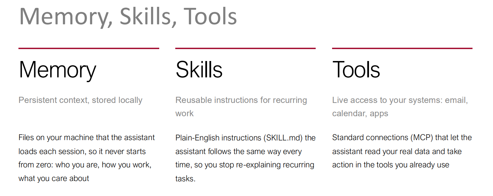

From a Tool You Use to a Colleague You Manage

最终 agentic workflows 会变成你管理的同事”，但当前还是“AI Assistant”，需要监督。心态转变：不再是“使用工具”，而是“管理一个助手”。

现在/未来（Colleague You Manage）：你面对的是一个“同事”。同事有主动性，会自己制定计划、执行任务、汇报结果，但也需要你管理——分配任务、设定目标、审查产出、纠正方向。

一个真正有用的 AI 助手，不是靠一个万能的大模型，而是由“记忆、技能、工具”三根支柱撑起来的。



构建一个**最小可用的 Agent 系统**：

| 要素       | 解决的问题       | 对应文件/协议 | 你的类比                          |
| ---------- | ---------------- | ------------- | --------------------------------- |
| **Memory** | 我是谁？我在哪？ | `Claude.md`   | 你的 `CLAUDE.md` + 项目目录的约定 |
| **Skills** | 这件事怎么做？   | `SKILL.md`    | 你的常用 prompt 模板 / 自定义命令 |
| **Tools**  | 我能操作什么？   | MCP           | 你连接的终端、文件系统、Git       |

# 关键概念

是的，**workspace** 就是“共享区/工作区”的英文标准写法。你把握得很准。

下面帮你把 **Memory、Workspace、Context Window** 这三者的边界和关系做一个系统总结：

---

## 三者的本质定位

| 概念               | 一句话定位            | 存在形式                   | 服务对象        |
| ------------------ | --------------------- | -------------------------- | --------------- |
| **Memory**         | Agent 的“个人档案”    | 本地文件（`CLAUDE.md` 等） | 单个 Agent 自己 |
| **Workspace**      | 多 Agent 的“协作看板” | 共享目录/数据库/消息队列   | 多个 Agent 之间 |
| **Context Window** | LLM 的“工作内存”      | 模型推理时的 token 空间    | 单次推理调用    |

---

## 三者的核心边界

### 1. Memory vs Workspace

| 维度     | Memory                              | Workspace                                   |
| -------- | ----------------------------------- | ------------------------------------------- |
| 目的     | 让 Agent 不遗忘“我是谁、我怎么工作” | 让 Agent 之间协调“我们在做什么、谁做到哪了” |
| 内容     | 个人偏好、工作习惯、项目上下文      | 任务状态、分工、中间产物、通信记录          |
| 生命周期 | 长期、跨会话                        | 通常跟随一个协作任务                        |
| 读写模式 | Agent 自己读、自己写                | 多方读写，需要并发控制                      |
| 隐私性   | 私有                                | 公共                                        |

**核心原则**：私有信息放 Memory，协作信息放 Workspace。个人习惯不污染共享区，公共状态不藏进私有记忆。

### 2. Memory / Workspace vs Context Window

| 维度     | Memory / Workspace                | Context Window             |
| -------- | --------------------------------- | -------------------------- |
| 本质     | 持久化存储（磁盘）                | 临时推理空间（内存）       |
| 容量     | 几乎无限（受磁盘限制）            | 有硬上限（如 200K tokens） |
| 生命周期 | 跨会话持久                        | 单次推理调用               |
| 加载方式 | 按需读取（grep、read_file_range） | 一次性注入                 |

**核心关系**：Memory 和 Workspace 是**磁盘上的持久数据**，Context Window 是**推理时的临时工作台**。Agent 不会把所有 Memory 都塞进 Context Window，而是**分层加载 + 按需读取**。

---

## 三者的协作流程

用一个具体场景串起来——3 个 Agent 协作写研究报告：

```
┌─────────────────────────────────────────────────────┐
│  Context Window（单次推理的临时工作台）              │
│  ┌───────────────────────────────────────────────┐  │
│  │ 当前任务指令 + 从 Memory 加载的索引           │  │
│  │ + 从 Workspace 读取的当前状态                 │  │
│  │ + 按需读取的主题文件内容                      │  │
│  └───────────────────────────────────────────────┘  │
└─────────────────────────────────────────────────────┘
              ↑ 按需读取          ↑ 按需读取
              │                   │
┌─────────────┴─────────┐  ┌──────┴──────────────────┐
│  Memory（私有）        │  │  Workspace（共享）       │
│  ├── CLAUDE.md         │  │  ├── task.md            │
│  ├── preferences.md    │  │  ├── status.md          │
│  └── private-notes.md  │  │  ├── outputs/           │
│                        │  │  └── messages/          │
│  Agent A 自己的        │  │  所有 Agent 共用        │
└────────────────────────┘  └─────────────────────────┘
```

**流程**：

1. Agent A 启动 → 自动加载自己的 `CLAUDE.md`（Memory 索引）
2. Agent A 读取 `Workspace/task.md`，知道自己的任务
3. Agent A 需要某篇文献 → 用 grep 在 Memory/Workspace 里定位 → 只读需要的片段到 Context Window
4. Agent A 完成 → 把结果写入 `Workspace/outputs/`，更新 `Workspace/status.md`
5. Agent B 读取 `Workspace/status.md`，知道 A 完成了，开始自己的工作

---

## 关键设计原则

### 1. 分层加载，而非全量注入

- **启动时**：只加载轻量索引（`CLAUDE.md`、`MEMORY.md` 前 200 行、技能名称和描述）
- **运行时**：Agent 根据任务需要，用 grep / read_file_range 按需读取详细内容
- **技能调用时**：才读取完整的 `SKILL.md`（每个技能约 5000 token 上限）

### 2. 按需发现，而非预加载

- MCP 工具默认只加载名称，需要时再查详细描述
- Wiki 文章不在启动时全部加载，而是问题触及某主题时才读取相关文章

### 3. 私有与共享分离

- Memory 是每个 Agent 的“个人档案”，不对外暴露
- Workspace 是团队的“公共看板”，所有 Agent 可读写
- 两者通过 MCP / 工具调用连接

### 4. 持久化与临时性分离

- Memory / Workspace 是磁盘上的持久数据，跨会话存在
- Context Window 是推理时的临时空间，单次调用后清空
- Agent 的工作就是“从持久层按需取数据 → 在 Context Window 里推理 → 把结果写回持久层”

---

## 一句话总结

**Memory 是 Agent 的私有记忆，Workspace 是多 Agent 的共享协作空间，Context Window 是 LLM 推理时的临时工作台。三者分工明确：Memory 解决“我是谁”，Workspace 解决“我们在做什么”，Context Window 解决“这一次推理能装下多少信息”。Agent 的智能不在于把所有记忆塞进上下文，而在于知道什么时候该读哪一部分。**

---

# 历史记录messages

Messages 由客户端自动维护并每次全量发送

```txt
Context Window
= System Prompt（固定层）
+ Messages[]（历史层，客户端每次重新发送）
+ 按需读取的内容（Memory / Skill / Wiki，通过 tool_result 进入 Messages[]）
```

按需读取的 Memory 和 Skill，本质上也是通过工具调用结果，变成了 Messages[] 里的一部分。所以它们最终也被“吸收”进了 Messages 这条线里。

每次api请求发送的东西：

```txt
{
  "model": "claude-sonnet-4-20250514",
  "system": "你是 Claude Code，一个......",   // System Prompt
  "messages": [                              // Messages[]
    { "role": "user",      "content": "帮我做个 PPT" },
    { "role": "assistant", "content": "好的，我先读取 pptx skill" },
    { "role": "user",      "content": "[tool_result] SKILL.md 全文......" },
    { "role": "assistant", "content": "明白了，现在开始执行步骤 1" },
    { "role": "user",      "content": "继续" }
  ],
  "tools": [ ... ]                           // 可用工具列表
}
```

完整的循环

```
┌─────────────────────────────────────────────────────────────┐
│  客户端本地维护的 messages[]                                  │
│  [user, assistant, user, assistant, ...]                    │
└─────────────────────────────────────────────────────────────┘
                          │
                          │ 每次请求：System Prompt + messages[]
                          ▼
┌─────────────────────────────────────────────────────────────┐
│  Anthropic API（LLM 无状态，只处理这次请求）                  │
│  输入：system + messages[] + tools                           │
│  输出：一条新的 assistant message                             │
└─────────────────────────────────────────────────────────────┘
                          │
                          │ 返回：{ role: "assistant", content: ... }
                          ▼
┌─────────────────────────────────────────────────────────────┐
│  客户端把新 message 追加到 messages[] 尾部                     │
│  如果是 tool_use → 执行工具 → 追加 tool_result → 再次请求      │
│  如果是 end_turn → 结束，等用户输入                            │
└─────────────────────────────────────────────────────────────┘
```

客户端维护 messages[]，注意这里的客户端指的是 API 调用场景

当你写代码直接调 Anthropic API 时：

你（调用方）必须自己维护 messages[]。
API 是无状态的，它不替你保存任何东西。
你每次请求都要把完整的历史重新发一遍。
这是 “API 消费者自己负责状态” 的模式。

---

bubblewrap（命令名 bwrap）是 Linux 上一个轻量的沙箱工具，由 Flatpak 项目开发维护，用 C 写成，核心作用只有一句话：

用 Linux 内核的非特权用户命名空间（unprivileged user namespaces），把某个进程关进一个受限的"盒子"里运行，而且不需要 root。

它做的事情大致是：

构造一个新的 mount namespace，然后把你指定的目录 --bind 进这个空世界里，其他路径根本不存在
可以只读挂载某些路径（--ro-bind）
用 --unshare-net 切断网络、--unshare-pid 隔离进程视图
用 --die-with-parent 保证父进程死了盒子也一起死
通过 --new-session、seccomp 过滤等限制进程能做的危险操作
所以它是"把命令关进只能看到 workspace 的笼子里"的实现方式。你平时用的 Flatpak 应用、部分发行版的沙箱化包管理，底层都是它。 它本身不是虚拟机、不是容器运行时（不含镜像、不含分层文件系统），就只是一个"启动进程时套一层命名空间"的极简可执行文件，约几百 KB。
