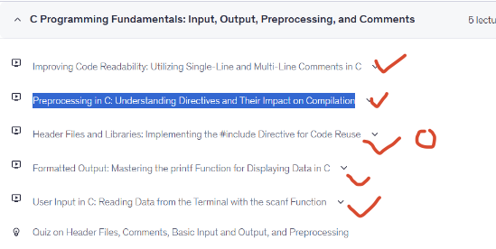

# Preprocessor

Preprocessor预处理器处理Preprocessor directive预处理指令

- Preprocessor directive（预处理指令） 是官方标准术语（学名）。

- Preprocessor statements（预处理语句） 是通俗描述性说法（俗称）。

比如`#include statement` is a `preprocessor directive`

```markdown
预处理指令（#include, #define 等）
    ↓
以 # 开头（# 必须是行首第一个非空格字符）
    ↓
预处理器在编译前处理这些指令
    ↓
用途一：#define → 定义常量（如 PI）和宏（如 SQUARE）
用途二：#include → 引入库文件（如 stdio.h）
用途三：#ifdef / #ifndef → 条件编译（跨平台或调试用）
```




# Variables And Data Type

`Memory` consists of a large number of `bits` that are in groups of eight (called `bytes`) and each byte has a unique `address`.

内存由大量的比特（bit）组成，这些比特按每八个一组进行分组（这八个比特称为一个字节），并且每个字节都有一个唯一的地址.


# 变量

通过记住十六进制的内存地址来访问内存，这是非常繁琐和困难的，所以变量的好处就是可以代替十六进制内存地址，来表示内存位置（直观上也可以说是内存名字）。

Variables are the names you give to computer memory locations which are used to store values in a computer program（变量是您赋予计算机内存位置的名称，这些内存位置用于在计算机程序中存储值。）

- 在 C 语言中，**“定义/声明变量” 和 “分配内存” 是同时发生的，不可分割**。

可以看到定义变量的时候就已经分配内存地址了，并且之后的赋值，地址一直没变

```c
#include <stdio.h>

int main()
{
    int a; // （定义变量时）：此时内存就已经分配了！ 编译器在编译阶段就决定好了。
    printf("           address: %p\n", &a);
    a = 3; //  （赋值时）：此时内存不再分配！ 只是在已有的盒子里写入数据 3。
    printf("a = 3 时的 address: %p\n", &a);
    a = 5;
    printf("a = 5 时的 address: %p\n", &a);
    return 0;
}

//            address: 0x7fff348be944
// a = 3 时的 address: 0x7fff348be944
// a = 5 时的 address: 0x7fff348be944
```

## 与高级语言（Java/Python）的区别

C语言与高级语言(Java/Python)之间定义变量，完全是彻底决裂。

1. 在 Java 中： `int b = a;` 是把 `a` 的引用（遥控器） 复制一份给 `b`，`a` 和 `b` 指向同一个对象。

2. 在 C 语言中： `int b = a;` 是把 `a` 盒子里的数据复制一份，放进新盒子 `b` 里。


在高级语言Java/Python中，变量只是一个引用,对比上面C语言的案例，可以看到id(a)一直在改变

```python
>>> a = 3
>>> id(a)
22291024
>>> a = 5
>>> id(a)
22291120
```

| 语言    | 设计哲学                  | 变量本质                          |
|---------|---------------------------|-----------------------------------|
| C 语言  | “信任程序员，贴近硬件”    | 变量是内存地址的别名，直接对应硬件 |
| Python  | “方便程序员，屏蔽硬件”    | 变量是对象的标签，对象在堆上自由浮动 |

```c
// C Variable
int a;     // 盒子造好了，里面是垃圾值（比如 -858993460）
a = 3;     // 把垃圾擦掉，写上 1
a = 5;     // 把 1 擦掉，写上 2
```

```python
# Python
>>> # 在堆上造一个对象 3，a 指向它
>>> a = 3
>>> id(a)
22291024
>>> # 在堆上造一个对象 5，a 指向它（对象 3 可能被回收）
>>> a = 5
>>> id(a)
22291120
```


- C 语言更快、更底层，但需要你手动管理内存（思考“盒子有多大”“什么时候销毁”）。

- Python 更安全、更方便，但牺牲了性能和控制力（你不需要关心盒子，只需要关心标签贴在哪）。


## 变量-地址-指针

1. C语言中变量`a` 就是**那块内存的“名字”**,用 `a`，就是让 `CPU` 去那个地址取数。 通过 a 拿到值，是因为编译器在底层偷偷帮我们把 `a` 转换成了地址，但这个过程是**隐式的**，我们看不到。

2. 虽然编译器知道 `a` 的地址，但它把这个地址藏起来了，不让你直接看到。你需要 `&a` 来“揭开这个盖子”，拿到地址本身
    - 让函数修改你的变量（传址调用）
    ```c
    void change(int *p) {
        *p = 100;   // 通过地址修改原变量
    }

    int a = 1;
    change(&a);  // 必须把 a 的地址传给函数
    ```
    - 把地址保存起来（指针变量）
    ```c
    int a = 1;
    int *p = &a;   // 把 a 的地址保存在指针变量 p 里
    ```

[exercise_02.c](./variables/exercise_02.c)
```c
int main()
{
    int a = 3;
    // 取值
    printf("%d\n", a);

    // 内存地址
    printf("%p\n", &a);

    // 定义指针，相当于Java/Python的引用一样
    int *p = &a;
    printf("%p\n", p);
    // 通过地址访问
    printf("%d\n", *p);

    // 因为指向同一块内存地址，修改p也是修改a
    *p = 5;
    printf("%d\n", a);

    return 0;
}

// 3
// 0x7ffe6bf0885c
// 0x7ffe6bf0885c
// 3
// 5
```

### `*ptr`

上面代码两个 `*p` 虽然长得一模一样，但在 C 语言的语法里，它们确实分属两个完全不同的身份。一个是**宣告身份**，一个是**操作身份**。

> 宣告身份

 `int *p = &a;` 这里的 `*` 是**类型修饰**:它出现在 `类型名（int）`和`变量名（p）`之间。
它的作用是告诉编译器：“我要声明一个变量，这个变量不是用来存整数的，而是用来存地址（门牌号） 的。”

> 操作身份

`int c = *p;`或者`*p = 5;` 这里的 `*` 是`解引用运算符`。
它出现在一个已经存在的指针变量（p）前面，作为一个**一元运算符**（就像 `-` 表示取负数一样）。通过指针变量中存储的地址，去操作（读取或写入）该地址所指向的那块内存。

1. `&a` 是“地址”（一个数值）。
2. `p` 是“指针变量”（一个专门存放地址的盒子）。
3. `*p` 是“解引用”（去地址里取东西的动作）。

通常我们说的“指针”，指的是 `p` 这个变量本身，而不是 `*p`。