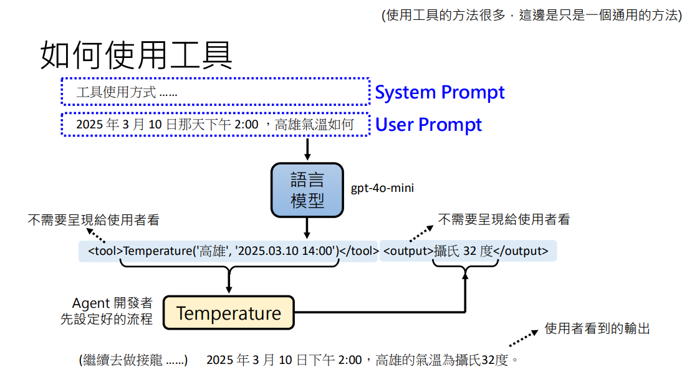

AI Agent 就是 “LLM + Harness + 目标” 组合起来的那整个系统。

Agent 的“动态上下文管理”

ChatGPT 网页版 = 托管 messages 的成品应用。
API = 让你自由管理 messages 的底层能力。

而 AI Agent 的本质，就是“用代码动态管理 messages + 调用工具 + 循环执行”。

# 记忆写入策略（Memory Write Policy）

Agent 在每次循环时，会把当前观察和动作发给 LLM，并在 System Prompt 里加上一句指令：

> "如果你认为当前信息具有长期价值、可复用、或是重要的错误反馈，请调用 `write_memory` 工具将其存入长期记忆。否则，继续执行任务。"

# Tool

**LLM 接龙 -> Harness 拦截 -> 执行函数 -> 回传结果** 的机制

这就是你之前理解的"API 动态管理 messages"在工程上的完美体现：

- Harness 动态地在 messages 里**插入**了 LLM 生成的 `<tool>` 消息。
- Harness 又动态地在 messages 里**追加**了工具返回的 `<output>` 消息。
- 最后，把这一整套"拼接好的 messages"再次喂给 LLM，让它顺着往下接龙。

# RAG

## 一、RAG 的本质定义

**RAG（Retrieval-Augmented Generation，检索增强生成）** 是一种将信息检索（Information Retrieval, IR）与大语言模型（LLM）相结合的架构范式。其核心目的是在 LLM 生成答案之前，通过检索外部知识源，为 LLM 提供事实依据（Grounding），从而**缓解模型幻觉（Hallucination）、弥补知识时效性不足，并降低微调成本**。

从系统架构看，RAG 是一个"**检索器（Retriever）+ 生成器（Generator）**"的流水线：

1. **Retrieval**：根据用户查询（Query），从外部知识源中召回（Recall）相关文档片段（Chunks）。
2. **Augmentation**：将召回的文档片段与原始查询拼接（Concatenate），构造增强后的 Prompt。
3. **Generation**：LLM 基于增强后的 Prompt，生成最终回答。

## 二、RAG 的两种核心范式

根据知识源的存储与获取方式，RAG 可分为两大范式：

**1. 静态 RAG（Static / Indexed RAG）**

- **知识源**：预先构建的离线索引库（通常是向量数据库 Vector DB，或关键词索引如 BM25）。
- **工作流程**：
  - 离线阶段：文档切分（Chunking）→ 嵌入（Embedding）→ 存入向量数据库。
  - 在线阶段：查询向量化 → 相似度检索（如余弦相似度）→ Top-K 召回 → 注入 Prompt。
- **典型应用**：企业知识库问答、内部文档检索、客服机器人。
- **优势**：检索速度快、可控性强、数据隐私好。
- **局限**：知识更新滞后，需要维护索引管道；无法回答索引库之外的问题。

**2. 动态 RAG（Dynamic / Online RAG）**

- **知识源**：实时外部环境（如搜索引擎 API、网页抓取、实时数据库）。
- **工作流程**：
  - 在线阶段：Agent 调用搜索工具（如 Google Search API）→ 获取实时网页/结果 → 内容抽取与清洗 → 注入 Prompt。
- **典型应用**：Google AI Overview、联网搜索 Agent、实时信息问答。
- **优势**：信息时效性强，覆盖范围广。
- **局限**：检索质量不可控（如 Reddit 恶搞帖）、延迟较高、依赖外部 API 稳定性。

> **关键澄清**：两种范式在学术与工程语境下均被称为 RAG，其本质区别在于**知识源的时效性与获取方式**。静态 RAG 是"检索已有知识"，动态 RAG 是"检索实时信息"。

## 三、RAG 在 AI Agent 架构中的定位

在 AI Agent 的 **Model + Harness = Agent** 公式中，RAG 扮演的是"**知识供给工具（Knowledge Supply Tool）**"的角色。

根据 Agent 的自主性程度，RAG 的调用方式分为：

1. **被动注入（Passive Injection）**
   - Harness 在构造 Prompt 时，**自动触发**检索，将结果注入 `messages`。
   - LLM **无感知**，仅负责生成。
   - 案例：Google AI Overview、传统企业知识库问答。
   - **特点**：低延迟、流程固定，但 LLM 缺乏对检索过程的控制权。

2. **主动调用（Active Tool Call）**
   - LLM 自主判断是否需要检索，输出 `<tool>` 调用指令。
   - Harness 拦截指令，执行检索，将结果作为 `<output>` 回传。
   - LLM 可进行多轮检索、交叉验证、甚至拒绝不可靠的检索结果。
   - 案例：Agentic RAG、Code Agent 的文件检索、研究型 Agent。
   - **特点**：高自主性、灵活，但延迟较高，依赖 LLM 的规划能力。

**Agentic RAG = LLM 自主决定"要不要检索、检索什么、检索几次"**，它是 Tool Calling 在检索场景下的一个特例。

所以：**"所有 tool 调用都是 Agentic RAG"不成立，但"所有 Agentic RAG 都是 tool 调用"成立。**

## 四、RAG 的核心挑战与工程考量

1. **检索质量（Retrieval Quality）**
   - 静态 RAG：依赖 Embedding 模型、Chunking 策略、索引结构。
   - 动态 RAG：依赖搜索引擎 API 的召回率、网页内容抽取质量。
   - **共同问题**："检索到错误信息"（如"加胶水"案例）。需引入来源可信度评估、元数据过滤（如时间、域名权重）。

2. **上下文窗口管理（Context Management）**
   - 召回多文档会撑爆 Context Window，增加成本与延迟。
   - 需进行**重排序（Re-ranking）**、**去重（Deduplication）**、**摘要压缩（Summarization）**。

3. **LLM 的判断力（Judgment）**
   - LLM 需在 Prompt 中被告诉："若检索结果与常识/安全规则冲突，应优先相信常识，并提示用户。"
   - 这是 Page 60 "不要完全相信工具，要有自己的判断力"的技术落地。

## 五、总结

| 维度         | 静态 RAG                 | 动态 RAG                |
| ------------ | ------------------------ | ----------------------- |
| **知识源**   | 预构建的向量索引库       | 实时搜索引擎 / 外部 API |
| **更新频率** | 离线更新（定期重建索引） | 实时更新                |
| **调用方式** | 通常为被动注入           | 通常为主动工具调用      |
| **典型场景** | 企业知识库、内部文档问答 | 联网搜索、实时信息助手  |
| **核心风险** | 知识过时、索引维护成本   | 信息不可靠、API 依赖    |

**RAG 的本质是"为 LLM 提供外部事实依据的检索-生成流水线"。** 在 AI Agent 架构中，它是连接 LLM 与外部世界的知识接口，其形态（静态/动态）与调用方式（被动/主动）取决于应用场景对时效性、自主性和可靠性的权衡。

# Resource

1. [Deepseek笔记](https://chat.deepseek.com/a/chat/s/e2c3dc27-9504-468c-ad8e-f5ee2d3ba74b)
