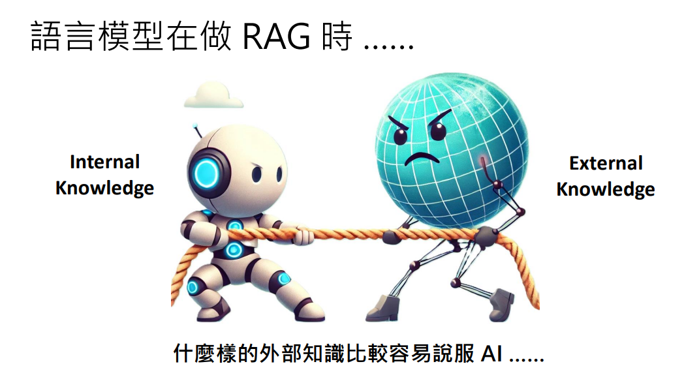

# Agent

- **工具型 Agent**：价值在于"**帮你动手做**"（订票、写代码）。核心**执行工具**
- **认知型 Agent**：价值在于"**帮你想清楚**"（写计划、做研究）。核心**生成内容**

对于"百万粉丝计划"，你需要的不是一个能打开浏览器、点击按钮的 Agent，而是一个**能像资深运营专家一样思考、分析、并输出策略的 Agent**。这个能力，LLM 本身（加上合适的 Prompt）就具备了。

---

AI Agent 就是 “LLM + Harness + 目标” 组合起来的那整个系统。AI Agent 的三大核心能力：记忆（Memory）、工具（Tools）、规划（Planning）

Agent 的“动态上下文管理”

ChatGPT 网页版 = 托管 messages 的成品应用。
API = 让你自由管理 messages 的底层能力。

而 AI Agent 的本质，就是“用代码动态管理 messages + 调用工具 + 循环执行”。

# 记忆写入策略（Memory Write Policy）

Agent 在每次循环时，会把当前观察和动作发给 LLM，并在 System Prompt 里加上一句指令：

> "如果你认为当前信息具有长期价值、可复用、或是重要的错误反馈，请调用 `write_memory` 工具将其存入长期记忆。否则，继续执行任务。"

# Tool

**LLM 接龙 -> Harness 拦截 -> 执行函数 -> 回传结果** 的机制

这就是你之前理解的"API 动态管理 messages"在工程上的完美体现：

- Harness 动态地在 messages 里**插入**了 LLM 生成的 `<tool>` 消息。
- Harness 又动态地在 messages 里**追加**了工具返回的 `<output>` 消息。
- 最后，把这一整套"拼接好的 messages"再次喂给 LLM，让它顺着往下接龙。


# RAG

AI 面对外部知识时，不是“全盘接受”，而是“带脑子的质疑”。当外部知识偏离常识太远时，AI 会启动“常识防御”，回归自己的先验知识（Prior）。

1. AI 不是“给什么资料就信什么”的傻瓜。它有一个“合理性阈值”。当外部知识偏离常识太远（无论是太小还是太大），AI 会启动防御机制，拒绝接受，转而相信自己原本的记忆。
2. 如果 AI 自己本来就很确定答案（比如“1+1=2”），你给它喂假资料，它很难被说服。但如果 AI 自己本来就不太确定（比如一个冷门医学问题），你给它喂资料，它就很容易被带偏。



## 一、RAG 的本质定义

**RAG（Retrieval-Augmented Generation，检索增强生成）** 是一种将信息检索（Information Retrieval, IR）与大语言模型（LLM）相结合的架构范式。其核心目的是在 LLM 生成答案之前，通过检索外部知识源，为 LLM 提供事实依据（Grounding），从而**缓解模型幻觉（Hallucination）、弥补知识时效性不足，并降低微调成本**。

从系统架构看，RAG 是一个"**检索器（Retriever）+ 生成器（Generator）**"的流水线：

1. **Retrieval**：根据用户查询（Query），从外部知识源中召回（Recall）相关文档片段（Chunks）。
2. **Augmentation**：将召回的文档片段与原始查询拼接（Concatenate），构造增强后的 Prompt。
3. **Generation**：LLM 基于增强后的 Prompt，生成最终回答。

## 二、RAG 的两种核心范式

根据知识源的存储与获取方式，RAG 可分为两大范式：

**1. 静态 RAG（Static / Indexed RAG）**

- **知识源**：预先构建的离线索引库（通常是向量数据库 Vector DB，或关键词索引如 BM25）。
- **工作流程**：
  - 离线阶段：文档切分（Chunking）→ 嵌入（Embedding）→ 存入向量数据库。
  - 在线阶段：查询向量化 → 相似度检索（如余弦相似度）→ Top-K 召回 → 注入 Prompt。
- **典型应用**：企业知识库问答、内部文档检索、客服机器人。
- **优势**：检索速度快、可控性强、数据隐私好。
- **局限**：知识更新滞后，需要维护索引管道；无法回答索引库之外的问题。

**2. 动态 RAG（Dynamic / Online RAG）**

- **知识源**：实时外部环境（如搜索引擎 API、网页抓取、实时数据库）。
- **工作流程**：
  - 在线阶段：Agent 调用搜索工具（如 Google Search API）→ 获取实时网页/结果 → 内容抽取与清洗 → 注入 Prompt。
- **典型应用**：Google AI Overview、联网搜索 Agent、实时信息问答。
- **优势**：信息时效性强，覆盖范围广。
- **局限**：检索质量不可控（如 Reddit 恶搞帖）、延迟较高、依赖外部 API 稳定性。

> **关键澄清**：两种范式在学术与工程语境下均被称为 RAG，其本质区别在于**知识源的时效性与获取方式**。静态 RAG 是"检索已有知识"，动态 RAG 是"检索实时信息"。

## 三、RAG 在 AI Agent 架构中的定位

在 AI Agent 的 **Model + Harness = Agent** 公式中，RAG 扮演的是"**知识供给工具（Knowledge Supply Tool）**"的角色。

根据 Agent 的自主性程度，RAG 的调用方式分为：

1. **被动注入（Passive Injection）**
   - Harness 在构造 Prompt 时，**自动触发**检索，将结果注入 `messages`。
   - LLM **无感知**，仅负责生成。
   - 案例：Google AI Overview、传统企业知识库问答。
   - **特点**：低延迟、流程固定，但 LLM 缺乏对检索过程的控制权。

2. **主动调用（Active Tool Call）**
   - LLM 自主判断是否需要检索，输出 `<tool>` 调用指令。
   - Harness 拦截指令，执行检索，将结果作为 `<output>` 回传。
   - LLM 可进行多轮检索、交叉验证、甚至拒绝不可靠的检索结果。
   - 案例：Agentic RAG、Code Agent 的文件检索、研究型 Agent。
   - **特点**：高自主性、灵活，但延迟较高，依赖 LLM 的规划能力。

**Agentic RAG = LLM 自主决定"要不要检索、检索什么、检索几次"**，它是 Tool Calling 在检索场景下的一个特例。

所以：**"所有 tool 调用都是 Agentic RAG"不成立，但"所有 Agentic RAG 都是 tool 调用"成立。**

## 四、RAG 的核心挑战与工程考量

1. **检索质量（Retrieval Quality）**
   - 静态 RAG：依赖 Embedding 模型、Chunking 策略、索引结构。
   - 动态 RAG：依赖搜索引擎 API 的召回率、网页内容抽取质量。
   - **共同问题**："检索到错误信息"（如"加胶水"案例）。需引入来源可信度评估、元数据过滤（如时间、域名权重）。

2. **上下文窗口管理（Context Management）**
   - 召回多文档会撑爆 Context Window，增加成本与延迟。
   - 需进行**重排序（Re-ranking）**、**去重（Deduplication）**、**摘要压缩（Summarization）**。

3. **LLM 的判断力（Judgment）**
   - LLM 需在 Prompt 中被告诉："若检索结果与常识/安全规则冲突，应优先相信常识，并提示用户。"
   - 这是 Page 60 "不要完全相信工具，要有自己的判断力"的技术落地。

## 五、总结

| 维度         | 静态 RAG                 | 动态 RAG                |
| ------------ | ------------------------ | ----------------------- |
| **知识源**   | 预构建的向量索引库       | 实时搜索引擎 / 外部 API |
| **更新频率** | 离线更新（定期重建索引） | 实时更新                |
| **调用方式** | 通常为被动注入           | 通常为主动工具调用      |
| **典型场景** | 企业知识库、内部文档问答 | 联网搜索、实时信息助手  |
| **核心风险** | 知识过时、索引维护成本   | 信息不可靠、API 依赖    |

**RAG 的本质是"为 LLM 提供外部事实依据的检索-生成流水线"。** 在 AI Agent 架构中，它是连接 LLM 与外部世界的知识接口，其形态（静态/动态）与调用方式（被动/主动）取决于应用场景对时效性、自主性和可靠性的权衡。

# LLM Plan

**LLM 的 Plan = 自然语言意图 + 结构化标签。**

**程序员代码里的动作 = 解析标签 → 执行对应分支（工具/暂停/结束）。**

LLM 负责"**想**"（输出带标签的计划），程序员负责"**做**"（解析标签，执行工具、暂停、或结束）。这两者之间的桥梁，就是那一套严格的**标签协议（Tag Protocol）**。 Agent 的"神经传导"机制：**LLM 是大脑，标签是神经信号，Harness 是肌肉。**

## 手动挡 Harness

> 在网页版中我自己手动扮演了“Harness 循环”的引擎

**【系统指令】**

你现在是一个"订票 Agent"。你的目标是帮用户订到高铁票。
你不能直接回答用户，必须通过调用工具来完成任务。
你可以使用的工具如下：

1. `open_browser(url)` - 打开浏览器并访问指定网址。
2. `search_train(from, to, date)` - 搜索从 from 到 to，日期为 date 的火车票。
3. `click_button(button_name)` - 点击页面上的指定按钮。

**【调用格式】**

如果你需要调用工具，请严格输出以下格式：
`<tool>工具名(参数1, 参数2)</tool>`

**【当前状态】**

浏览器未打开。

> **【模型输出】**
> `<tool>open_browser(https://www.12306.cn)</tool>`

**【工具返回】**

`<output>浏览器已成功打开 12306 官网。当前页面显示：出发地输入框、目的地输入框、出发日期选择框、搜索按钮。页面没有弹窗或广告。</output>`

> **【模型输出】**
> `<tool>search_train(北京, 上海, 2026-09-23)</tool>`

**【工具返回】**

`<output>搜索完成。找到 5 个车次：1. G1 次 09:00 出发 13:28 到达；2. G3 次 10:00 出发 14:30 到达；3. G5 次 11:00 出发 15:35 到达；4. G7 次 12:00 出发 16:38 到达；5. G9 次 13:00 出发 17:40 到达。请问用户想选哪一班？</output>`

> **【模型输出】**
> 请问您想选择哪一列车次？
> 例如：G1、G3、G5、G7 或 G9。

**【用户输入】**

G1，二等座。

> **【模型输出】**
> `<tool>click_button(G1 二等座)</tool>`

**【工具返回】**

`<output>已成功点击 "G1 二等座" 按钮。当前页面跳转至订单确认页。页面显示：乘车人：张三（已默认选中），车次：G1，座位：二等座 05 车 12A，票价：553 元。下方有 "提交订单" 按钮。</output>`

> **【模型输出】**
> `<tool>click_button(提交订单)</tool>`

**【工具返回】**

`<output>订单已提交成功。当前页面跳转至支付页面。显示：订单号 E123456789，应付金额 553 元。支付方式选项：支付宝、微信支付、银行卡。</output>`

> **【模型输出】**
> 订单已提交成功，订单号为 E123456789，应付金额 553 元。
>
> 请选择支付方式：支付宝、微信支付或银行卡。

**【用户输入】**

支付宝

> **【模型输出】**
> `<tool>click_button(支付宝)</tool>`

**【工具返回】**

`<output>支付成功！订单号 E123456789，金额 553 元。电子车票已发送至您的手机。祝您旅途愉快！</output>`

> **【模型输出】**
> 支付成功！订单号 E123456789，金额 553 元。电子车票已发送至您的手机。祝您旅途愉快！

## 分析

System Prompt 干了三件事：

1. **设定角色**："你现在是一个'订票 Agent'。"——把它从"作家"变成了"司机"。
2. **限制行为**："你不能直接回答用户，必须通过调用工具来完成任务。"——**切断了它用自然语言直接回答的后路。**
3. **定义工具与格式**：明确给出了 `open_browser`、`search_train` 等工具，并严格规定了 `<tool>...</tool>` 的输出格式。

**结论**：你不是在跟它"聊天"，你是在给它"**洗脑**"，让它进入一个特定的角色剧本。它所有的后续输出，都是在拼命遵守你设定的这个规则。

---

## 最关键的"惊险一跃"：格式即命运

在实验中有一个极其珍贵的"失误"：在支付页面，你忘了写 `<output>` 标签，直接用自然语言回复了。

**结果 ChatGPT 立刻"精神分裂"了**：它切换回了聊天模式，问你"请选择支付方式"。

这个失误完美地证明了：**LLM 完全依赖格式来区分"系统反馈"和"用户输入"。**

- 看到 `<output>`，它知道："这是系统执行的结果，我要继续接龙。"
- 看到普通文字，它知道："这是用户在跟我说话，我要回应用户。"

你补发了正确的 `<output>` 后，它立刻回到了 Agent 模式，继续输出 `<tool>click_button(支付宝)</tool>`。**格式就是它的"行为开关"。**

## harness循环与人类的参与

**情况 A：全自动 Agent（Human-out-of-the-loop）**

- 场景：你让 Agent 帮你订票，然后你去喝咖啡了。
- 流程：Harness 自动循环，直到订票成功，然后给你发个通知。
- 人类参与：只在最开始发一个 Goal，最后看结果。中间完全不参与。
- 例子：ZCode、DeepSeek Harness、Cursor 的自动模式。

**情况 B：人机协作 Agent（Human-in-the-loop）**

- 场景：Agent 订票时，需要你确认"选 G1 还是 G3？"或者"支付方式选支付宝还是微信？"
- 流程：Harness 在需要用户决策时，**暂停循环**，把问题抛给用户。用户回答后，Harness 把用户的回答作为新的输入，继续循环。
- 人类参与：在关键决策点介入。
- 例子：你的实验里，ChatGPT 问你"选哪一班？"，你回答了"G1，二等座"。这就是 Human-in-the-loop。

**所以，人类不是"必须"参与，而是"可以选择"参与。** 对于简单任务，全自动即可；对于复杂或高风险任务，人机协作更安全。

---

## Harness 工程实现的核心逻辑

**一、循环怎么才算结束？**

在 Harness 的代码里，`while` 循环的终止条件通常由两类信号触发：

**1. 显式终止信号（Explicit Finish）**

LLM 在输出中明确表示"任务完成"或"任务失败"。

- 比如，你在 System Prompt 里约定：如果任务完成，输出 `<finish>任务完成</finish>`；如果失败，输出 `<error>失败原因</error>`。
- Harness 解析到 `<finish>` 或 `<error>` 标签，就跳出循环，把最终结果返回给用户。

**2. 隐式终止条件（Guardrails）**

即使 LLM 没说停，Harness 也可能强制终止，防止死循环或失控：

- **最大循环次数（Max Turns）**：比如设置 `max_turns = 20`，循环 20 次后强制停止，返回"任务超时或无法完成"。
- **最大 Token 消耗**：如果累计消耗的 Token 超过预算，强制停止，防止烧钱。
- **无进展检测（No Progress Detection）**：如果连续 3 轮 LLM 输出的 Action 完全一样，或者 Observation 没有变化，判定为死循环，强制终止。

**总结**：循环结束的信号，要么是 LLM 主动说"我干完了"，要么是 Harness 发现"再干下去也没意义了"。

**二、Human-in-the-loop 时，怎么暂停循环去通知人类？**

在工程上，这通常通过"**中断（Interrupt）+ 状态持久化（State Persistence）**"来实现。

**核心思路：把"同步循环"变成"异步可暂停的流程"**

1. **识别需要人类介入的节点：**
   - **显式标记**：在 System Prompt 里约定，当 LLM 需要用户决策时，输出 `<ask_user>问题内容</ask_user>`。
   - **隐式规则**：Harness 代码里写死规则，比如"当 Action 是 `pay` 时，必须暂停，等待用户确认"。

2. **暂停循环（Break / Yield）：**
   - 当 Harness 解析到 `<ask_user>` 标签，或者触发了预设的暂停规则时，**立即跳出 `while` 循环**。
   - 此时，Harness 不会丢弃当前的 `messages` 状态，而是把它**序列化（Serialization）**保存起来（比如存到数据库、Redis 或本地文件）。

3. **通知人类（Notification）：**
   - Harness 通过前端 UI（网页弹窗、App 推送、邮件）把 `<ask_user>` 的内容展示给用户。
   - 此时，整个 Agent 处于"挂起（Suspended）"状态，不消耗算力，也不继续执行。

4. **恢复循环（Resume）：**
   - 用户输入回答后，Harness 把用户的回答**拼回之前保存的** `messages` 里。
   - 然后，Harness **重新启动** `while` 循环，从上次暂停的地方继续往下走。

**工程实现的关键点：**

- **状态持久化**：`messages` 数组不能只存在内存里，必须能存能取（比如用 JSON 序列化后存数据库）。
- **会话 ID（Session ID）**：每个 Agent 任务需要一个唯一 ID，这样用户回答后，Harness 才知道该恢复哪个任务的 `messages`。
- **幂等性（Idempotency）**：恢复循环时，要确保已经执行过的工具不会因为恢复而重复执行（比如不能因为恢复循环，就重复扣款）。

**三、一个直观的流程示例（订票 Agent 暂停等用户确认）**

```text
循环开始
  ├─ LLM 输出 <tool>search_train(...)</tool>
  ├─ Harness 执行搜索，得到结果
  ├─ Harness 把结果拼回 messages
  ├─ LLM 输出 <ask_user>请选择车次：G1/G3/G5</ask_user>  💬 触发暂停
  ├─ Harness 检测到 <ask_user> 标签
  ├─ Harness 保存当前 messages 到数据库（状态持久化）
  ├─ Harness 跳出 while 循环  ⏸️ 循环暂停
  └─ Harness 通知前端："请用户选择车次"

(用户输入：G1)

循环恢复
  ├─ Harness 从数据库读取 messages
  ├─ Harness 把"用户选择 G1"拼回 messages
  ├─ Harness 重新进入 while 循环
  ├─ LLM 输出 <tool>click_button(G1)</tool>
  └─ ... 继续执行，直到 <finish>
```

**四、总结**

| 问题                             | 工程实现思路                                                                   |
| -------------------------------- | ------------------------------------------------------------------------------ |
| **循环怎么结束？**               | LLM 输出 `<finish>` / `<error>`，或 Harness 触发最大轮次 / 超时 / 无进展检测。 |
| **Human-in-the-loop 怎么暂停？** | LLM 输出 `<ask_user>`，Harness 检测到后保存状态 + 跳出循环 + 通知人类。        |
| **怎么恢复？**                   | 用户输入后，Harness 读取保存的 `messages` + 拼入用户回答 + 重新进入循环。      |

**一句话总结：**

Harness 的循环不是"一条路走到黑"，而是一个"可暂停、可恢复、有终止条件"的状态机。Human-in-the-loop 的本质，就是在这个状态机里插入一个"等待用户输入"的暂停节点，靠状态持久化来实现"暂停-恢复"。

## 本质

LLM 输出的 Plan（计划），在程序员代码里，就是被解析成各种"标签（Tags）"或"结构化指令"，用来驱动程序的下一步动作。

我们可以把这个过程叫做"语义到语法的降维"：

**一、LLM 的"Plan"到底是什么？**

LLM 输出的所谓"计划"，本质上就是一段自然语言文本（或者一段 JSON）。它没有能力直接操作电脑，它只是在"纸上"写下了它的意图。

比如，它输出：

> "好的，我先打开浏览器，然后搜索车票，如果遇到需要用户选择的情况，我就问用户。"

这段话在程序员眼里，**毫无意义**，因为程序无法执行"好的"或者"如果"。

**二、程序员如何把"Plan"变成"代码里的动作"？**

程序员在 Harness 里写了一个解析器（Parser），它会扫描 LLM 的输出，寻找特定的标签（Tags）。这些标签，就是 LLM 和程序之间的"API 契约"。

根据标签的不同，程序会执行完全不同的分支逻辑：

| LLM 输出的标签                    | 程序员代码里的对应动作              | 本质含义                              |
| --------------------------------- | ----------------------------------- | ------------------------------------- |
| `<tool>open_browser(...)</tool>`  | `execute_tool('open_browser', ...)` | **调用工具（Action）**                |
| `<ask_user>请选择车次</ask_user>` | `pause_loop(); notify_human();`     | **请求人类介入（Human-in-the-loop）** |
| `<finish>订票成功</finish>`       | `break; return_result();`           | **结束循环（Finish）**                |
| `<error>支付失败</error>`         | `break; handle_error();`            | **异常终止（Error）**                 |
| `<plan>先查票，再选座</plan>`     | `store_plan_to_memory();`           | **存储计划（可选，供后续参考）**      |

所以，**LLM 的 Plan 不是"代码"，而是"指令集"**。程序员通过定义这些标签，把 LLM 的自然语言意图，翻译成了程序可以执行的控制流（Control Flow）。

**三、为什么这很重要？（工程视角的核心）**

这解释了一个关键问题：**为什么 Agent 开发中，Prompt Engineering 和 Harness 设计同等重要？**

- **Prompt 负责"生成标签"**：你在 System Prompt 里告诉 LLM："如果你想调用工具，请输出 `<tool>...</tool>`；如果你想问我问题，请输出 `<ask_user>...</ask_user>`。"
- **Harness 负责"解析标签"**：程序员写代码，用正则表达式或 JSON 解析器，从 LLM 的输出里提取这些标签，然后决定是执行工具、暂停循环，还是结束任务。

LLM 和程序之间，靠的就是这套"标签协议"来沟通。没有这套协议，LLM 的输出就是一堆无法执行的"废话"。

**四、回到你的实验：你手动扮演的就是"解析器"**

回想你手动模拟 Harness 的过程：

- 当你看到 ChatGPT 输出 `<tool>open_browser(...)</tool>` 时，你手动执行了打开浏览器的动作。
- 当你看到 ChatGPT 输出 `请选择支付方式` 时，你手动切换到了"用户角色"，回复了"支付宝"。
- 当你看到 ChatGPT 输出 `支付成功` 时，你手动停止了循环。

**你当时做的，就是程序员用代码写的"标签解析 + 分支处理"逻辑。** 你只是用人类的大脑，替代了代码的 `if-else`。

## 小结

**LLM 的 Plan = 自然语言意图 + 结构化标签。**

**程序员代码里的动作 = 解析标签 → 执行对应分支（工具/暂停/结束）。**

LLM 负责"**想**"（输出带标签的计划），程序员负责"**做**"（解析标签，执行工具、暂停、或结束）。这两者之间的桥梁，就是那一套严格的**标签协议（Tag Protocol）**。 Agent 的"神经传导"机制：**LLM 是大脑，标签是神经信号，Harness 是肌肉。**

1. **ChatGPT 网页版可以当 Agent 用**：只要你给它正确的 System Prompt，并且手动模拟 Harness 循环。
2. **Harness 的本质是"循环控制器"**：它负责执行工具、回传结果、驱动 LLM 一步步往下走。
3. **真正的 Agent 产品（如 ZCode）**：就是把你实验中手动做的事情（执行工具、回传 `<output>`、循环）**全部自动化了**。所以它才能飞快地帮你订票、写代码。

# 扩展案例

聊天型一口气输出的模版：

```txt
可以执行的操作：
1. 从桌上拿起一个积木
2. 从另一个积木上拿起另一个积木
3. 把积木放到桌上
4. 将一个积木堆在另一个积木上

初始状态：蓝色积木在橘色积木的上面，红色积木在桌子上，橘色积木在桌子上，黄色积木也在桌子上。

目标：让橘色积木放置在蓝色积木上。
```

工具调用的系统提示词模版：

```txt
【系统指令】

你是一个“积木世界 Agent”。你的目标是通过调用工具，将积木从初始状态移动到目标状态。

你不能直接回答用户，必须通过调用工具来完成任务。

【可执行的操作（工具）】

1. pick_up(block) - 从桌上或从另一个积木上，拿起指定的积木。
2. put_down(block) - 将手中拿着的积木放到桌上。
3. stack(block1, block2) - 将 block1 堆叠到 block2 上面（block1 必须已经在手中，block2 必须在桌上）。

【调用格式】

如果你需要调用工具，请严格输出以下格式：
<tool>工具名(参数)</tool>

【当前状态】

- 蓝色积木在橘色积木的上面
- 红色积木在桌子上
- 橘色积木在桌子上
- 黄色积木也在桌子上

【目标状态】

- 让橘色积木放置在蓝色积木上

【执行规则】

- 每次只能执行一个操作。
- 每次执行操作后，你会收到一个 <output> 标签，告诉你操作后的新状态。
- 请根据新状态决定下一步操作。
- 当目标达成时，输出 <finish>任务完成</finish>。
```

# Resource

1. [Deepseek笔记](https://chat.deepseek.com/a/chat/s/e2c3dc27-9504-468c-ad8e-f5ee2d3ba74b)
