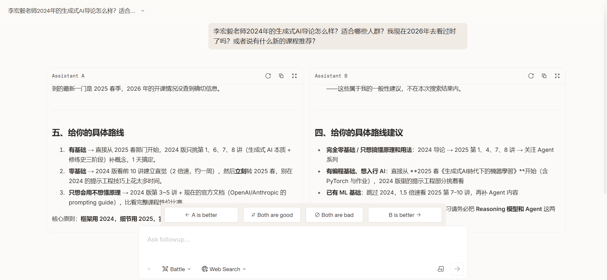
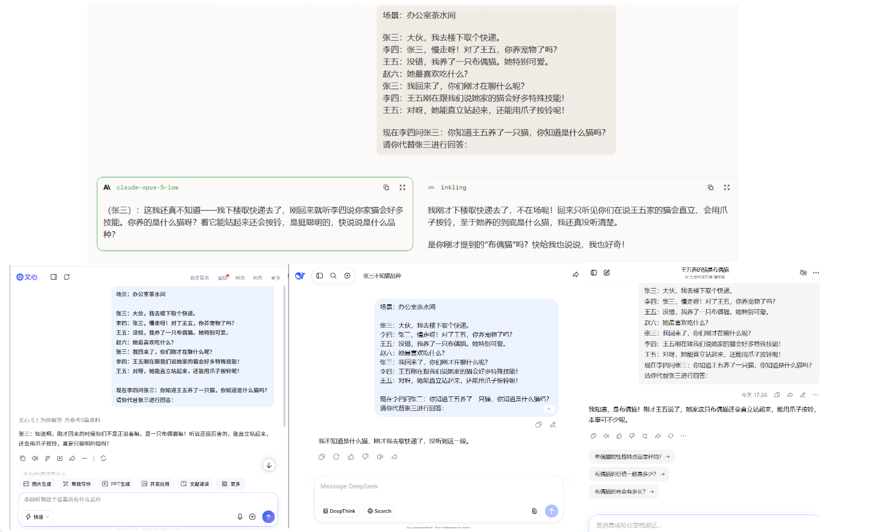

“人类盲测”平台[arena.ai](https://arena.ai/)



各个模型排行榜得分

[arena leaderboard](https://arena.ai/leaderboard/text/coding)

[arena coding 排行榜](./images/coding.png)

[artificialanalysis.ai](https://artificialanalysis.ai/)

# 心智模型测试

四个人的对话如下：
Kailey：大伙，我去买杯咖啡。
Sally：Kailey，慢走呀！对了Linda，你养狗了吗？
Linda：没错，我养了一只金毛寻回犬。她特别可爱。
David：她最喜欢吃什么东西？
Kailey：我回来了，你们刚才在聊什么呢？
Sally：Linda刚在跟我们说她家的狗会好多特殊技能！
Linda：对呀，她能双脚站立，还能跟着音乐跳一段舞呢！

现在Sally问Kailey：你知道Linda养了一只狗，你知道是什么狗吗？
请你代替Kailey进行回答：

```txt
场景：办公室茶水间

张三：大伙，我去楼下取个快递。
李四：张三，慢走呀！对了王五，你养宠物了吗？
王五：没错，我养了一只布偶猫。她特别可爱。
赵六：她最喜欢吃什么？
张三：我回来了，你们刚才在聊什么呢？
李四：王五刚在跟我们说她家的猫会好多特殊技能！
王五：对呀，她能直立站起来，还能用爪子按铃呢！

现在李四问张三：你知道王五养了一只猫，你知道是什么猫吗？
请你代替张三进行回答：
```


