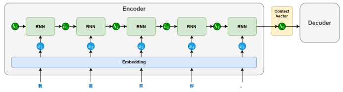
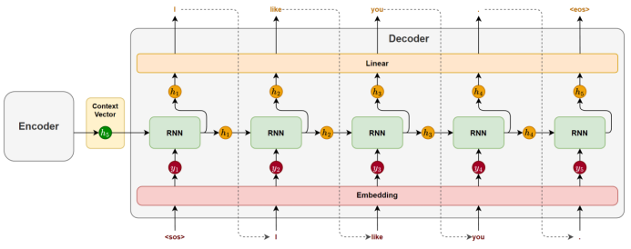

# Seq2Seq结构

> 以预测的视角来看seq2seq结构

encoder与decoder的中间联系是包含语义信息的最后一个时间步的隐藏状态。

decoder在生成开始时，循环神经网络以`上下文向量`作为`初始隐藏状态`，并接收一个特殊的起始标记 `<sos>`（start of sentence）作为`第一个时间步的输入`，用于预测第一个 token。

随后，在每一个时间步，模型都会根据`前一时刻的隐藏状态`和`上一步生成的 token`，预测当前的输出。这种“将前一步的输出作为下一步输入”的方式被称为`自回归生成（Autoregressive Generation）`，它确保了生成结果的连贯性。
生成过程会持续进行，直到模型生成了一个特殊的结束标记 `<eos>`（end of sentence），表示句子生成完成。

> 说明：起始标记和结束标记会在训练数据中显式添加，模型会在训练中学会何时开始、如何续写，以及何时结束，从而掌握完整的生成流程。

# 训练流程

# 预测流程
