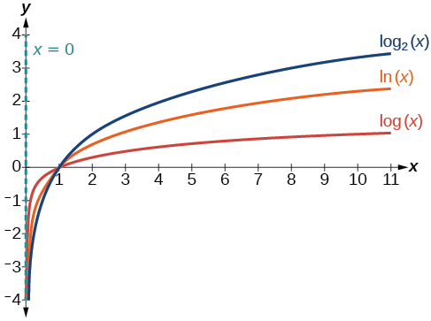
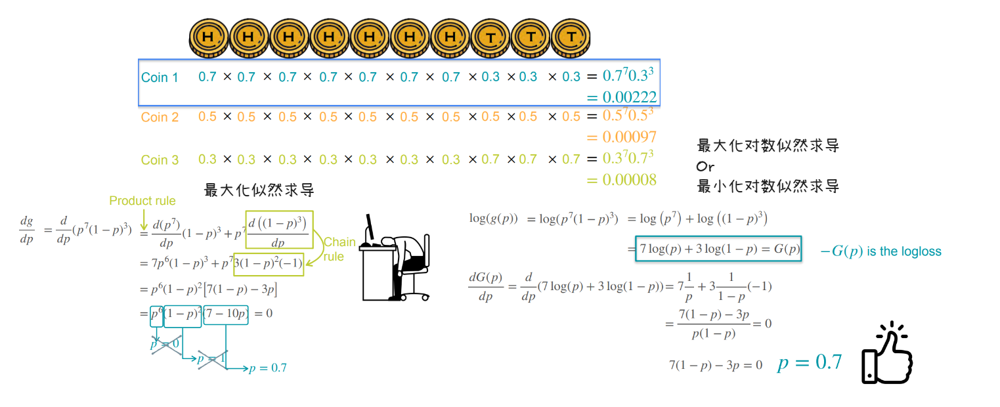
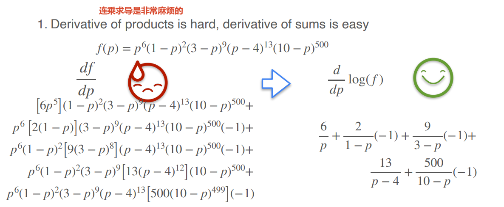

# Optimization优化

常用的损失优化两种方式

## square loss(平方损失优化)

**square loss（平方损失）= 把每个误差平方后加起来，是回归任务最常用的损失函数，对应高斯噪声下的最大似然估计。**

距离相加会因为正负抵消而失效；平方保证「所有误差都为正」，同时让函数光滑可导、有漂亮解。

### 为什么需要平方

计算三个电线杆的距离，计算公式为什么不能直接距离相加`(x-a) + (x-b) + (x-c)`

假设三个电线杆位置是 a=1, b=5, c=9。

目标函数：

$$
f(x) = (x - 1) + (x - 5) + (x - 9)
$$

化简：

$$
f(x) = 3x - 15
$$

这是一条直线，斜率恒为 3。

求最小值：

$$
f'(x) = 3
$$

导数永远等于 3，**永远不会等于 0**。

这意味着什么？**这个函数没有最小值！**

- $x$ 越小，$f(x)$ 越小
- $x \to -\infty$ 时，$f(x) \to -\infty$

也就是说，按上面的方案，房子应该建在**负无穷远**的地方。这显然荒谬。

**为什么距离相加会出问题？**

关键问题：**距离是带符号的。**

$$
(x - a) + (x - b) + (x - c)
$$

如果 $x$ 在 $a$ 左边，$x-a$ 是负数；如果 $x$ 在 $c$ 右边，$x-c$ 是正数。

正负会**互相抵消**，导致函数一路单调下降，没有最低点。

打个比方：

- 你欠 A 100 块，B 欠你 100 块 $\to$ 净债务是 0
- 但这不代表你真的「没有债务」了，只是正负抵消了

数学上也是一样：**符号抵消掩盖了真实的「距离总量」。**

### 几何直觉

把「连接电线的成本」转化成「三个正方形的总面积」，然后找让总面积最小的位置。

## Log loss(对数损失优化)

log loss = 把观测数据的概率取对数、取负号后得到的损失函数。最小化 log loss，等价于最大化观测数据出现的概率。它是分类问题里最常用的损失函数。

---

### QA扫盲

**1. 为什么可以加 log**

核心依据是一条数学性质：

> 如果 G(p) 是正数，那么「G(p) 最大」等价于「log(G(p)) 最大」。

因为 log 是一个单调递增函数：

- 输入越大 → 输出越大
- 输入越小 → 输出越小

所以：

$$
G(p_1) > G(p_2) \iff \log(G(p_1)) > \log(G(p_2))
$$

**最大值的位置完全相同。**

打个比方：

- 考试分数最高的人，也是「分数取平方后」最高的人
- 因为平方在正数范围内也是单调递增的

**log 和平方一样**，只是换了个「尺度」，**不改变谁最大谁最小**。

---

### 2. 为什么需要log

**原因 1：乘积变加法，求导更容易**

不加 log 时：

$$
G(p) = p^7(1 - p)^3
$$

求导要用乘积法则，而且如果有 100 个因子，要迭代 100 次，极其麻烦。

加了 log 后：

$$
\log G(p) = 7 \log(p) + 3 \log(1 - p)
$$

**乘积 → 加法**，求导只需逐项求导再相加。

而且：

$$
\frac{d}{dp} \log(p) = \frac{1}{p}
$$

非常简洁。

**原因 2：避免数值下溢**

如果 p = 0.5，1000 个概率相乘：

$$
0.5^{1000} \approx 10^{-301}
$$

这个数已经接近计算机能表示的最小正数（double 类型最小约 $10^{-308}$）。

如果 2000 个概率相乘（概率的值都是0到1之间），直接**下溢为 0**，计算机无法处理。

但取 log 后：

$$
\log(0.5^{1000}) = 1000 \cdot \log(0.5) \approx -693
$$

一个正常的负数，计算机轻松处理。

**这就是为什么机器学习里几乎从不直接连乘概率，而是取 log 后连加。**

1. 几乎从不直接最大化似然 $L(\theta) = \prod_i p_i$

2. 而是最大化对数似然 $\log L(\theta) = \sum_i \log p_i$

3. 或者最小化负对数似然 $-\sum_i \log p_i$

---

### 3. 关于负号

**一、先确认：不加负号，答案一样吗？**

一样。

不加负号：

$$
\max_p G(p) = \max_p \left[7 \log(p) + 3 \log(1 - p)\right]
$$

求导 = 0 → p = 0.7

加了负号：

$$
\min_p \left[-G(p)\right] = \min_p \left[-(7 \log(p) + 3 \log(1 - p))\right]
$$

求导 = 0 → p = 0.7

两者最优解完全相同。

所以说「不添加负数也能求解」——完全正确。

---

**二、那为什么还要加负号？**

**原因 1：机器学习统一用「最小化」**

这是行业惯例。

机器学习里几乎所有算法（梯度下降、SGD、Adam）都是最小化一个损失函数：

$$
\min_\theta L(\theta)
$$

而不是最大化。

所以当你手上有个「要最大化的东西」（比如似然、概率）时，标准做法是：

> 取负号，把它变成「要最小化的东西」。

这样就能套用所有现成的优化工具。

**负号 = 把「最大化」翻译成「最小化」的开关。**

**原因 2：loss 通常定义为非负数**

这是约定俗成。

「损失」(loss) 这个名字本身就暗示了：

- loss = 0 → 完美，没有损失
- loss 越大 → 模型越差

你很难跟别人解释「我的 loss 是 -0.357，这个模型很好」——听起来很别扭。

但如果你说「我的 loss 是 0.357，越小越好」——立刻清晰。

所以**为了语义上的自然**，loss 一般设计成非负，越小越好。

取负号后：

$$
\log(0.7) \approx -0.357
$$

$$
-\log(0.7) \approx +0.357
$$

正数，符合「loss 非负」的直觉。

### 📌对似然的理解

可以把「似然」理解成：

> 「参数有多像真的」
>
> 「哪个参数最像能产生这组数据」

**最大似然估计（MLE）= 找最像真的那个参数。**

- **概率**：描述**数据**出现的可能性
- **似然**：描述**参数**看起来「像不像」真的参数

「似然」强调的不是「概率大小」，而是「像不像」。

**概率（probability）**

> 已知参数，问数据出现的可能性。

比如：已知硬币正面概率 p = 0.7，问抛 10 次出现 7 正 3 反的概率是多少？

**方向：参数 → 数据**

**似然（likelihood）**

> 已知数据，问哪个参数最「像」是产生这组数据的参数。

比如：已经抛了 10 次，结果是 7 正 3 反，问「硬币正面概率 p 是多少，才最像能产生这组数据？」

**方向：数据 → 参数**
