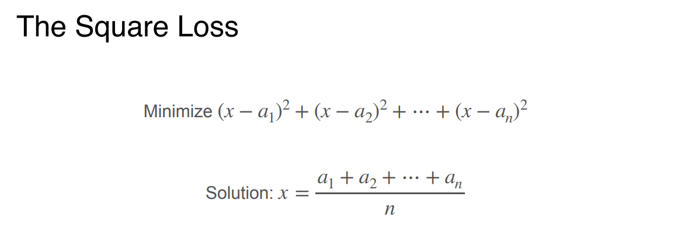
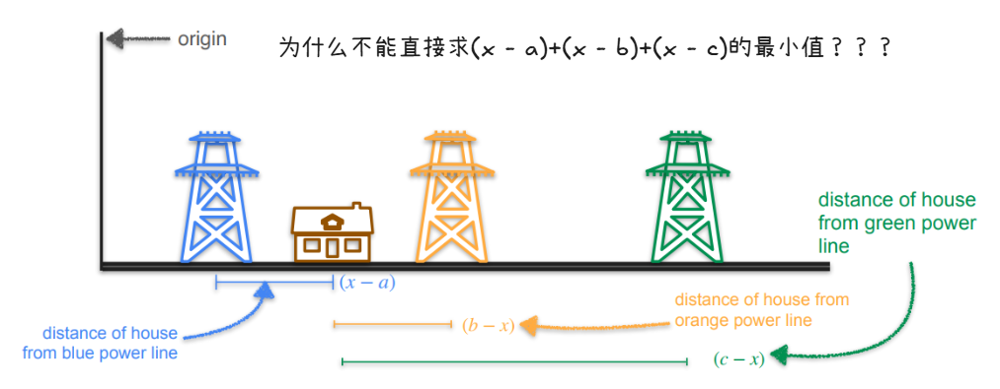
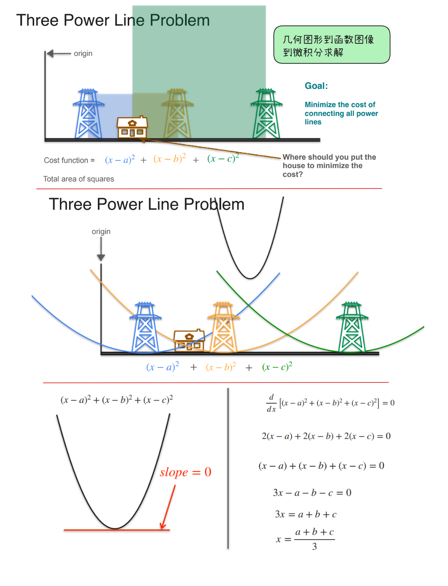

# square loss(平方损失)

**square loss（平方损失）= 把每个误差平方后加起来，是回归任务最常用的损失函数，对应高斯噪声下的最大似然估计。**

距离相加会因为正负抵消而失效；平方保证「所有误差都为正」，同时让函数光滑可导、有漂亮解。

## 为什么需要平方

计算三个电线杆的距离，计算公式为什么不能直接距离相加`(x-a) + (x-b) + (x-c)`

假设三个电线杆位置是 a=1, b=5, c=9。

目标函数：

$$
f(x) = (x - 1) + (x - 5) + (x - 9)
$$

化简：

$$
f(x) = 3x - 15
$$

这是一条直线，斜率恒为 3。

求最小值：

$$
f'(x) = 3
$$

导数永远等于 3，**永远不会等于 0**。

这意味着什么？**这个函数没有最小值！**

- $x$ 越小，$f(x)$ 越小
- $x \to -\infty$ 时，$f(x) \to -\infty$

也就是说，按上面的方案，房子应该建在**负无穷远**的地方。这显然荒谬。

**为什么距离相加会出问题？**

关键问题：**距离是带符号的。**

$$
(x - a) + (x - b) + (x - c)
$$

如果 $x$ 在 $a$ 左边，$x-a$ 是负数；如果 $x$ 在 $c$ 右边，$x-c$ 是正数。

正负会**互相抵消**，导致函数一路单调下降，没有最低点。

打个比方：

- 你欠 A 100 块，B 欠你 100 块 $\to$ 净债务是 0
- 但这不代表你真的「没有债务」了，只是正负抵消了

数学上也是一样：**符号抵消掩盖了真实的「距离总量」。**

## 几何直觉

把「连接电线的成本」转化成「三个正方形的总面积」，然后找让总面积最小的位置。

