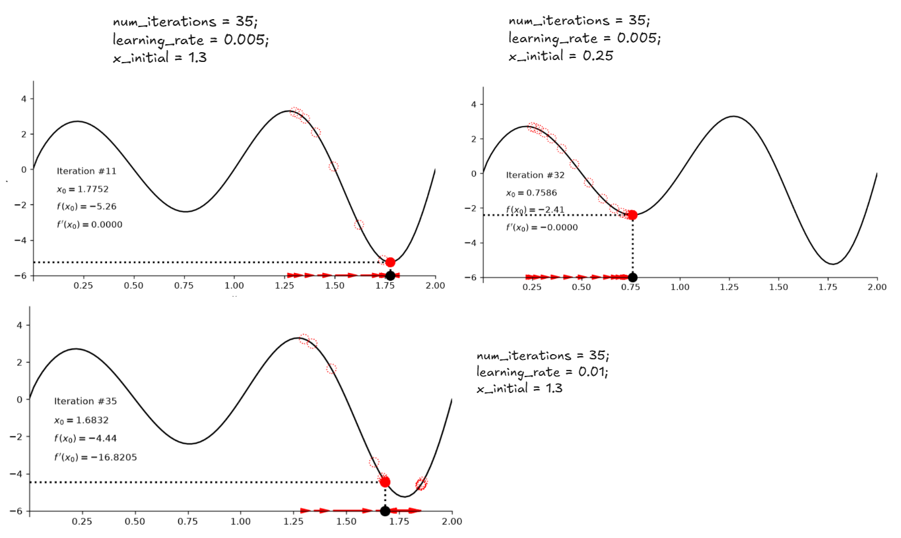

# 梯度下降的核心公式

$$
x_{k+1} = x_k - \alpha \cdot \frac{df}{dx}(x_k)
$$

| 符号                 | 含义                    |
| -------------------- | ----------------------- |
| $x_k$                | 第 k 步的位置           |
| $\alpha$             | 学习率（learning rate） |
| $\frac{df}{dx}(x_k)$ | 该点的导数（梯度）      |

**核心思想：**

> 沿着导数的反方向走，就能下山。

## 代码角度

收敛与否取决于三个参数的组合：

| 参数                     | 作用     | 太大                  | 太小               |
| ------------------------ | -------- | --------------------- | ------------------ |
| `learning_rate` $\alpha$ | 步长     | **发散**（跨过头）    | **磨蹭**（跑不完） |
| `num_iterations` n       | 步数上限 | 浪费计算              | 提前停，没到位     |
| `x_initial`              | 起点     | **陡峭区 → 梯度爆炸** | —                  |

```python
def gradient_descent(dfdx, x, learning_rate=0.1, num_iterations=100):
    for iteration in range(num_iterations):
        x = x - learning_rate * dfdx(x)
    return x
```

```python
# 超参设置
num_iterations = 25; learning_rate = 0.1; x_initial = 0.05
```

$x_0 = 0.05$ 处函数更陡，梯度绝对值达 18.95，第一步跳了 1.895 到 $x_1 = 1.945$。但因为没跳出定义域，梯度下降仍然能顺着坡滑回最小值点 0.5671。


# 收敛判据

工程细节 的 `while` 循环有三个停止条件：

```python
while (self.i <= self.n_it                    # ① 次数上限
       and abs(self.dfdx(x_0_new)) >= 0.00001 # ② 收敛判据
       and x_0_new >= self.x_range[0]):       # ③ 定义域护栏
```

- 条件② 是核心：$|f'(x)| < 10^{-5}$ 时认为到达最小值
- 条件① 保证不会死循环
- 条件③ 防止跑到 $\log(x)$ 定义域外变 NaN

**工程映射：这就是深度学习训练循环的原型——max_epochs + early stopping + NaN 保护。**

# 梯度下降的鲁棒性

梯度下降的优点：它不需要复杂的数学推导（比如解析求导、解方程），只需要：

- 会算导数
- 有个起点
- 迭代几次

就能"通用地"优化各种函数。**哪怕函数没有解析解、哪怕函数很复杂，这个方法照样能跑**——这就是它"鲁棒"的体现。

| robust 的表现  | 但前提是……              |
| -------------- | ----------------------- |
| 能优化各种函数 | 但可能卡在局部极小值    |
| 计算简单       | 但依赖学习率/起点的选择 |
| 实现容易       | 但可能发散或不收敛      |

所以它的"鲁棒"是相对解析法而言——解析法遇到无解方程就彻底没办法，梯度下降总能"试一试"。但试得好不好，另说。


