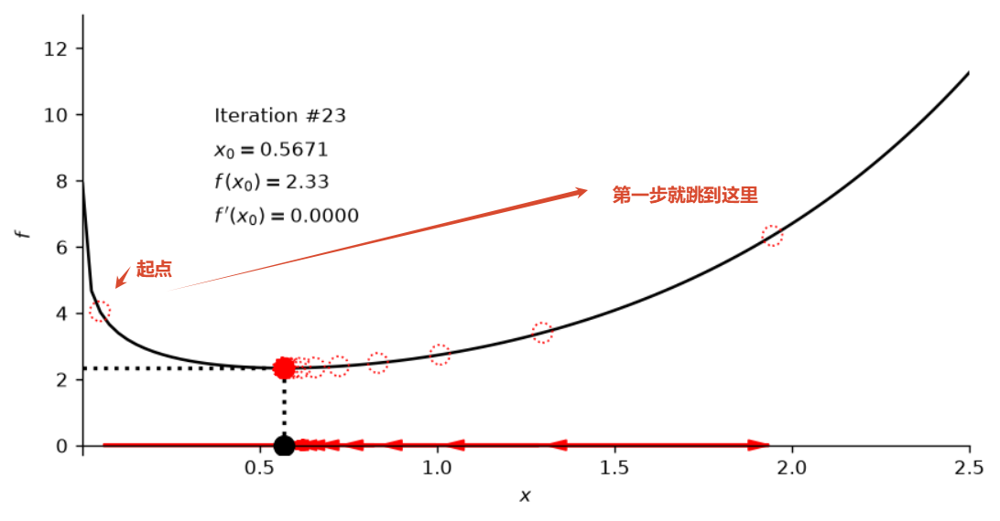

# 梯度下降的核心公式

$$
x_{k+1} = x_k - \alpha \cdot \frac{df}{dx}(x_k)
$$

| 符号                 | 含义                    |
| -------------------- | ----------------------- |
| $x_k$                | 第 k 步的位置           |
| $\alpha$             | 学习率（learning rate） |
| $\frac{df}{dx}(x_k)$ | 该点的导数（梯度）      |

**核心思想：**

> 沿着导数的反方向走，就能下山。

```python
# 超参设置
num_iterations = 25; learning_rate = 0.1; x_initial = 0.05
```

$x_0 = 0.05$ 处函数更陡，梯度绝对值达 18.95，第一步跳了 1.895 到 $x_1 = 1.945$。但因为没跳出定义域，梯度下降仍然能顺着坡滑回最小值点 0.5671。


