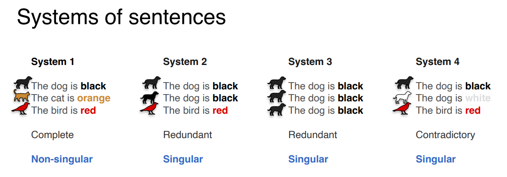
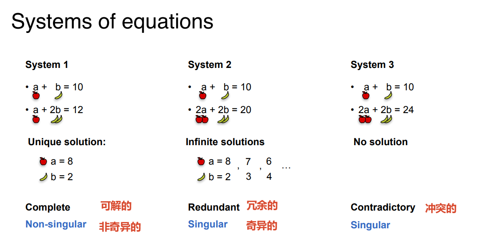
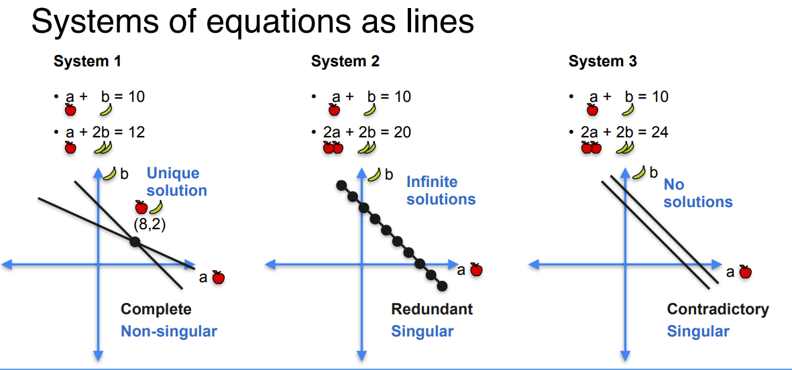
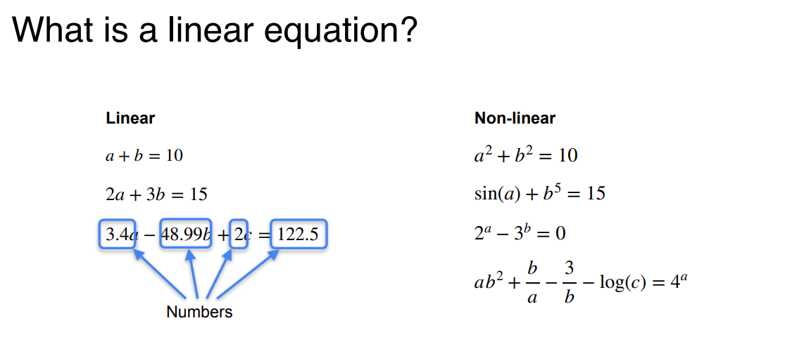
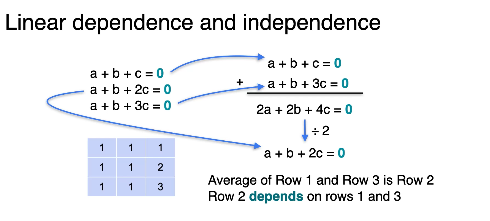

# 句子系统

句子带有描述信息，信息可分为完整的，冗余的，矛盾的，从而可归类到奇异的，非奇异的



# 矩阵的奇异性与非奇异性

1. 奇异方程组（singular system）与非奇异方程组（non-singular system）
2. 非奇异方程组有唯一解，而奇异方程组有无数解或者无解



可视化



# 线性问题的定

`线性`方程的本质是`变量的次数只能为1次`，并且变量之间不能互相`纠缠`



1. $a^2 + b^2 = 10$: 变量自乘（幂次不是1），破坏了线性。
2. $\sin(a) + b^5 = 15$: 变量在三角函数或高次幂里，破坏了线性。
3. $2^a - 3^b = 0$: 变量在指数位置，破坏了线性。
4. $ab^2 + \frac{b}{a} - \log(c) = 4^a$: 变量与变量相乘 ($ab^2$)、相除 ($b/a$)、取对数、作为指数——全是非线性操作。

只要变量之间只做“乘以固定系数后相加”，就是线性。一旦出现“变量乘变量”、“变量的幂”、“变量的函数（sin, log, 指数）”，就是非线性。

> **补充**:
> 在深度学习（神经网络）中，激活函数（如 ReLU, Sigmoid）引入的就是**非线性**，因为如果神经网络全是线性的，那堆叠再多的层也只是一个线性变换，根本解决不了复杂问题（比如识别图片）。

# 矩阵是否奇异

**如何判断矩阵是否奇异？**

1. **计算行列式**：若 $\det(A) = 0$，则矩阵奇异。
2. **观察行（或列）之间的关系**：若存在某一行是另一行的倍数，或者某一行可以由其他行线性组合得到（线性相关），则矩阵奇异。

> **几何直觉**：奇异矩阵在高维空间中发生了“降维”（比如三维被压扁成平面或线），丢失了信息。



**在机器学习中的意义：**

- 奇异矩阵意味着**特征（数据）冗余**。比如你收集了 3 条数据，但实际只有 2 条有效信息，矩阵不满秩。
- 此时矩阵**不可逆**（因为分母为 0），直接求解 $Ax = b$ 会崩溃。
- **解决办法**：不能直接求逆，而应使用 **伪逆（Moore-Penrose 伪逆）** 或 **岭回归（Ridge Regression）**，通过引入正则化项使得矩阵可逆，从而求解。

---

```txt
线性方程组（苹果、香蕉价格问题）

矩阵的奇异性（Singular）与非奇异性（Non-singular）

行与行的线性相关（Linear dependence）与独立（Independence）

行列式（Determinant）及其与奇异性的关系

从 2D（直线）到 3D（平面）的几何直觉
```
