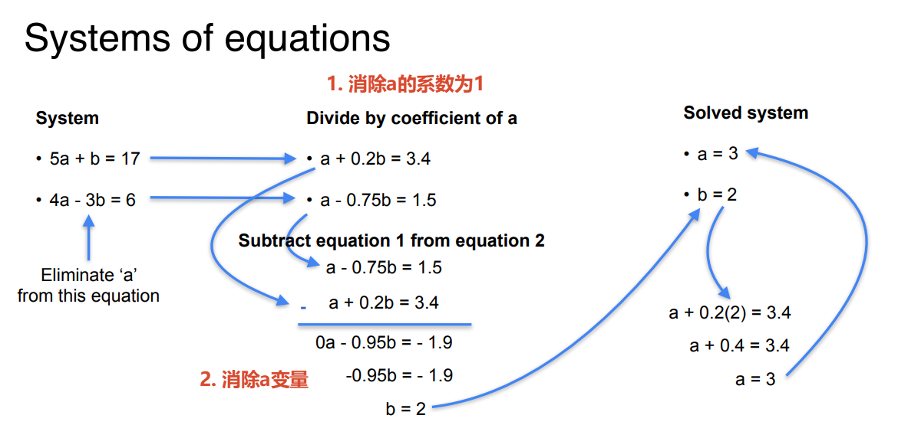
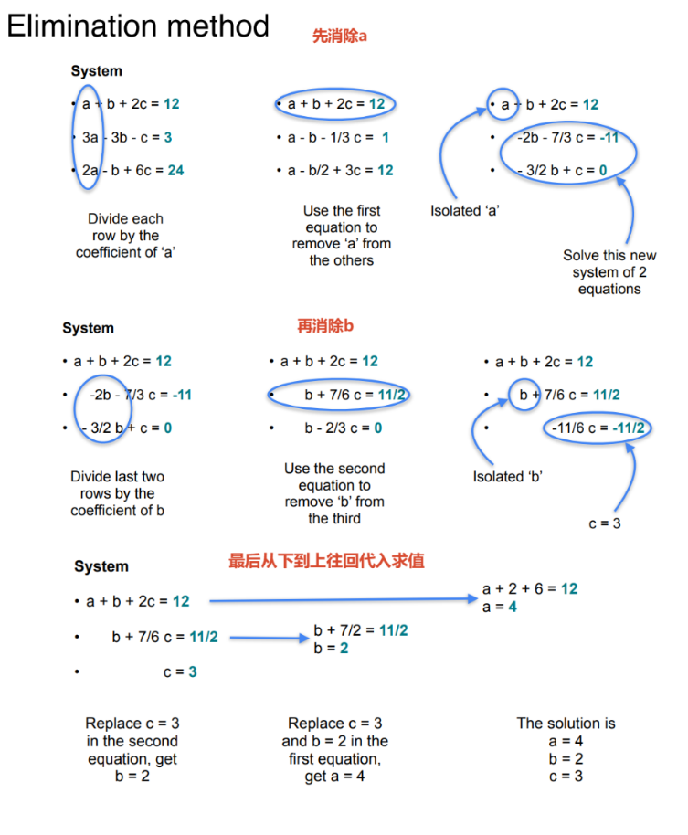
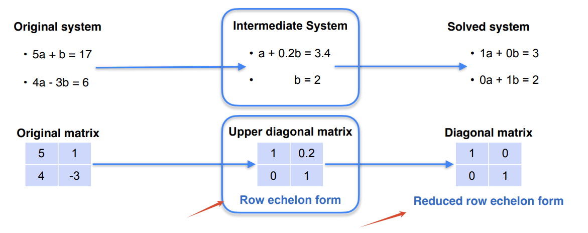
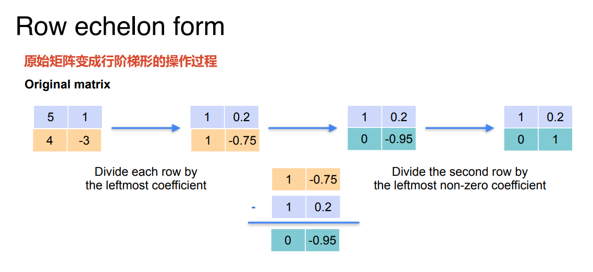
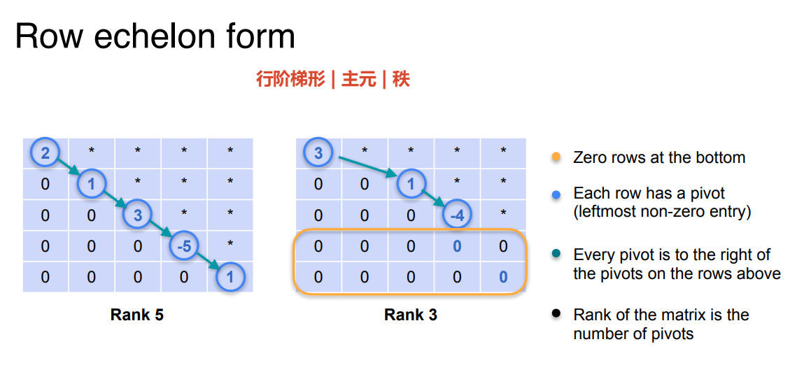
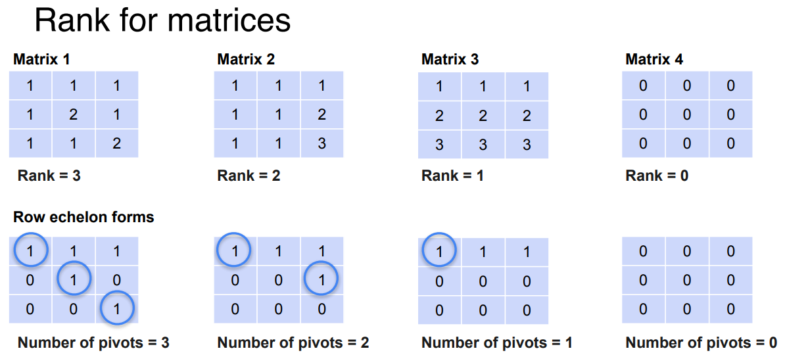
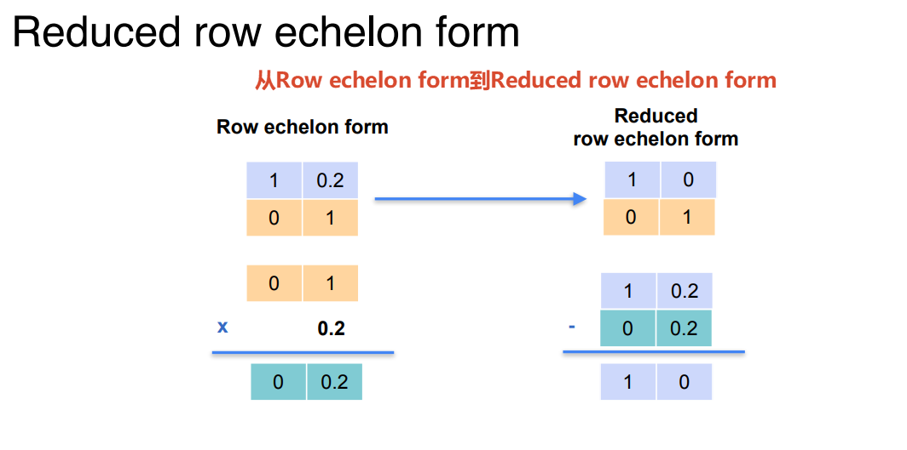
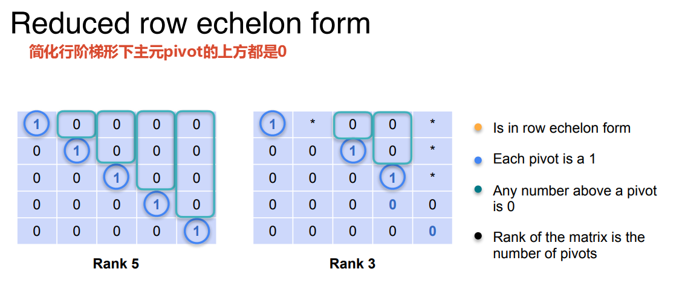
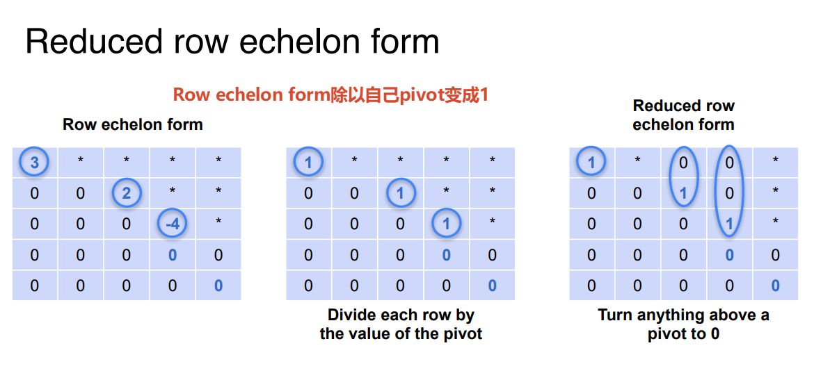
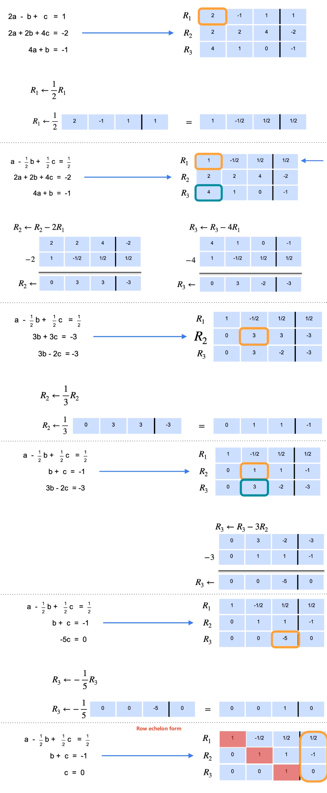

# Solving systems of equations(解决线性方程组)

## Elimination(消除法)

非奇异线性方程组求解



多个变量的消除法



## Matrix row reduction

Matrix row reduction（矩阵行化简） 和 Gaussian elimination（高斯消元法） 在大多数情况下是同义词，可以互换使用。两者指的都是用行操作把矩阵化简为行阶梯形（Row Echelon Form） 的过程。

- Echelon /ˈeʃ.ə.lɒn/ 梯队 / 阶梯 在数学中特指阶梯形

更多操作名称中文目标操作**Gaussian elimination**高斯消元法将矩阵化为**行阶梯形**通过行操作消去主元下方的元素**Gauss-Jordan elimination**高斯-约当消元法将矩阵化为**简化行阶梯形**继续消去主元上方的元素，使主元为 1**Matrix row reduction**矩阵行化简泛指上述**任何一个**过程三种行操作的统称

| 名称                         | 中文            | 目标                       | 操作                               |
| :--------------------------- | :-------------- | :------------------------- | :--------------------------------- |
| **Gaussian elimination**     | 高斯消元法      | 将矩阵化为**行阶梯形**     | 通过行操作消去主元下方的元素       |
| **Gauss-Jordan elimination** | 高斯-约当消元法 | 将矩阵化为**简化行阶梯形** | 继续消去主元上方的元素，使主元为 1 |
| **Matrix row reduction**     | 矩阵行化简      | 泛指上述**任何一个**过程   | 三种行操作的统称                   |

```txt
Matrix row reduction（矩阵行化简）
├── Gaussian elimination（高斯消元法）
│   └── 目标：Row Echelon Form（行阶梯形）
│       └── 主元下方全为 0
│
└── Gauss-Jordan elimination（高斯-约当消元法）
    └── 目标：Reduced Row Echelon Form（简化行阶梯形）
        └── 主元为 1，主元上方和下方全为 0
```



假设我们有一个矩阵：

$$
\begin{bmatrix}
5 & 1 & 17 \\
4 & -3 & 6
\end{bmatrix}
$$

> 步骤 1: Gaussian Elimination (高斯消元法)

目标：化为行阶梯形

$$
\begin{bmatrix}
1 & 0.2 & 3.4 \\
0 & 1 & 2
\end{bmatrix}
$$

✔ 已经可以回代求解了。

> 步骤 2: Gauss-Jordan Elimination (高斯-约当消元法)

目标：继续化为简化行阶梯形

$$
\begin{bmatrix}
1 & 0 & 3 \\
0 & 1 & 2
\end{bmatrix}
$$

✔ 解直接读出来：$a = 3$, $b = 2$

# Rank of Matrix

**秩 = 矩阵中"有用信息"的条数**

你可以把矩阵想象成一个**信息记录表**，每一行就是一条"信息"。但有些信息是**重复的**，有些信息是**废话**，有些信息是**真正有用的**。

**秩，就是"真正有用的信息有几条"。**

---

## Rank秩与Determinant行列式

**行列式只能回答“是不是非奇异”**，而**秩能回答“有多奇异、少了几条信息、空间被压扁了几维”**。
Rank秩与Determinat行列式的对比

| 问题                       | 行列式                            | 秩                                   |
| -------------------------- | --------------------------------- | ------------------------------------ |
| 能算在什么矩阵上？         | 只能是方阵（行数 = 列数）         | 任意矩阵都可以算（长方形也行）       |
| 输出是什么？               | 一个数（标量）                    | 一个整数（0, 1, 2, ...）             |
| 能判断奇异吗？             | ✅ 能，$\det(A) = 0$ 就是奇异     | ✅ 能，$\text{rank}(A) < n$ 就是奇异 |
| 能区分“无解”和“无穷解”吗？ | ❌ 不能，行列式只知道“没有唯一解” | ✅ 能，结合增广矩阵可以区分          |
| 能表示信息量吗？           | ❌ 不能                           | ✅ 能，秩就是“有用信息的条数”        |
| 能用来压缩数据吗？         | ❌ 不能                           | ✅ 能（低秩近似 → SVD / PCA）        |

## Row echelon form(行阶梯形)

1. 矩阵的秩（Rank）= 行阶梯形中"主元（pivot）"的个数 = 非零行的个数。
2. 在简化行阶梯形（Reduced Row Echelon Form）中，秩 = 对角线上 1 的个数。

> pivot /ˈpɪv.ət/ 主元 / 枢轴 指矩阵在行阶梯形中，每一行第一个非零元素。在行化简过程中，主元是该行中从左到右第一个非零的数，其所在列称为主元列。主元的个数等于矩阵的秩（Rank），也是判断矩阵是否奇异的重要依据。在简化行阶梯形中，每个主元都会被化为 1，并且主元所在列的其他元素都化为 0。



行阶梯形与主元与秩的关系



秩与pivot主元的关系



## Reduced Row echelon form(简化行阶梯形)

从下往上操作，可以将Row echelon form变化成Reduced row echelon form







# 高斯消元法Gaussion Elimination

先一行一行找主元pivot,从上到下，变成Row echelon form行阶梯形式。



# 小结

1. 从上往下变成Row echelon form
2. 从下往上变成Reduced Row echelon form
3. 结合增广矩阵(Augmented matrix)就能求得未知数
