# Determinants In-depth(深入理解行列式)

行列式不是"一堆数字乘来乘去"——它是线性变换对空间的"缩放指示器"。绝对值告诉你放大多少倍，符号告诉你有没有翻面，0 告诉你空间被压扁了。

## Singularity and rank of linear transformations

> 线性变换的奇异性与秩

一个线性变换(矩阵)是奇异还是非奇异，取决于它把整个平面映射到了多大的空间——是完整的平面，还是一条线，还是一个点。而这个空间的维度，就是矩阵的秩。

1. 非奇异变换 = 平面 → 平面（满秩）
2. 奇异变换 = 平面 → 直线或点（秩亏）
3. 秩 = 变换后空间的维度。

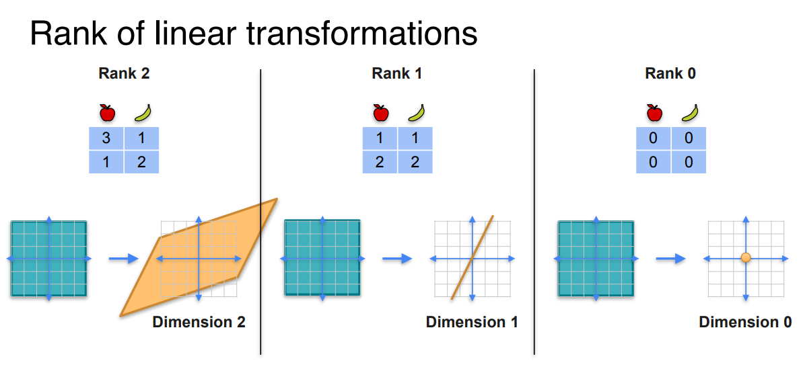

## Determinant as area

行列式的绝对值 = 一个图形经过线性变换后的面积缩放倍数。当这个面积为 0 时，变换把空间压扁了，矩阵就是奇异的。`几何缩放因子`

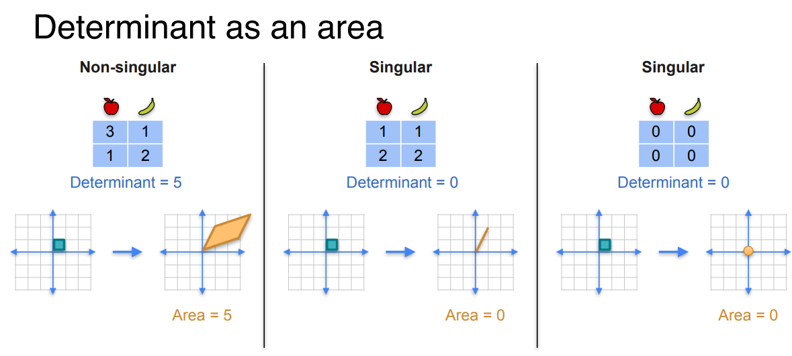

## Determinant of a product

行列式的乘积性质

$$
\det(AB) = \det(A) \det(B)
$$

矩阵乘积的行列式 = 各自行列式的乘积，因为面积缩放是连续的、可乘的——先缩放 A 倍，再缩放 B 倍，总共缩放 A×B 倍。

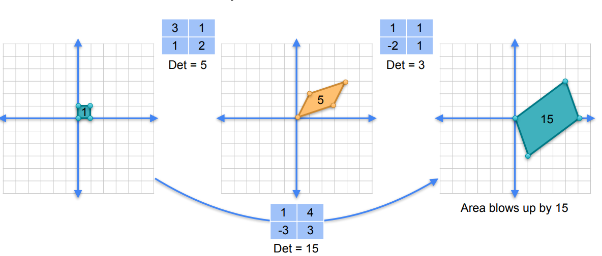

面积缩放倍数是可乘的。奇异矩阵就是面积缩放到 0 的矩阵，所以乘以任何矩阵，面积还是 0。

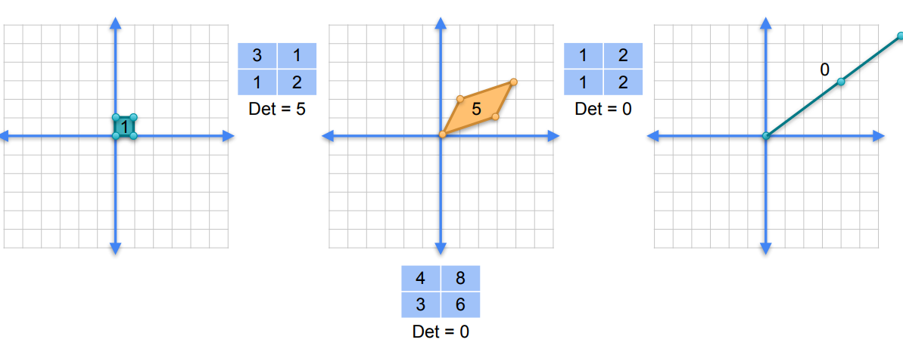

## Determinant of inverse

逆矩阵的行列式

$$
\det(A^{-1}) = \frac{1}{\det(A)}
$$

"逆矩阵的行列式，等于原矩阵行列式的倒数。这是因为 $A \cdot A^{-1} = I$，两边取行列式，就得到了这个关系。"

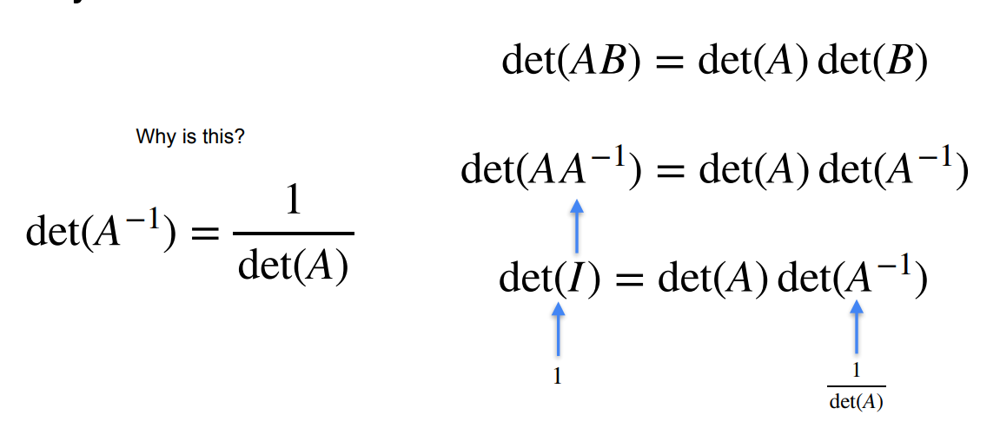

# Eigenvalues and Eigenvectors

**特征向量和特征值不是“随便选的”，它们是 A 的内在属性。不同的 A 有不同的特征向量和特征值。特征向量告诉我们“哪些方向在 A 的变换下不转方向”，特征值告诉我们“在这些方向上被放大了多少倍”**

- **Eigenvalues** /ˈaɪ.ɡɒnˌvæl.juːz/ 特征值：指在线性变换中，某些特定方向上的向量在变换后只被缩放（拉伸或压缩），而不改变方向。这个缩放因子就是特征值，通常用希腊字母 $\lambda$ 表示。满足方程 $Av = \lambda v$。

- **Eigenvectors** /ˈaɪ.ɡɒnˌveɪk.tɔːz/ 特征向量：指在线性变换中，方向保持不变（或反向）的向量。它们对应的缩放倍数就是特征值。每个特征值都对应一个特征向量方向。

- **Eigenbasis** /ˈaɪ.ɡɒnˌbeɪ.sɪs/ 特征基：指由特征向量构成的一组基。如果一个矩阵的特征向量能张成整个空间，那么这组特征向量就是该空间的一组基，称为特征基。在特征基下，矩阵的线性变换变得非常简单——它只是在各个坐标轴上做独立的缩放。这也是为什么在机器学习的 PCA 中，我们总是寻找特征基来降维。

## Basis

基是一组向量，它们的方向足够‘独立’，让你能通过组合它们到达空间中的任何一点。如果它们方向重复（共线），就无法覆盖整个空间，就不是基。

其中：笛卡尔基集合是被称为是标准基

> 基 = 一组方向，让你能通过组合它们到达空间中的任何点。只要两个方向不共线，它们就是基。

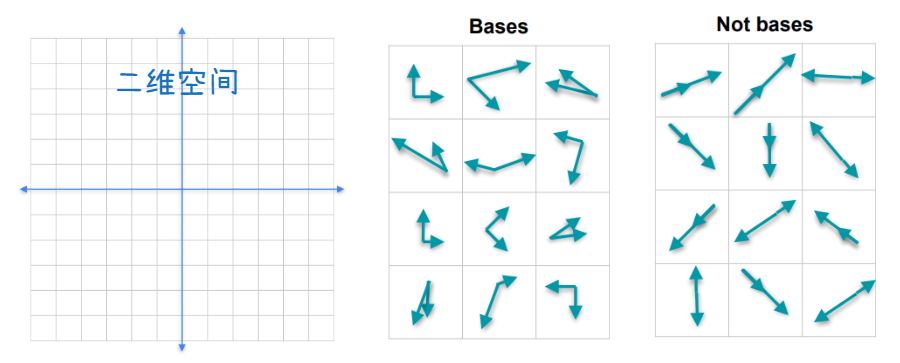

### 基的作用

**第一层：不同的基 = 不同的"观察角度"**

想象你在描述一个点：

- **标准基**：用 $(1,0)$ 和 $(0,1)$ 来描述 → 坐标是 $(3,2)$
- **另一个基**：用 $(1,1)$ 和 $(-1,1)$ 来描述 → 同一个点的坐标可能是 $(2.5,0.5)$

同一个点，在不同基下有不同的"坐标"。

就像你用不同的语言描述同一个事实，语言不同，表达不同，但事实不变。

---

**第二层：好的基让问题变得简单**

有些基会让矩阵变得特别简洁。

| 普通基                        | 特征基                               |
| ----------------------------- | ------------------------------------ |
| 矩阵 $A$ 可能是满的，计算复杂 | 矩阵在特征基下变成对角矩阵，计算极简 |
| 变换方向混杂                  | 变换方向独立，每个方向只做缩放       |

比如特征向量构成的基，矩阵就变成了对角矩阵：

$$
A = PDP^{-1}
$$

这是整个线性代数最重要的分解之一——**对角化**。它把复杂的变换分解成"换基 → 简单缩放 → 换回来"。

---

**第三层：选择合适的基 = 降维、压缩、简化**

在机器学习中，PCA（主成分分析）做的就是这件事：

1. 找一组新的基，让数据在这些基的方向上方差最大
2. 去掉方差小的方向 → 降维
3. 用更少的基表示数据 → 压缩

图像压缩、特征提取、推荐系统，背后都是这个逻辑。

## Span张成

> “张成”是“张开、生成”的意思，不是人名。😂

如果说`基`是静态的坐标系，那`张成`就是动态的`能走到的范围`。张成(span 可以看成是动词)是创建子空间(subspace 可以看成是名词)的机制

**张成（Span）是一组向量通过组合能到达的所有点的集合。基（Basis）就是‘恰好够用、一个不多、一个不少’的张成集**

一组向量的张成 = 你只能沿着这些向量的方向走，能到达的所有位置的集合。

> 张成是‘能走到哪’，基是`刚好走到那的最少方向`。基 = 张成 + 线性无关。

## Eigenbasis

从上面知道可以有很多基，但是有些基比其他基更有用，能让复杂的变换变成“纯缩放”，叫做特征基

**特征基是一组特殊的基，它让线性变换变得极其简单——每个方向独立缩放，没有旋转，没有混合**

下图中:

1. 在标准基下，变换看起来是“混合的”——竖直向量被“掰歪”了。
2. 在特征基下，两个方向都只被缩放，没有旋转！

   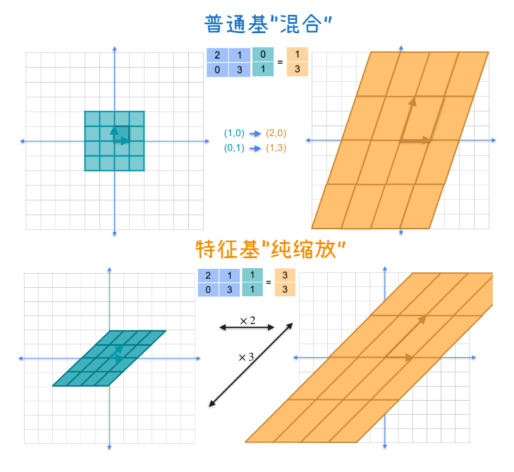

特征基是一组特殊的方向。在这个基下，线性变换只是对每个方向做独立的缩放，互不干扰。这些方向叫**特征向量**，缩放倍数叫**特征值**

### 价值：特征基让变换(计算)变得简单

在标准基下，对任意点 $(x, y)$，`变换是混合的——两个分量相互影响`。

在特征基下：

- 沿 $v_1$ 方向的分量 $\rightarrow$ 乘以 2
- 沿 $v_2$ 方向的分量 $\rightarrow$ 乘以 3
- 两个方向**完全独立**，互不干扰

这就是特征基的价值：**把复杂的矩阵乘法，变成每个方向的独立缩放。**

---

| 概念                     | 它们共同的目标                   |
| :----------------------- | :------------------------------- |
| 基（Basis）              | 选一个“好视角”来看空间           |
| 特征基（Eigenbasis）     | 选一个“让变换变成纯缩放”的好视角 |
| 特征值（Eigenvalues）    | 每个方向上“缩放了多大”           |
| 特征向量（Eigenvectors） | 哪些方向“不转，只缩放”           |

> **整个线性代数，本质上是在学习如何“选一个好坐标系”，让复杂的问题变得简单。**

## eigenvalues and eigenvectors

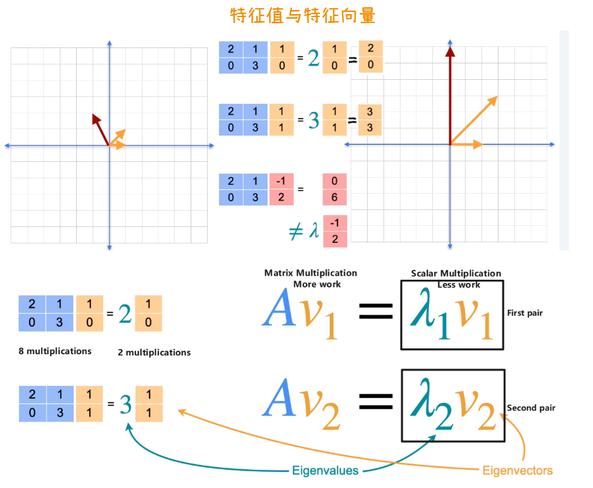

> 利用特征向量和特征值：计算(-1,2)也就是红色的，经过变换后过程。相比使用矩阵进行多次乘法，这里直接使用标量乘法

**步骤1：把它表示成特征基的组合**

特征基是：

$$
v_1 = (1, 0), \quad v_2 = (1, 1)
$$

找到：

$$
(-1, 2) = -3 \cdot (1, 0) + 2 \cdot (1, 1)
$$

---

**步骤2：把矩阵乘进去**

$$
A(-1, 2) = A(-3v_1 + 2v_2) = -3Av_1 + 2Av_2
$$

---

**步骤3：用特征向量简化**

因为 $v_1, v_2$ 是特征向量：

$$
Av_1 = 2v_1, \quad Av_2 = 3v_2
$$

所以：

$$
A(-1, 2) = -3 \cdot 2v_1 + 2 \cdot 3v_2 = -6v_1 + 6v_2
$$

---

**步骤4：换回标准基**

$$
-6(1, 0) + 6(1, 1) = (0, 6)
$$

全程没有做矩阵乘法！全部是标量乘法！

## 计算出特征值和特征向量

特征值是通过解 $\det(A - \lambda I) = 0$ 这个方程找到的。这个方程展开后是一个多项式（特征多项式），它的根就是特征值。(齐次方程，什么非零解推导出det为0，大概就是那么个意思，然后推导得出这个公式)

在得到特征值之后，就可以代入计算特征向量。

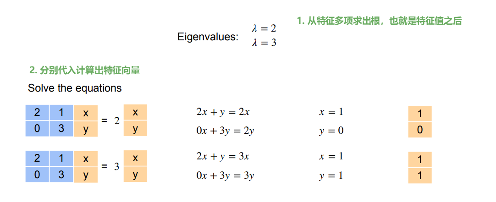

## 特征向量的个数

特征值的重复次数，不一定等于特征向量的数量。有些矩阵虽然特征值重复，但仍然能找到足够多的特征向量；有些则找不到

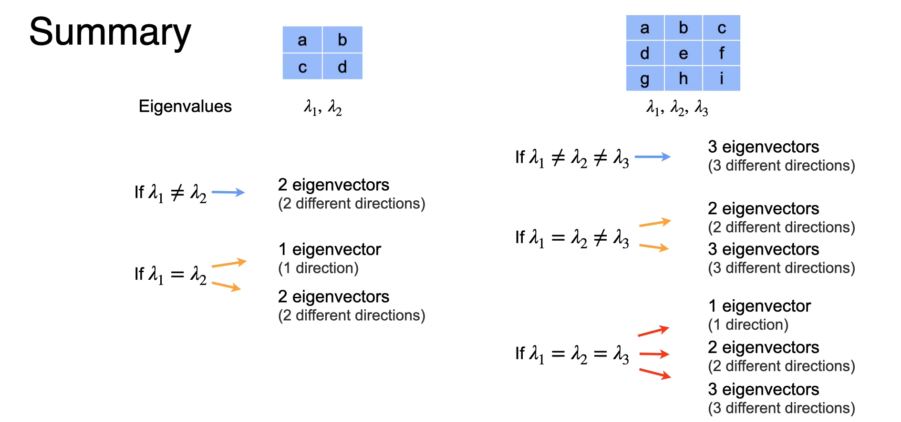

如果找不到足够多的特征向量（无法张成整个空间），那么：

- ❌ 不能把所有向量都简化成"纯标量乘法"
- ✅ 只能对少数特殊方向用标量乘法
- ✅ 大部分向量只能老老实实做矩阵乘法（但可以通过其他方法降维）

这样的矩阵叫 **"不可对角化矩阵"**。

# PCA

简单删列（特征选择）会丢失有用信息。PCA 的目标就是“瘦身”(降维)的同时，尽可能保住信息。

## Dimensionality Reduction

降维(减少列数)。 降维就是通过“投影”把高维数据压到低维空间；投影在数学上就是“原数据”乘以“选定的单位方向向量”。

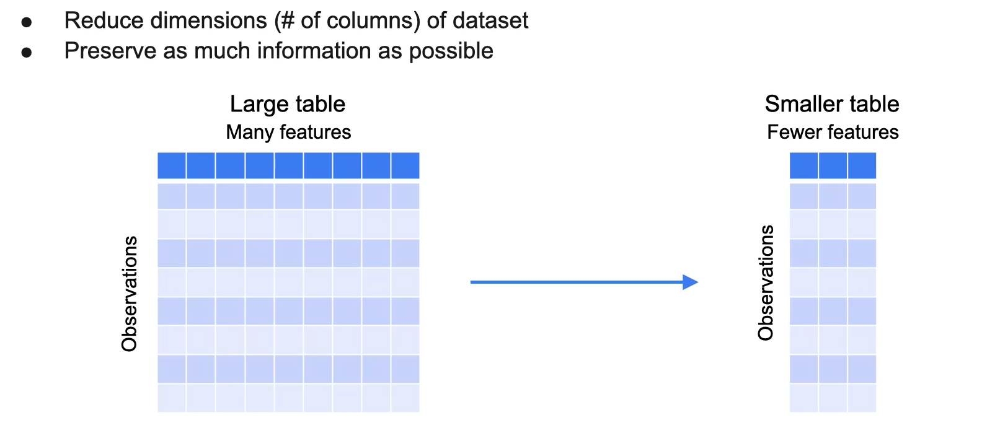

## Project投影

投影的本质是：找到一个数字（标量），用来表示这个点在直线 $y = x$ 上的"位置"。

想象直线 $y = x$ 是一条数轴，原点在 (0,0)。我们想知道每个点垂直投射到这条数轴后，它所对应的刻度值是多少。

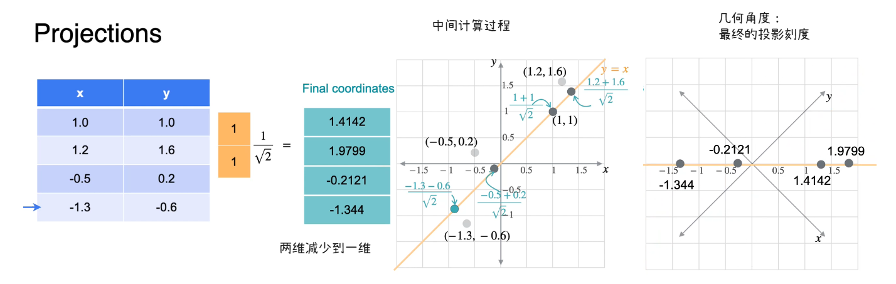

**第一步：点积的几何含义**

对于两个向量 $\mathbf{a}$ 和 $\mathbf{b}$，它们的点积定义为：

$$
\mathbf{a} \cdot \mathbf{b} = \|\mathbf{a}\| \cdot \|\mathbf{b}\| \cdot \cos \theta
$$

其中 $\theta$ 是 $\mathbf{a}$ 和 $\mathbf{b}$ 之间的夹角。

这个公式告诉我们：

- **点积**是一个向量的长度 $\times$ 另一个向量在它方向上的投影长度

---

**让我们把这句话拆开来看：**

假设 $\mathbf{b}$ 是单位向量（即 $\|\mathbf{b}\| = 1$），那么：

$$
\mathbf{a} \cdot \mathbf{b} = \|\mathbf{a}\| \cdot \cos \theta
$$

而 $\|\mathbf{a}\| \cdot \cos \theta$ 正是 $\mathbf{a}$ 在 $\mathbf{b}$ 方向上的投影长度！

这就是点积最原始的意义：点积就是在测量一个向量在另一个向量方向上的"影子"有多长。

---

**第二步：应用到你的例子**

现在我们把 $\mathbf{a} = (x, y)$，$\mathbf{b} = (1, 1)$。

但是注意，$(1, 1)$ 不是单位向量，它的长度是 $\sqrt{2}$。

所以：

$$
(x, y) \cdot (1, 1) = \|(x, y)\| \cdot \sqrt{2} \cdot \cos \theta
$$

这个结果包含了"拉伸"——因为 $(1, 1)$ 的长度是 $\sqrt{2}$，所以投影结果被放大了 $\sqrt{2}$ 倍。

**为了去掉这个拉伸**，我们除以 $\sqrt{2}$：

$$
\frac{(x, y) \cdot (1, 1)}{\sqrt{2}} = \|(x, y)\| \cdot \cos \theta
$$

右边正是原向量在直线方向上的真实投影长度。

---

**第三步：把公式拆成坐标形式，看得更清楚**

$$
\frac{(x, y) \cdot (1, 1)}{\sqrt{2}} = \frac{x \cdot 1 + y \cdot 1}{\sqrt{2}} = \frac{x + y}{\sqrt{2}}
$$

这就是PPT里写的公式。

---

**第四步：用"三角形"理解（最适合直觉）**

想象你在平面上有一个点 $P(x, y)$，你想知道它垂直投影到直线 $y = x$ 上的位置。

从 $P$ 向直线作垂线，垂足就是投影点。

这个投影点的位置，可以用一个标量 $t$ 表示：从原点沿直线走多远。

这个 $t$ 的计算公式就是：

$$
t = \frac{x + y}{\sqrt{2}}
$$

你可以这样理解：

- $x + y$ 是沿着直线方向的"粗略位移"（因为直线方向是 $(1, 1)$，两个坐标同等重要）
- 除以 $\sqrt{2}$ 是为了把"斜着走"的距离还原成"沿着直线实际走的距离"

---

**终极结论（帮你把握空间环）**

点积的本质就是在测量"一个向量在另一个向量方向上的影子长度"。

当你把一个向量换成单位向量时，点积结果恰好等于投影长度。

这就是为什么点积能用来做投影——因为点积天生就是为"测量投影"而设计的。

---

**一句话记住**

- **点积 = 投影的数乘式。**

---

### 向量点积与矩阵乘法的区别

**1. 点积的"原生形态"：只针对两个向量**

首先，你的直觉是对的。**点积 (Dot Product)** 最原始、最严格的定义，就是针对两个长度相同的向量。

- 向量 $a = [a_1, a_2, \dots, a_n]$
- 向量 $b = [b_1, b_2, \dots, b_n]$
- 点积 $a \cdot b = a_1 b_1 + a_2 b_2 + \dots + a_n b_n$

**几何意义**：就是一个向量在另一个向量方向上的投影长度（当另一个向量是单位向量时）。

---

**2. "矩阵的点积"？其实我们叫"矩阵乘法"**

在数学上，不叫"矩阵的点积"，而是叫"矩阵乘法 (Matrix Multiplication)"。

但是！**矩阵乘法在底层，就是由无数个"向量的点积"组成的。**

---

# Discrete Dynamical System

**discrete dynamical system** /dɪˈskriːt/ 离散动力系统 / 离散动态系统：指在离散时间步长（如 $t = 0, 1, 2, \dots$）上，系统的状态按照固定的规则（通常是线性变换）从一个状态更新到下一个状态的数学模型。在实验中，网页导航模型就是一个离散动力系统：

$$
X_t = P \cdot X_{t-1}
$$

其中：

- $X_t$：时间 $t$ 时浏览器在各页面上的概率分布（状态向量）
- $P$：转移概率矩阵（每列之和为 1 的马尔可夫矩阵）
- 系统从初始状态 $X_0$ 出发，每次导航都乘以矩阵 $P$

经过很多步（$m \to \infty$）之后，状态向量会收敛到满足 $PX = X$ 的 **稳态分布**，而这个稳态分布正好是矩阵 $P$ 对应特征值 1 的特征向量。这正是 PageRank 算法的核心思想：**用特征向量代替无限次矩阵乘法**。[Lab 2 Application of Eigenvalues and Eigenvectors Webpage navigation model and PCA](./code/Lab_2_Application_of_Eigenvalues_and_Eigenvectors-Webpage-navigation-model-and-PCA.ipynb)

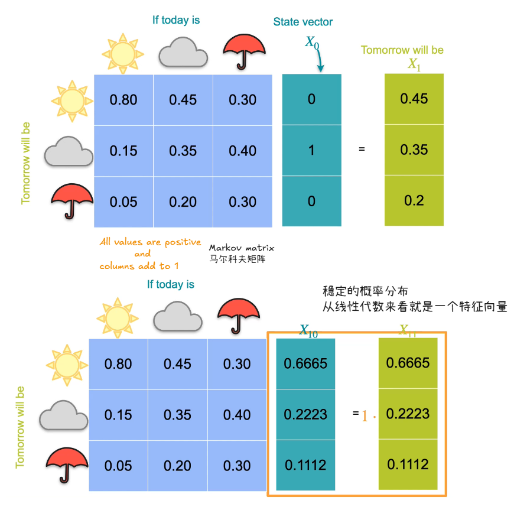
