# Probability Distributions

| 阶段           | 核心内容                                    | 一句话概括           |
| -------------- | ------------------------------------------- | -------------------- |
| ① 随机变量     | Random Variable、离散 vs 连续、随机 vs 确定 | 把"事件"升级成"数值" |
| ② 离散分布     | PMF、Binomial、Bernoulli                    | 可数结果的概率模型   |
| ③ 连续分布     | PDF、CDF、Uniform                           | 不可数结果的概率模型 |
| ④ 三大连续分布 | Normal、Standard Normal、Chi-square         | ML 里最常用的三个    |
| ⑤ 采样         | Sampling from a Distribution                | 怎么从分布里"抽"数据 |

# Random Variable

**Random variables allow you to model the whole experiment at once.**（随机变量让你能一次性建模整个实验。）

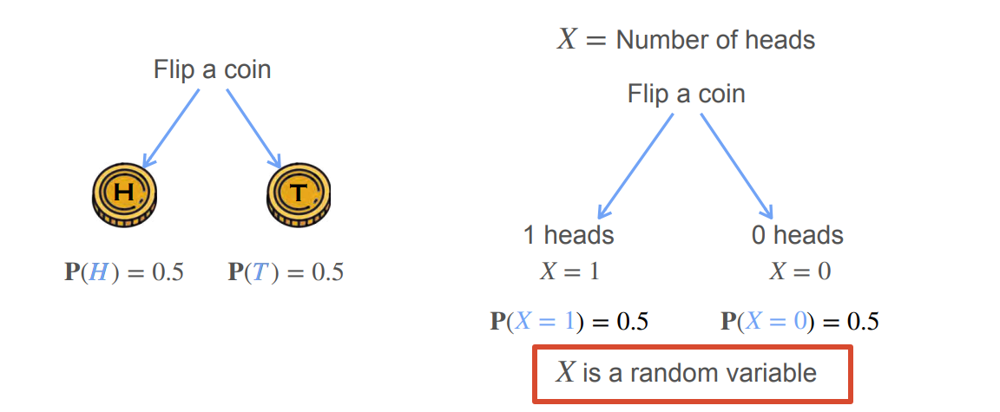

**蒙特卡洛估计**实验设定：

- 一次实验 = **抛 10 次公平硬币**，记正面次数 $X$
- 重复 **500 次**这样的实验
- 横轴：$X$ 的取值，0 到 10
- 纵轴：每个取值出现的**频率**（不是概率，是频率）

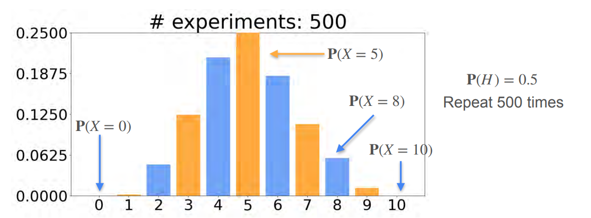

1. **随机变量的取值是离散的、可列的**: 横轴是 $0, 1, 2, \dots, 10$——一根根柱子，中间没有东西。这就是"离散"的视觉含义：$X$ 只能取整数值，不可能取 $X = 4.5$。对比一下：如果换成"等公交时间"这种连续 RV(Random Variable)，横轴会是平滑曲线，而不是柱子。
2. **分布不是均匀的**: 而是中间高、两边低、左右对称。

$$
P(X = 5) = \frac{\binom{10}{5}}{1024} = \frac{252}{1024} \approx 0.246
$$

图中 $P(X = 5)$ 那根柱子最高，大约在 0.25 附近——**和你手算的数字一致**。建立的直觉：**概率大小取决于"有多少种排列方式"。**

## 组合的计算

$$
P(X = k) = \binom{10}{k} \left(\frac{1}{2}\right)^k \left(\frac{1}{2}\right)^{10-k}
$$

> $(1/2)^k (1/2)^{10-k}$ 是"$k$ 次正面 + $(10-k)$ 次反面"这个具体排列的概率。
>
> 指数 $k$ 和 $10 - k$ 分别对应**正面次数**和**反面次数**。
>
> 公平硬币时它可以合并成 $(1/2)^{10}$；

$$
P(X = k) = \underbrace{\binom{n}{k}}_{\substack{\text{"恰好 } k \text{ 个正面"这个事件} \\ \text{包含多少种具体序列（组合）}}} \times \underbrace{p^k (1-p)^{n-k}}_{\text{每一种具体序列的概率}}
$$

用"硬币结果"替换"排法"：

> $P(X = k) =$（"恰好 k 个正面"包含多少种硬币序列）$\times$（每一种硬币序列的概率）

|      | 排列 (Permutation)   | 组合 (Combination)        |
| ---- | -------------------- | ------------------------- |
| 符号 | $P(n, k)$ 或 $A_n^k$ | $\binom{n}{k}$ 或 $C_n^k$ |
| 顺序 | **计顺序**           | **不计顺序**              |
| 公式 | $\frac{n!}{(n-k)!}$  | $\frac{n!}{k!(n-k)!}$     |

> 排列 > 组合

**用 3 次抛硬币把这件事走一遍**

$n = 3$，问 $P(X = 2)$。X代表正面出现的次数

**层面 1：列出所有记录（8 条，有序）**

```text
1. HHH   → X=3
2. HHT   → X=2  ┐
3. HTH   → X=2  │ 这 3 条记录
4. THH   → X=2  ┘ 都对应 X=2
5. HTT   → X=1
6. THT   → X=1
7. TTH   → X=1
8. TTT   → X=0
```

注意：这里 8 条记录是**有序的**。第 2 条 `HHT` 和第 4 条 `THH` 是**不同的记录**——它们第 1 次的结果就不同。

**层面 2：按 X 的值分组**

| X 值 | 对应哪些记录  | 记录条数 |
| ---- | ------------- | -------- |
| 0    | TTT           | 1        |
| 1    | HTT, THT, TTH | 3        |
| 2    | HHT, HTH, THH | 3        |
| 3    | HHH           | 1        |

问 $P(X = 2)$，就是问："X=2"这个事件包含多少条记录？答案是 **3 条**。

这 3 条记录**互不相同**（顺序不同），但它们都被归到 X=2 名下。所以：

$$
P(X = 2) = \underbrace{3}_{X=2 \text{ 的记录条数}} \times \underbrace{(1/2)^3}_{\text{每条记录的概率}} = \frac{3}{8}
$$

**关键问题：这个"3"是怎么数出来的？**

这就是 $\binom{3}{2}$ 的来源。它问的是：

> "3 个位置里恰好放 2 个 H"，有多少条不同的记录？

数法：

1. 从 3 个位置里选出 2 个位置放 H
2. 位置选定后，记录就唯一确定了（剩下的位置自动是 T）

所以"3 个位置选 2 个"的方案数 = $\binom{3}{2} = 3$。

**这里的"不计顺序"指的是什么？**

指的是：选位置的时候，**先选位置 1 再选位置 2** 和 **先选位置 2 再选位置 1**，得到的是同一个位置集合 $\{1, 2\}$，所以算 **1 种**，不是 2 种。

- 排列：计顺序会数成：$(1,2), (2,1), (1,3), (3,1), (2,3), (3,2) \to 6$ 种
- 组合： 不计顺序：$\{1,2\}, \{1,3\}, \{2,3\} \to 3$ 种

但无论哪种数法，最后得到的都是"位置集合"。位置集合一旦确定，记录 `HHT` 就确定了——因为位置 1 和 2 是 H，位置 3 是 T。

**所以"顺序"到底在哪一层？**

用一张图总结：

```text
实验本身：第 1 次、第 2 次、……、第 10 次  <- 有固定顺序

每条记录：HHHTTTTTTT  <- 是一条"有序"的记录

我们数的是：有多少条记录属于"恰好 k 个正面"？

数的时候：不区分"记录内部 H 之间谁先谁后"，
          因为 H 之间没有身份区别，
          只关心"哪些位置是 H"。

-> 位置集合的数法 = 组合
```

"不计顺序"精确地说，是指：**不区分"从哪些位置中选 H 时，选择的先后"**。

不是"记录没有顺序"，而是"我们在数记录条数时，不把选位置的先后算作不同"。

# Probability Distributions与PMF

**Probability Distributions（概率分布） = 把随机变量所有可能取值排成一排，看每个值对应的概率**。

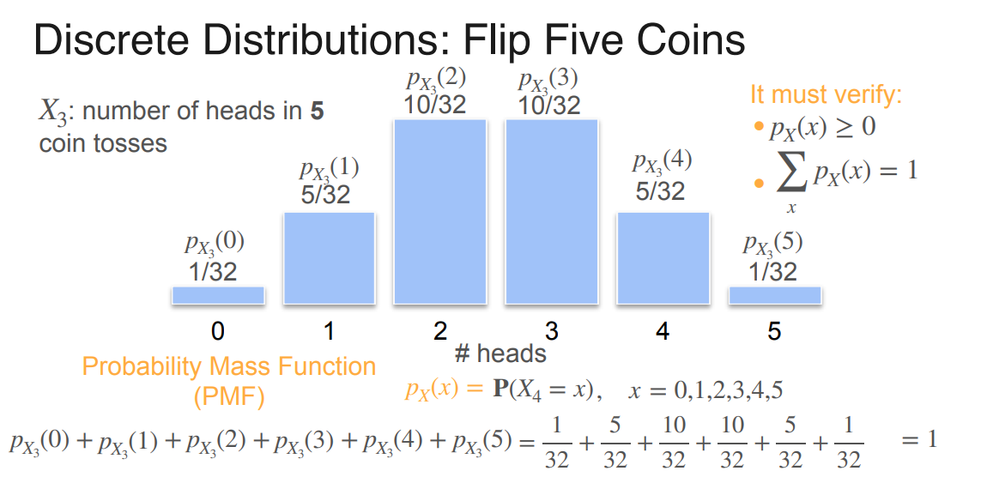

抛5次硬币，其中正面是3次的计算（复习上面的组合）过程

$$
\binom{5}{3} = \frac{5!}{3!\,(5-3)!} = \frac{5!}{3!\,2!} = \frac{120}{6 \times 2} = \frac{120}{12} = 10
$$

然后算概率：

$$
p_{X_3}(3) = \binom{5}{3} \left(\frac{1}{2}\right)^3 \left(\frac{1}{2}\right)^{5-3} = 10 \times \left(\frac{1}{2}\right)^5 = \frac{10}{32}
$$

和图上标的 $10/32$ 完全一致 ✓

## 数学定义：PMF

**概率质量函数（Probability Mass Function, PMF）** 是离散随机变量 $X$ 的分布函数，定义为：

$$p_X(x) = P(X = x)$$

- 下标 $X$ 表示"这是哪个随机变量的 PMF"
- 自变量 $x$ 是 $X$ 可能取的某个值
- 输出是 $X$ 恰好取到 $x$ 的概率

**为什么叫"质量函数"（mass）**：想象把总概率 1 当成 1 千克的质量，分散撒在横轴的各个离散点上。每个点分到的"质量"就是 $p_X(x)$。"质量"这个词强调它是**离散的点**——对比连续情形的"密度"（density）。

**两条公理**

**(1) 非负性**

$$
p_X(x) \geq 0 \quad \forall x
$$

$\forall x$ 表示：不是某一个特定的 $x$，而是所有可能的 $x$ 都满足。概率不能为负。

| 符号      | LaTeX     | 读法    | 含义   |
| --------- | --------- | ------- | ------ |
| $\forall$ | `\forall` | for all | 对所有 |

**(2) 归一化**

$$
\sum_{x} p_X(x) = 1
$$

所有可能取值的概率加起来必须等于 1。

# Binomial Distribution二项分布

binomial /baɪˈnəʊmiəl/ 二项式；二项分布。

$$
\boxed{p_X(x) = P(X = x) = \binom{n}{x} p^x (1-p)^{n-x}, \quad x = 0, 1, 2, \dots, n}
$$

> **二项分布 = 做 $n$ 次独立的"成功/失败"试验，成功次数 $X$ 的分布。**

关键词：

- **$n$ 次**：固定次数
- **独立**：每次互不影响
- **二元结果**：成功 / 失败（H/T、1/非1、生病/健康）
- **成功概率 $p$ 不变**：每次都是同一个 $p$

只要满足这四条，成功次数 $X$ 就服从 $\text{Binomial}(n, p)$。

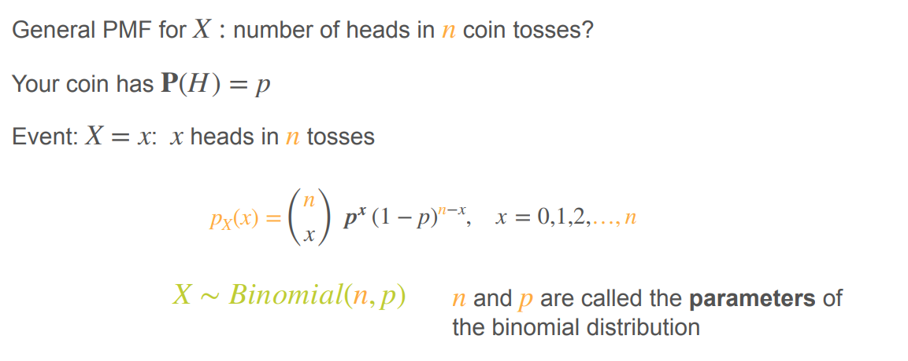

$$
X \sim \text{Binomial}(n, p)
$$

- $\sim$ 读作"服从"
- $n$ = 试验次数（number of trials）
- $p$ = 单次成功概率（probability of success）

**参数**：$n$ 和 $p$ 就叫二项分布的**参数**（parameters）。改变它们就得到不同的二项分布。

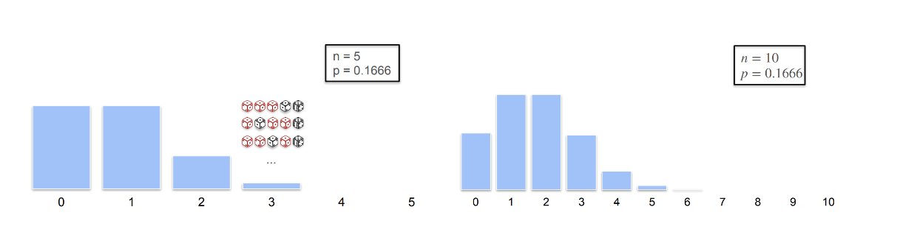

# Bernoulli Distribution

Bernoulli /bɜːˈnuːi/ 伯努利（人名/分布名）

在机器学习中它是所有二分类任务的理论基础：逻辑回归的输出层就是在估计一个 Bernoulli 分布的参数p，训练用的 binary cross-entropy 损失就是 Bernoulli 的对数似然取负号。

$$
X \sim \text{Bernoulli}(p)
$$

只有一个**参数** $p$。`the probability of success`

Bernoulli 试验 = 只有两种结果的一次试验。

- 成功（success）：记 $X = 1$
- 失败（failure）：记 $X = 0$

注意这里的"成功"是**人为定义的**，不一定代表好事。

"成功"只是"我们关心的那个结果"。关心生病，那生病就是成功；关心硬币正面，那正面就是成功。名字是约定，不是价值判断。

只要你能把结果二分成"我关心的"和"其余"，就是 Bernoulli 试验。

---

## 与二项分布的关系

$$
\text{Bernoulli}(p) = \text{Binomial}(1, p)
$$

**证明**：把 $n = 1$ 代入二项分布 PMF：

$$
P(X = k) = \binom{1}{k} p^k (1-p)^{1-k}, \quad k \in \{0, 1\}
$$

- $k = 0$：$\binom{1}{0} p^0 (1-p)^1 = 1 \cdot 1 \cdot (1-p) = 1 - p$
- $k = 1$：$\binom{1}{1} p^1 (1-p)^0 = 1 \cdot p \cdot 1 = p$

# Continuous连续概率分布

从离散概率分布概率到连续概率分布是从"点"转向"窗口"。

- 离散概率分布中是各个点之后为1 （点概率）
- 连续概率分布中是区间的面积为1 （窗口概率 ）

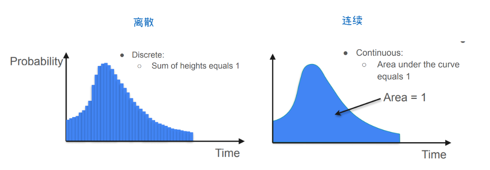

## 积分

$$
\boxed{\lim_{n \to \infty} \sum_{i=1}^{n} f(c_i)\,\Delta x_i = \int_a^b f(x)\,dx = F(b) - F(a)}
$$

> 积分是"累积"的数学工具。它把无穷多个无穷小的贡献，按一定规则加起来，得到一个总量。

导数是"变化率"——问"这一点变化得多快"。
**积分**是反过来的——问"把每一点的贡献累积起来，总共多少"。

在连续概率里：

- $f_X(x)$：密度（每单位长度的概率贡献）
- $dx$：无穷小宽度
- $f_X(x)\,dx$：一小条无穷窄柱子的面积
- $\int$：把这些无穷小面积全加起来

$$
P(\text{区间}) = \text{面积} = \text{把每一小条面积加起来}
$$

**积分的几何意义：面积**

看一张图。函数 $f(x)$ 在 $x$ 轴上方画一条曲线。

$$
\int_a^b f(x)\,dx
$$

的几何意义：**曲线 $f(x)$ 在 $[a, b]$ 区间下方与 $x$ 轴围成的面积。**

**怎么算这个面积？**

方法：用矩形逼近。

1. 把 $[a, b]$ 分成 $n$ 个小区间，每段宽 $\Delta x$
2. 每个小区间上，用 $f(x_i)$ 当高度，画一个小矩形
3. 小矩形面积 = $f(x_i) \cdot \Delta x$
4. 把所有小矩形加起来：

$$
S_n = \sum_{i=1}^{n} f(x_i)\,\Delta x
$$

5. 让 $n \to \infty$（矩形越来越窄、越来越多），$S_n$ 的极限就是积分：

$$
\int_a^b f(x)\,dx = \lim_{n \to \infty} \sum_{i=1}^{n} f(x_i)\,\Delta x
$$

**这就是积分的定义：无限细分下的面积和。**

**关键：$dx$ 是什么？**

在积分式 $\displaystyle\int f(x)\,dx$ 里：

- $f(x)$：被积函数（高度）
- $dx$：无穷小宽度（$\Delta x \to 0$ 的极限）

$f(x)\,dx$ 就是"一个无穷窄柱子的面积"。

$$
\underbrace{f(x)}_{\text{高度}} \times \underbrace{dx}_{\text{无穷小宽度}} = \text{无穷小面积}
$$

积分符号 $\int$（拉长的 S，代表 Sum）就是把这些无穷小面积全加起来。

**注意**：$dx$ 不是可有可无的装饰，它本身就是积分的一部分，代表"对 $x$ 积分"。没有 $dx$ 这个积分就没有意义。

**原函数求解**

设 $F(x)$ 是 $f(x)$ 的原函数（即 $F'(x) = f(x)$）。

算 $\int_a^b f(x)\,dx$，也就是从 $a$ 到 $b$ 的"总面积"。

**微积分基本定理**:

$$
\boxed{\lim_{n \to \infty} \sum_{i=1}^{n} f(c_i)\,\Delta x_i = \int_a^b f(x)\,dx = F(b) - F(a)}
$$

它告诉你：积分（面积）等于原函数在两端点的差值。

---

**类比：速度与路程**

这是最经典的类比。

- $v(t)$：速度（变化率）
- $s(t)$：位置（$s'(t) = v(t)$，所以 $s$ 是 $v$ 的原函数）

问：从时刻 $a$ 到 $b$，走了多少路程？

**方法 1（积分定义）**：把时间切成无数小段，每小段路程 $= v(t_i)\,\Delta t_i$，全部加起来 $= \int_a^b v(t)\,dt$。

**方法 2（端点相减）**：路程 = 末位置 - 初位置 = $s(b) - s(a)$。

**两种方法结果一样：**

$$
\int_a^b v(t)\,dt = s(b) - s(a)
$$

**直观理解：**

- 每一瞬间你都在往前走一点（速度 × 时间）
- 所有瞬间加起来，总路程就是**你从起点到终点的净位移**
- 净位移 = 末位置 - 初位置

"相减"就是"末减初"。

## PDF概率密度函数（Probability Density Function）

**概率密度函数（Probability Density Function, PDF）** 是连续随机变量 $X$ 的分布函数，记作 $f_X(x)$，它告诉你"在 $x$ 附近概率累积的速率"。

"rate"（速率）是关键——它不是概率本身，而是**概率的密度**。

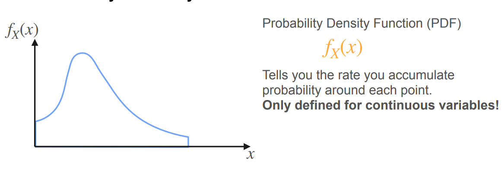

# CDF(Cumulative Distribution Function)

Cumulative /ˈkjuːmjələtɪv/ 累积的；渐增的。

**CDF 的答案**：把"从最左端累积到 $x$"的概率预先算好，做成一个函数 $F_X(x)$。以后要算 $P(a < X < b)$，直接查表相减：

$$
P(a < X < b) = F_X(b) - F_X(a)
$$

**类比**：CDF 就像"前缀和数组"。原数组每次区间求和要 $O(n)$，前缀和数组查一次 $O(1)$。

---

**为什么离散有跳跃**：因为概率"质量"集中在离散点上。每经过一个可能取值，CDF 突然"跳"高 $p_X(x)$。

**为什么连续没跳跃**：因为单点概率为 0，概率是"平滑累积"的，没有突然的跳变。

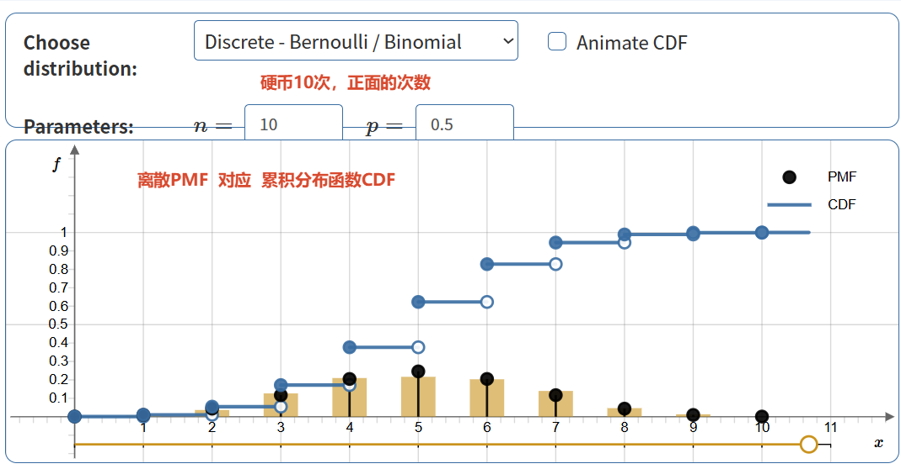

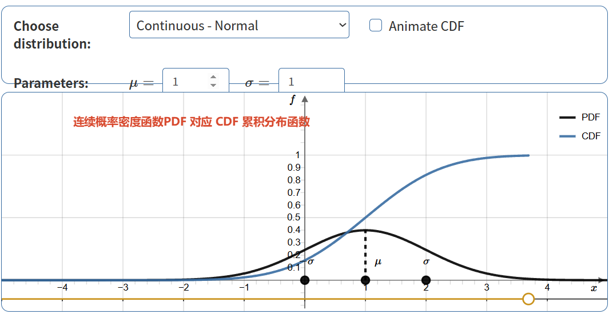

|            | PMF            | PDF              | CDF                  |
| ---------- | -------------- | ---------------- | -------------------- |
| 适用       | 离散           | 连续             | 两者都适用           |
| 记号       | $p_X(x)$       | $f_X(x)$         | $F_X(x)$             |
| 定义       | $P(X = x)$     | 概率密度         | $P(X \leq x)$        |
| 归一化     | $\sum p = 1$   | $\int f\,dx = 1$ | $F(\infty) = 1$      |
| 算区间概率 | 求和           | 积分             | $F(b) - F(a)$        |
| 形状       | 柱状           | 曲线             | 递增曲线             |
| 单点含义   | **该点的概率** | **密度，非概率** | **累积到该点的概率** |

# Uniform Distribution Model均匀分布

> **Uniform 分布 = 在区间 $[a, b]$ 上，概率密度处处相等的连续分布。**

三个要点：

1. **连续**随机变量（不是离散）
2. 所有值落在某个区间 $[a, b]$ 里（区间外概率为 0）
3. 每个值出现的频率相同（PDF 是常数）

Uniform 分布是"区间内每个值等可能"的连续分布，只有两个参数 $a$ 和 $b$，PDF 是高度为 $1/(b - a)$ 的矩形。

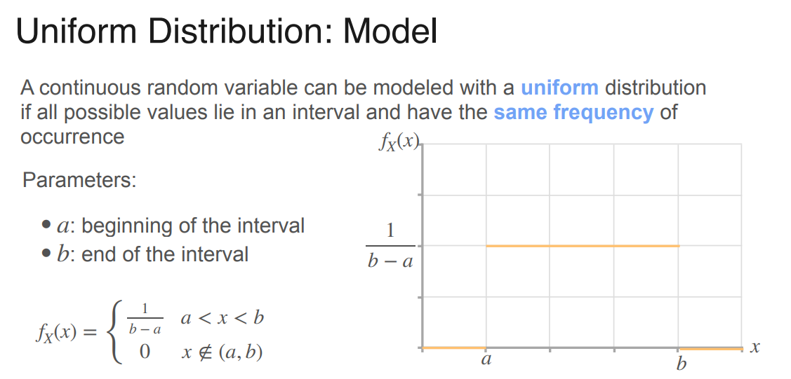

> Uniform 是一个"具体的分布"；PDF 和 CDF 是描述"任何连续分布"的两种"通用工具"。
> Uniform 分布可以被它的 PDF 描述，也可以被它的 CDF 描述。两者是同一个分布的两副面孔

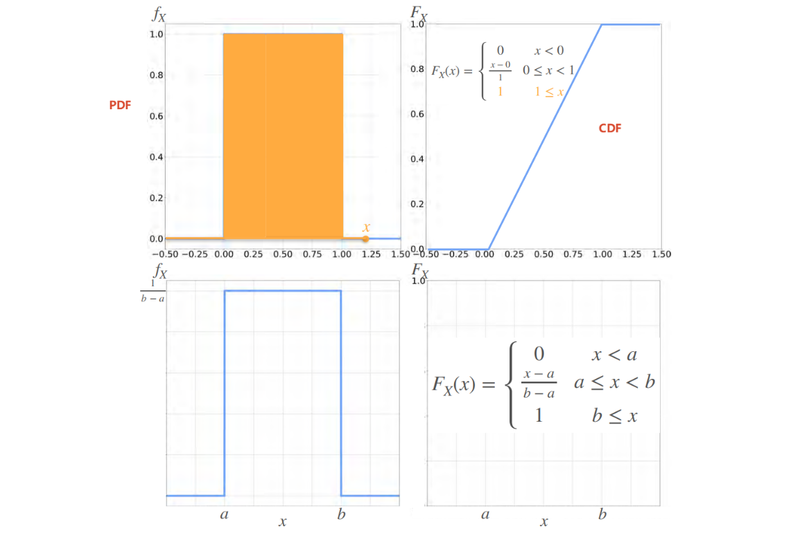

# 🎉正态分布(高斯分布)Normal Distribution

二项分布 $\text{Binomial}(n, p)$ 当 $n$ 很大时，形状趋近于一条钟形曲线。

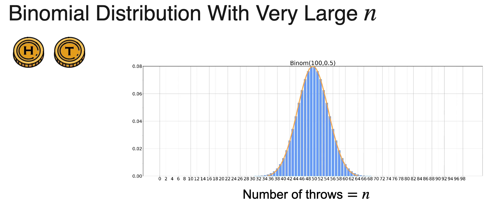

"Normal 的公式"就是"正态分布的 PDF"，也叫"高斯分布的 PDF"。**PDF**

$$
f_X(x) = \frac{1}{\sigma\sqrt{2\pi}} e^{-\frac{(x-\mu)^2}{2\sigma^2}}
$$

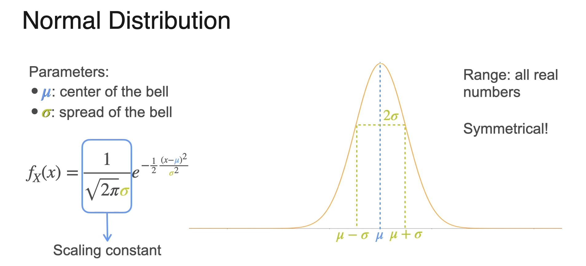

**逐项拆解：**

| 部分                               | 含义                           |
| ---------------------------------- | ------------------------------ |
| $\frac{1}{\sigma\sqrt{2\pi}}$      | **归一化常数**（保证面积 = 1） |
| $e^{-\frac{(x-\mu)^2}{2\sigma^2}}$ | **钟形核心**（指数衰减）       |
| $\mu$                              | **中心**（均值）               |
| $\sigma$                           | **宽度**（标准差）             |

**记号**

$$
X \sim \mathcal{N}(\mu, \sigma^2)
$$

**注意：第二个参数是 $\sigma^2$（方差），不是 $\sigma$。**

**为什么用 $\sigma^2$ 而不是 $\sigma$**：这是历史约定。$\sigma$ 和 $\sigma^2$ 一一对应（因为 $\sigma > 0$），信息量相同，但习惯上用方差。

**两个参数**

| 参数     | 含义           | 影响                 |
| -------- | -------------- | -------------------- |
| $\mu$    | 中心（均值）   | 决定曲线**左右位置** |
| $\sigma$ | 宽度（标准差） | 决定曲线**胖瘦**     |

## Normal的公式的拟合

Normal 的公式不是凭空拍出来的，而是通过"三步修补"从 $e^{-x^2/2}$ 拟合出来的。

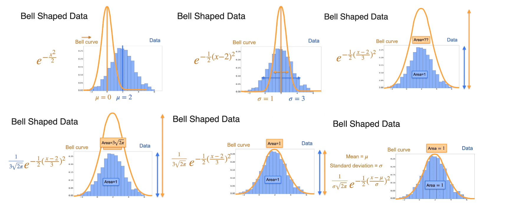

**起点：$e^{-x^2/2}$**

老师说：

> "The curve $e^{-x^2/2}$ seems to work pretty well, because it seems to look like a bell curve."

$e^{-x^2}$ 这个函数天然是钟形：中间高，两边快速衰减，对称。

**问题 1：中心不对**

- 数据中心在 $x = 2$（记作 $\mu$）
- 曲线 $e^{-x^2/2}$ 中心在 $x = 0$

**修正**：用 $(x - \mu)$ 替换 $x$：

$$
e^{-(x-\mu)^2/2}
$$

这一步叫"平移"。

**问题 2：宽度不对**

- 数据的"胖瘦"由 **标准差 $\sigma$** 决定
- 曲线 $e^{-x^2/2}$ 的 $\sigma = 1$
- 数据的 $\sigma = 3$（更胖）

**修正**：指数除以 $\sigma^2$：

$$
e^{-(x-\mu)^2/(2\sigma^2)}
$$

这一步叫"缩放"。

**问题 3：高度不对（面积不是 1）**

- 概率密度必须满足"面积 = 1"
- 缩放后的曲线面积不是 1

**修正**：除以归一化常数 $\sigma\sqrt{2\pi}$：

$$
f_X(x) = \frac{1}{\sigma\sqrt{2\pi}} e^{-\frac{(x-\mu)^2}{2\sigma^2}}
$$

**最终公式诞生。**

$$
f_X(x) = \frac{1}{\sigma\sqrt{2\pi}} e^{-\frac{(x-\mu)^2}{2\sigma^2}}
$$

## 标准正态分布

**定义**

$$
\mu = 0, \quad \sigma = 1
$$

$$
X \sim \mathcal{N}(0, 1)
$$

**PDF 简化：**

$$
f_X(x) = \frac{1}{\sqrt{2\pi}} e^{-\frac{x^2}{2}}
$$

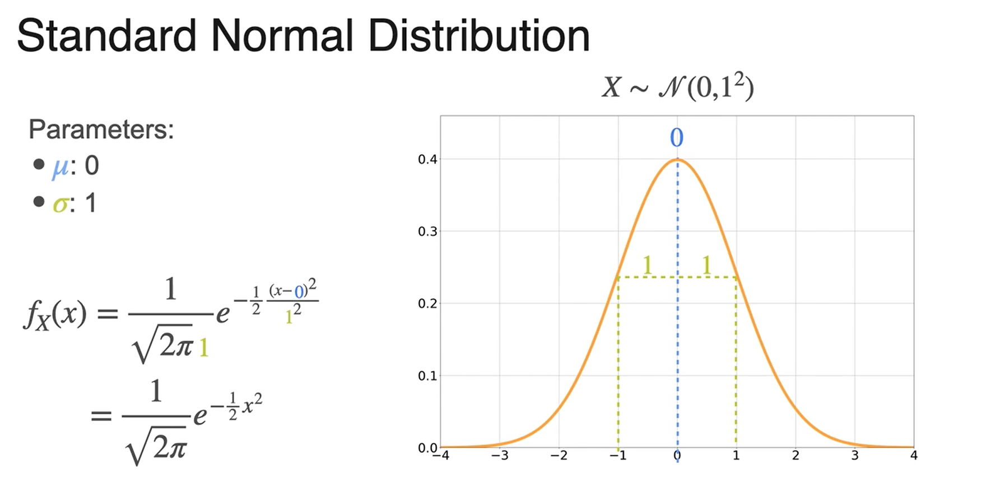

## 标准化Standardization

- magnitudes /ˈmæɡnɪtjuːdz/ 量级；大小；幅度。
- Standardization /ˌstændədaɪˈzeɪʃn/ 标准化；规范化。

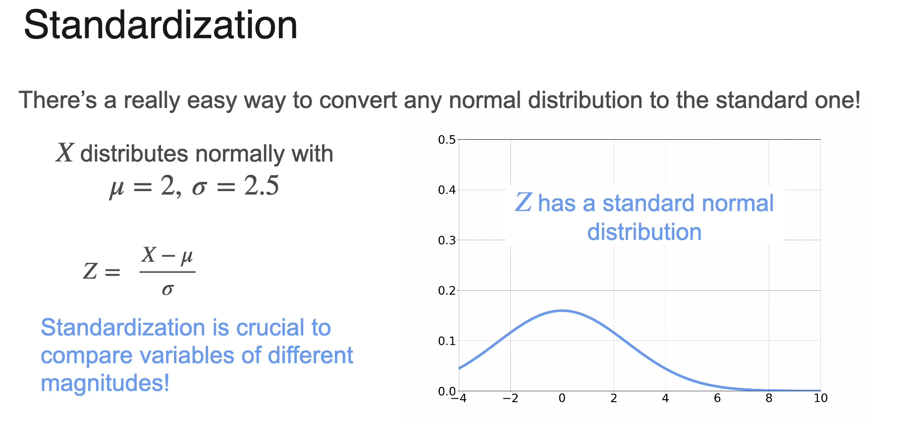

$Z = (X - \mu)/\sigma$ 是由 $X$ 标准化后得到的新随机变量，服从 $\mathcal{N}(0, 1)$。
它不是 $X$ 的别名，而是 $X$ 的"标准化版本"——同一个实验，不同的数值刻度。
引入 $Z$ 的目的是统一标准，方便比较和查表。

$$
Z = \frac{X - \mu}{\sigma}
$$

$Z$ 是由 $X$ 通过"减 $\mu$、除 $\sigma$"这两个操作得到的新随机变量。

- $X$：原始随机变量，$X \sim \mathcal{N}(\mu, \sigma^2)$
- $Z$：标准化后的随机变量，$Z \sim \mathcal{N}(0, 1)$

**它们的关系：$Z$ 是 $X$ 的函数（线性变换）。**

1. 减 $\mu$ 是"整条数轴平移"，把中心从 $\mu$ 搬到 0。
2. 除 $\sigma$ 是"缩放"，把宽度从 $\sigma$ 缩到 1。
3. 合起来就是标准化：$Z = (X - \mu)/\sigma \sim \mathcal{N}(0, 1)$。

---

|            | 阶段 1                                                       | 阶段 2                                     |
| ---------- | ------------------------------------------------------------ | ------------------------------------------ |
| 变量       | $X$                                                          | $Z = \frac{X - 2}{\sigma}$                 |
| 变量中心   | 2                                                            | 0                                          |
| 代入的公式 | $\frac{1}{\sigma\sqrt{2\pi}} e^{-\frac{(x-2)^2}{2\sigma^2}}$ | $\frac{1}{\sqrt{2\pi}} e^{-\frac{z^2}{2}}$ |
| 公式中心   | 2                                                            | 0                                          |
| 面积       | 1                                                            | 1                                          |
| 重合位置   | 2                                                            | 0                                          |

---

## PDF与CDF

[normal_pdf_cdf.html](./onlinedemos/normal_pdf_cdf.html)

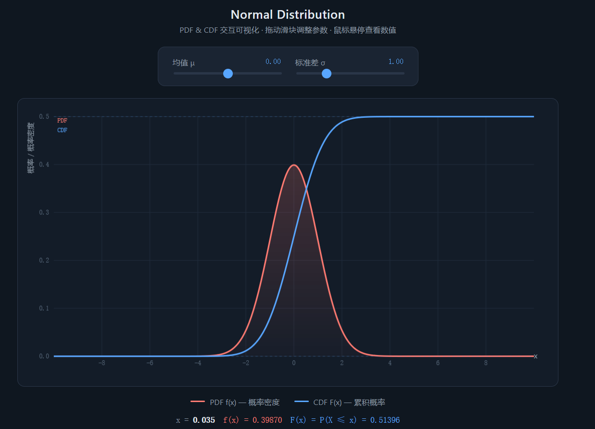
