# 走进概率Probabilities的世界

概率不是描述这次发生了什么，而是描述在实验开始之前，各种结果的可能性分布。

关键：概率是事前的（ex ante），不是事后的（ex post）。如抛硬币

- 抛之前：H 的概率 50%，T 的概率 50%
- 抛之后：结果是 H，H 的「频率」是 100%

# 古典概型

**古典概型 = 有限样本空间 + 等可能结果 → 概率就是「数数相除」**

「数数法」解释一个问题：

> 抛 3 枚硬币，3 次都是正面的概率是多少？

$P(HHH) = \frac{1}{8} = 0.125$。

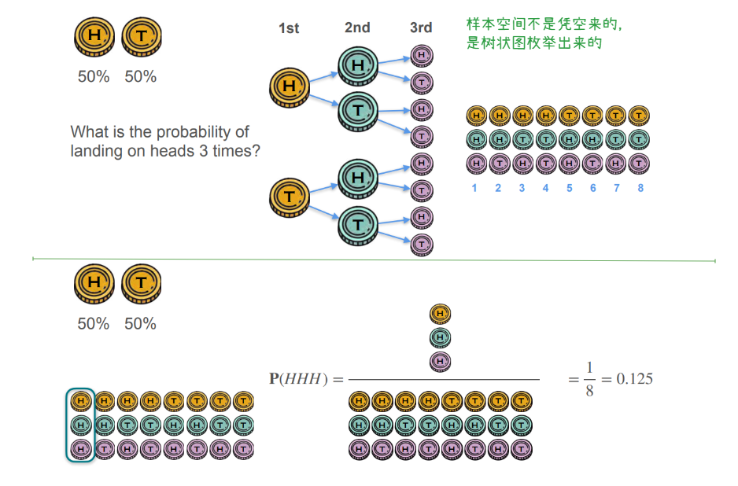

## 数学定义

两个关键术语

| 术语     | 英文         | 含义                              | 本例             |
| -------- | ------------ | --------------------------------- | ---------------- |
| 样本空间 | Sample Space | 所有可能结果的集合，记作 $\Omega$ | 10 个孩子        |
| 事件     | Event        | 你关心的结果子集，记作 $A$        | 3 个踢足球的孩子 |

$$
P(A) = \frac{|A|}{|\Omega|}
$$

其中 $|A|$ 表示集合 $A$ 的元素个数（基数）。

**实验（Experiment）**：任何产生不确定结果的过程。抛硬币、掷骰子、抽孩子都是实验。

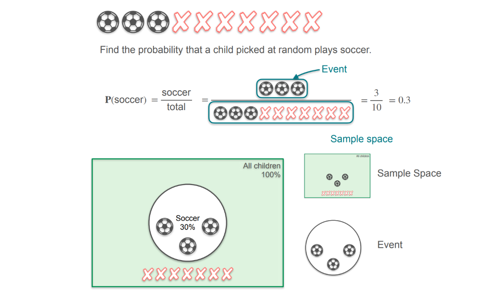

# Complement of Probability补集

**complement** /ˈkɒmplɪmənt/ 补足物；补集；补角。概率课程语境里，complement 特指**补集**：事件 $A$ 不发生的那部分，记作 $A'$ 或 $A^c$。它和 $A$ 互斥且完备，两者合起来就是整个样本空间 $\Omega$，所以满足 $P(A') = 1 - P(A)$。

`补集 = 1 − 事件概率`。它不需要任何前提，因为「发生」和「不发生」天然就把 100% 分完了。

$A$ 和 $A'$ 是**互斥**（disjoint）且**完备**（exhaustive）的：

- 互斥：$A \cap A' = \varnothing$，不可能同时发生
- 完备：$A \cup A' = \Omega$，必有一个发生

所以 $P(A) + P(A') = 1$，移项就得到补集规则。

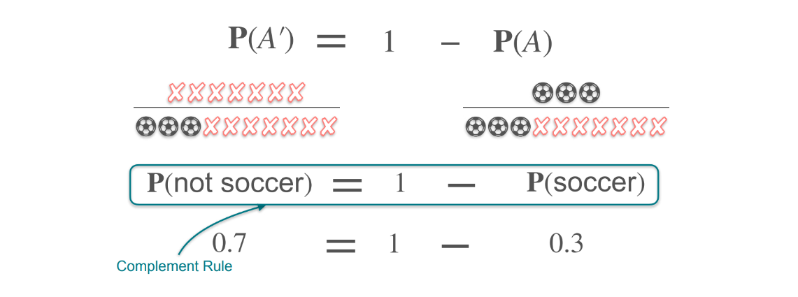

# Sum of Probabilities

## Disjoint Events

两个事件「或」的概率，什么时候可以直接相加？**当它们互斥（disjoint）时**。直观感受就是**互斥 = 不重叠**

求和规则不是无条件的，它的前提是「互斥」。

$$
P(A \cup B) = P(A) + P(B) \quad (\text{仅当 } A \cap B = \varnothing)
$$

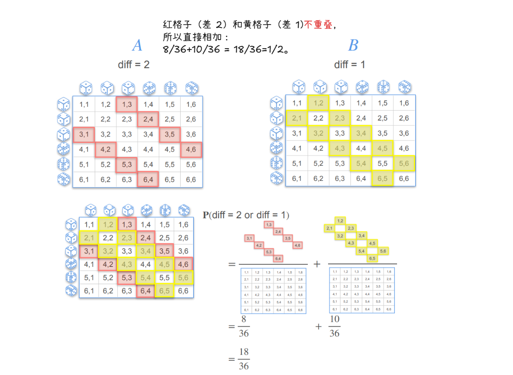

**ML 里的求和规则**：

- 多分类 softmax：每个类别的概率加起来等于 1，因为类别互斥
- 词袋模型：每个词出现与否，若假设互斥（朴素贝叶斯的前提），概率可加
- 决策树的叶节点：每个叶节点对应互斥的区域

## Joint Events(容斥原理)

上个Disjoint Events的概率求和只在**互斥**时成立。这里把前提拿掉，处理**可以同时发生**的事件。

$$
P(A \cup B) = P(A) + P(B) - P(A \cap B)
$$

多出来的 $P(A \cap B)$ 就是重叠（overlap）部分，因为直接相加会把它数两次。

核心就是 **容斥原理（inclusion-exclusion principle） = 先把各块加起来，再把重复数的减掉**。
「容」是容纳（加），「斥」是排斥（减），合起来就是「去重」。

> 用大白话讲：
> 你要数「A 或 B」有多少，先把 A 和 B 各自的数量加起来。
> 但如果你直接加，同时属于 A 和 B 的那部分会被数两次。
> 所以要把多算的那一次减掉。

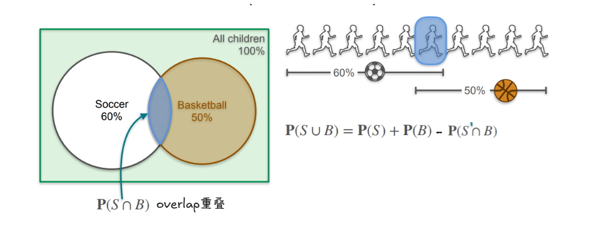

> **容斥原理与联合概率的区别**

生活例子：假设 10 个孩子，6 个踢足球，5 个打篮球，3 个两者都玩。

**联合概率问的是：**

> 一个孩子既踢足球又打篮球的概率？

答案：$P(S \cap B) = \frac{3}{10} = 0.3$

**容斥原理问的是：**

> 一个孩子至少玩一种（踢足球或打篮球）的概率？

答案：$P(S \cup B) = 0.6 + 0.5 - 0.3 = 0.8$

**两个答案完全不同。联合概率是 0.3，容斥算出来是 0.8。**

---

## Disjoint与Joint的直观区别

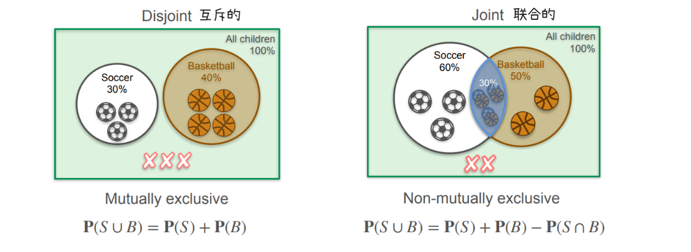

# Independence独立性

两个事件独立时，它们「同时发生」的概率 = 各自概率的乘积。`它把「乘法」引入了概率论，而乘法是朴素贝叶斯、似然函数、对数概率的根基。`

$$
P(A \cap B) = P(A) \cdot P(B) \quad (\text{当 A、B 独立})
$$

**独立的定义：**

> 独立 = 一个发生不影响另一个。
> 事件 $A$ 的发生，**不改变**事件 $B$ 的概率。

写成公式：

$$
P(B \mid A) = P(B)
$$

这句话的意思是：「已知 $A$ 发生了，$B$ 的概率还是原来那个」。这就是独立的本质。

> 注意这个符号：$P(A \cap B)$，它只是一个数学符号，性质可以有不同的解释

- **互斥**：看**能不能同时发生**（几何关系，两个圈碰不碰），告诉你它等于 0(没有重叠)。
- **独立**：看**概率会不会被影响**（因果关系，一个发生会不会改变另一个）

## 案例说明

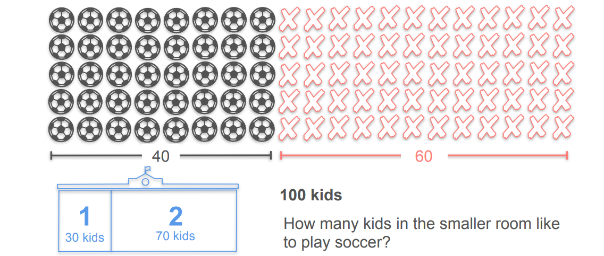

把它翻译成了概率语言：

| 事件        | 概率                     | 来源   |
| ----------- | ------------------------ | ------ |
| 喜欢足球    | $P(S) = 0.4$             | 40/100 |
| 不喜欢足球  | $P(\text{not } S) = 0.6$ | 60/100 |
| 分到 Room 1 | $P(R_1) = 0.3$           | 30/100 |
| 分到 Room 2 | $P(R_2) = 0.7$           | 70/100 |

问的是：

$$
P(S \cap R_1) = ?
$$

因为随机分房，所以「喜欢足球」和「分到 Room 1」独立，于是：

$$
P(S \cap R_1) = P(S) \cdot P(R_1) = 0.4 \times 0.3 = 0.12
$$

人数：$0.12 \times 100 = 12$ 人。 这是**期望值**，不是某一次的具体结果

# 🎉Birthday Problem

你有 30 个朋友在派对上。你觉得下面两件事，哪个更可能发生？

- **A**：存在两个人，他们的生日是同一天
- **B**：没有任何两个人的生日是同一天

**假设一年 365 天，没有人 2 月 29 日生日。**

分析：「30 个朋友」：这是一个具体的小群体，不是 365 人，也不是 2 人，是 30 人。

「两个选项」：

- A = 「至少有一对同生日」
- B = 「所有人不同生日」

注意：**A 和 B 是互补的**。要么至少有一对同生日，要么所有人不同生日，没有第三种情况。

用前面学的补集规则：

$$
P(A) + P(B) = 1
$$

## 数学表达

「所有人生日不同」= 「第 2 个和第 1 个不同」**且**「第 3 个和前 2 个不同」**且** …

这些「且」用乘法连起来（独立乘法规则）：

$$
P(\text{所有人不同}) = P(2 \text{ 不撞 } 1) \times P(3 \text{ 不撞 } 1,2) \times P(4 \text{ 不撞 } 1,2,3) \times \cdots
$$

每一项都是：

$$
P(\text{第 } k \text{ 个人不撞前 } k - 1 \text{ 个}) = \frac{365 - (k - 1)}{365}
$$

分母永远是 365（因为每个人的生日都在 365 天里均匀分布，独立）。

分子递减（因为要避开的人越来越多，约束累积）。

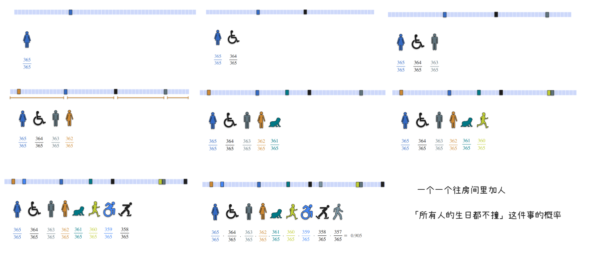

**生日问题的概率随人数指数下降，23 人是 50% 临界点。**

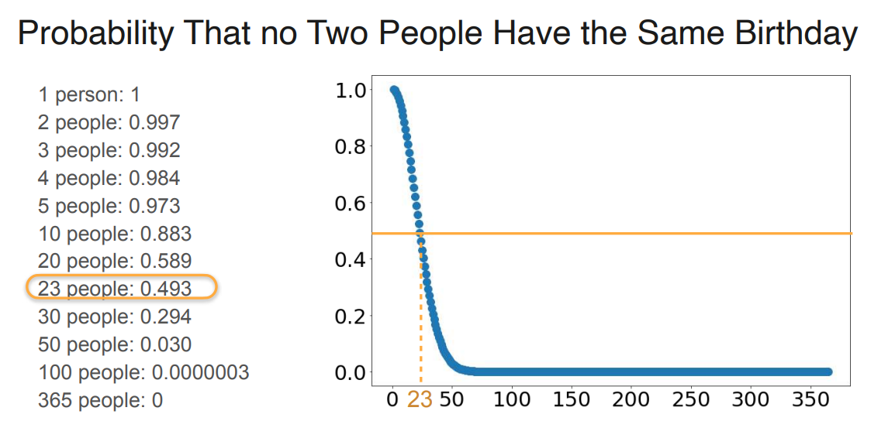

# Conditional Probability条件概率

> 条件概率 = **缩小样本空间**。

信息越多，样本空间越小，概率越「锐利」。

这个洞察贯穿整个概率论：

- 贝叶斯：用新信息更新先验
- 语言模型：用前文预测下一个词
- 分类器：用特征预测标签
- 强化学习：用状态决定动作

**「条件」就是「信息」，「条件概率」就是「带信息的概率」。**

1. **条件 = 信息。**
2. **条件概率 = 带信息的概率。**
3. **独立 = 信息没用。**
4. **不独立 = 信息有用。**

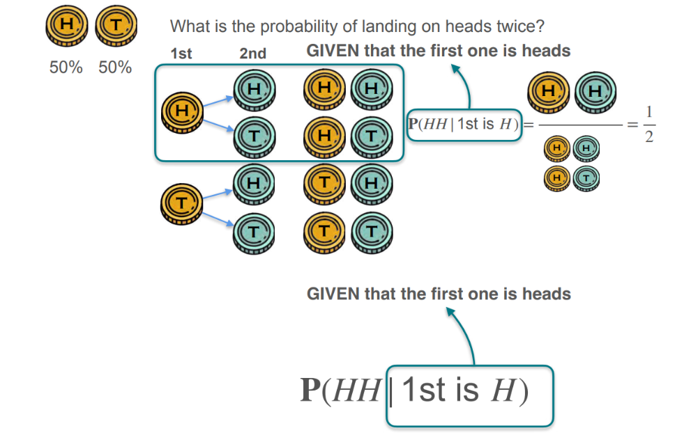

> 条件概率与独立事件概率的关系:

|                             | 公式                                   | 前提          |
| --------------------------- | -------------------------------------- | ------------- |
| Independence                | $P(A \cap B) = P(A) \cdot P(B)$        | A、B **独立** |
| **Conditional Probability** | $P(A \cap B) = P(A) \cdot P(B \mid A)$ | **永远成立**  |

独立时 $P(B \mid A) = P(B)$，`Conditional Probability`退化成`Independence`

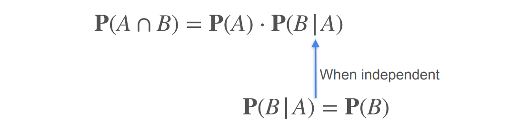

## 案例分析

> 问题： 踢足球 **且** 穿跑鞋的孩子有多少人？

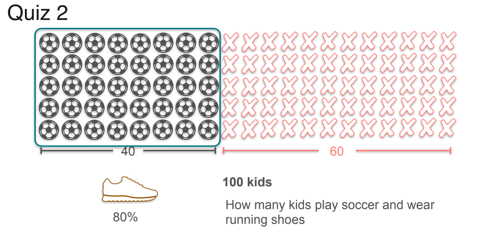

这个 80% 是**条件概率**：$P(\text{跑鞋} \mid \text{踢足球}) = 80\%$

**计算**概率：

$$
P(S \cap R) = P(S) \cdot P(R \mid S) = 0.4 \times 0.8 = 0.32
$$

答案：100 \* 0.32 = 32 人。

整体条件概率树的结构：

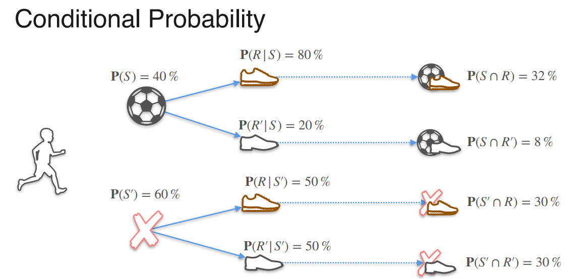

# Bayes Theorem贝叶斯定理

> 医学检测案例

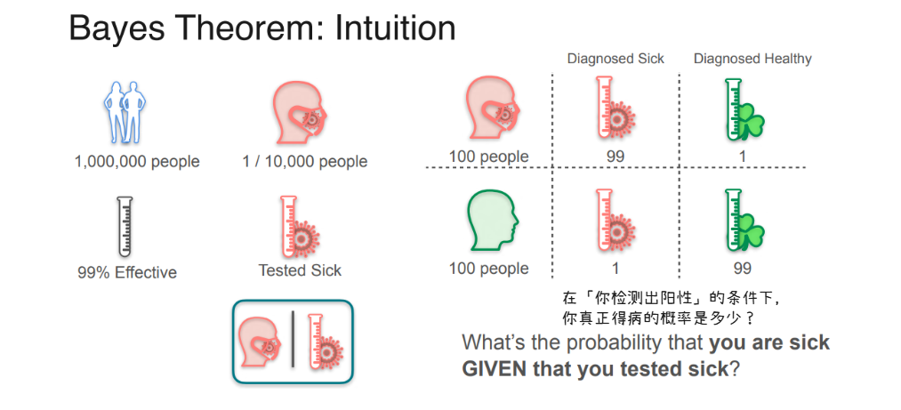

| 项目       | 数值      | 含义                            |
| ---------- | --------- | ------------------------------- |
| 总人口     | 1,000,000 | 100 万人                        |
| 患病率     | 1/10,000  | 每 1 万人中 1 个得病            |
| 检测灵敏度 | 99%       | 得病的人里 99% 被正确诊断为阳性 |
| 检测特异度 | 99%       | 健康的人里 99% 被正确诊断为阴性 |

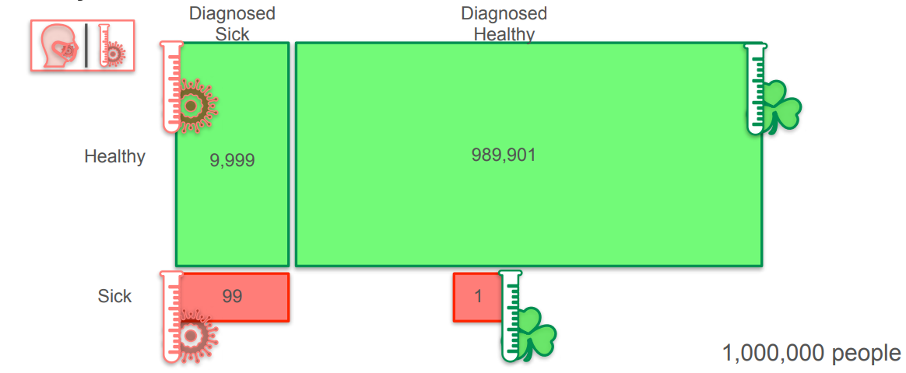

**把 100 万人分成四组：**

|              | 得病 | 健康    | 合计      |
| ------------ | ---- | ------- | --------- |
| **检测阳性** | 99   | 9,999   | 10,098    |
| **检测阴性** | 1    | 989,901 | 989,902   |
| **合计**     | 100  | 999,900 | 1,000,000 |

**你检测阳性，所以你在第一行：**

- 这一行总共 10,098 人
- 其中真得病的只有 99 人

$$
P(\text{得病} \mid \text{阳性}) = \frac{99}{10{,}098} \approx 0.0098 = 0.98\%
$$

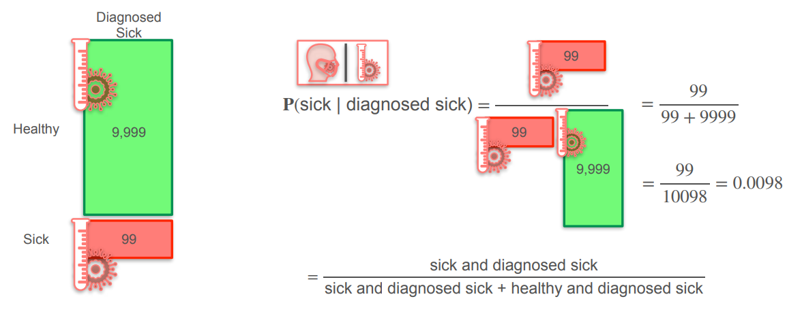

## 贝叶斯定理的数学公式

$$
P(A \mid B) = \frac{P(A)P(B \mid A)}{P(A)P(B \mid A) + P(A')P(B \mid A')}
$$

诊断案例的理解

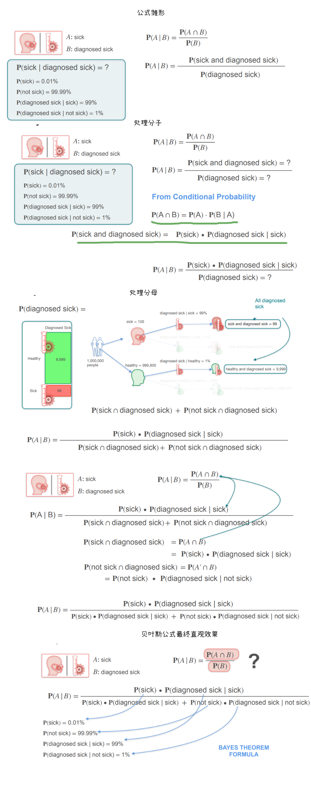

## 垃圾邮件案例

> 用贝叶斯定理，就是在删掉所有无关的邮件，只留下符合条件的那些。

具体到这个问题：

- 100 封邮件里，只有 24 封含「lottery(彩票)」
- 其余 76 封**不含 lottery**，直接删掉
- 在剩下的 24 封里，14 封是垃圾
- 所以 $P(\text{spam} \mid \text{lottery}) = \frac{14}{24} = 0.583$

**这就是贝叶斯定理的几何直觉：缩小样本空间。**

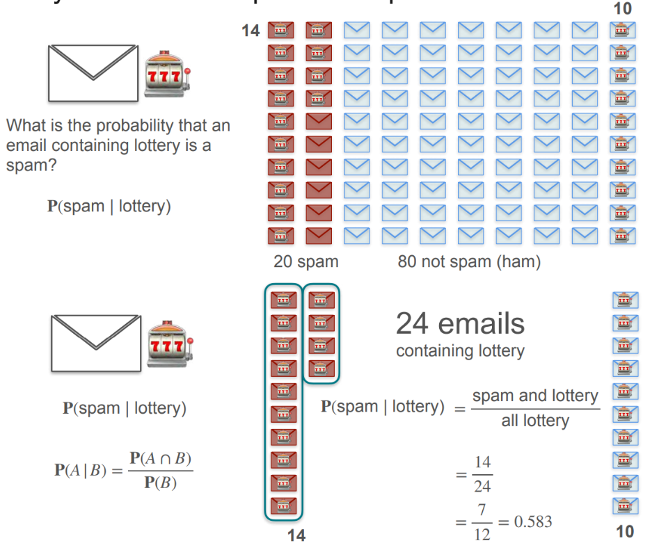

用贝叶斯公式来求解

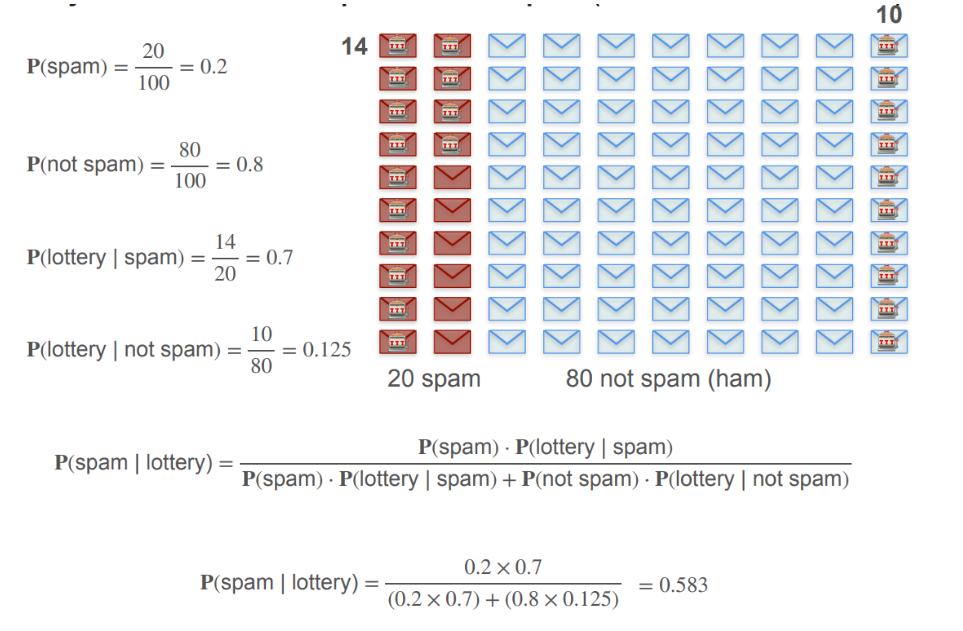
