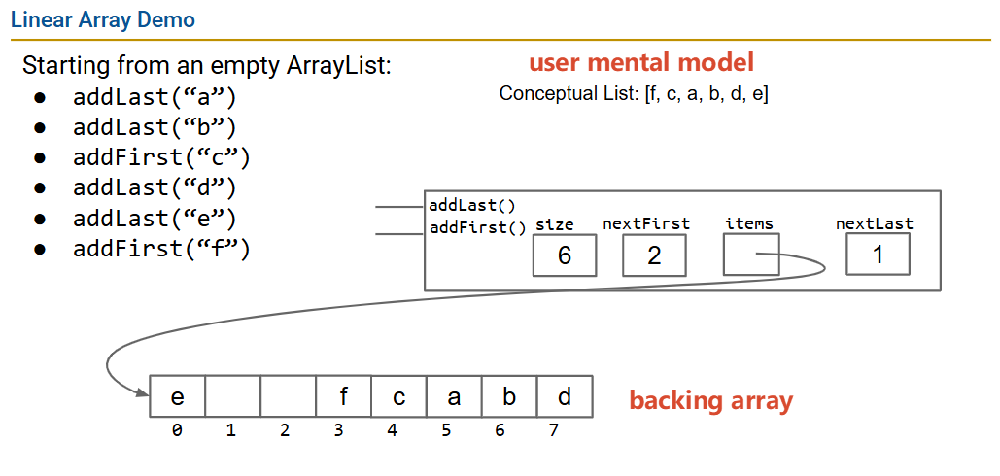

# 在环形中：处理下标的技巧

使用JDK内置方法Math.floorMod或者传统方式加上原本的除数

```java
// 现代方式
nextFirst = Math.floorMod(nextFirst - 1, items.length);
// 传统方式
nextFirst = (nextFirst - 1 + items.length) % items.length;
```

上面的两种方式是一样的效果,测试代码[IndexFrontBackTest.java](./src/test/java/io/github/upangka/cs61b/IndexFrontBackTest.java)

```java
    @Test
    public void testIndexFrontBack() {
        int size = 8;
        int nextFirst = 4, nextLast = 5;
        int[] actual = new int[size];
        int[] expected = new int[size];

        for (int i = 0; i < size; i++) {
            actual[i] = Math.floorMod(nextFirst - i, size);
            expected[i] = (nextFirst - i + size) % size;
        }

        Truth.assertThat(actual).isEqualTo(expected);
        log.info("Good Test nextFirst {}", Arrays.toString(actual));


        actual = new int[size];
        expected = new int[size];

        for (int i = 0; i < size; i++) {
            actual[i] = Math.floorMod(nextLast + i, size);
            expected[i] = (nextLast + i + size) % size;
        }

        Truth.assertThat(actual).isEqualTo(expected);
        log.info("Good Test nextLast {}", Arrays.toString(actual));
    }
```
运行结果:

```txt
Good Test nextFirst [4, 3, 2, 1, 0, 7, 6, 5]
Good Test nextLast  [5, 6, 7, 0, 1, 2, 3, 4]
```


# 底层实现与用户的思维模型（User mental model）

不同视角，开发者知道的视角： 底层数组的数据的存储顺序
用户看到数据顺序就是有顺序的添加的顺序。




```python
# 底层视角
             nextLast  nextFirst
                   ↓   ↓
Backing array: [e, _ , _ ,f,c,a,b,d]
# 用户使用者的视角, user mental model
User mental model: [f, c, a, b, d, e]
```

[user_mental_model.java](src/main/java/io/github/upangka/user_mental_model.java)

```java
void main() {
    Deque61B<String> deque = new ArrayDeque61B<>() {{
        addLast("a");
        addLast("b");
        addFirst("c");
        addLast("d");
        addLast("e");
        addFirst("f");
    }};

    System.out.println("Backing array: %s".formatted(deque));
    System.out.println("User mental model: %s".formatted(deque.toList()));
}
```

输出:
```python
Backing array: [e, _ , _ ,f,c,a,b,d]
User mental model: [f, c, a, b, d, e]
```


# 匿名子类的初始化

```java
Deque61B<String> deque = new ArrayDeque61B<String>() {
    // 这是一个匿名子类
    {
        // 实例初始化块：在构造器执行后运行
        addLast("a");
        addLast("b");
        addFirst("c");
        addLast("d");
        addLast("e");
        addFirst("f");
    }
};
```

# Truth

[ArrayDeque61BEnhancementTest.java](src/test/java/io/github/upangka/cs61b/ArrayDeque61BEnhancementTest.java)

```java
/**  The Truth library works by iterating over our object  */
        Truth.assertThat(ad).containsExactly("front", "middle", "back");
```

# hashcode

hashcode一样，equals可以不一样，因为允许hash冲突
但是equals一样，那么hashcode一定一样。

在重写equals的时候，必须重写hashcode

```jshelllanguage
jshell> public int myh(List<String> lst){
   ...>     int ret = 1;
   ...>     for(String itm: lst){
   ...>         ret = 31 * ret + itm.hashCode();
   ...>     }
   ...>     return ret;
   ...> }
|  created method myh(List<String>)

jshell> myh(List.of("A","B"))
$3 ==> 3042

jshell> myh(List.of("B","A"))
```