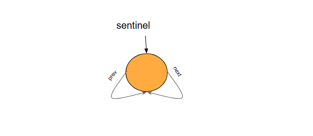
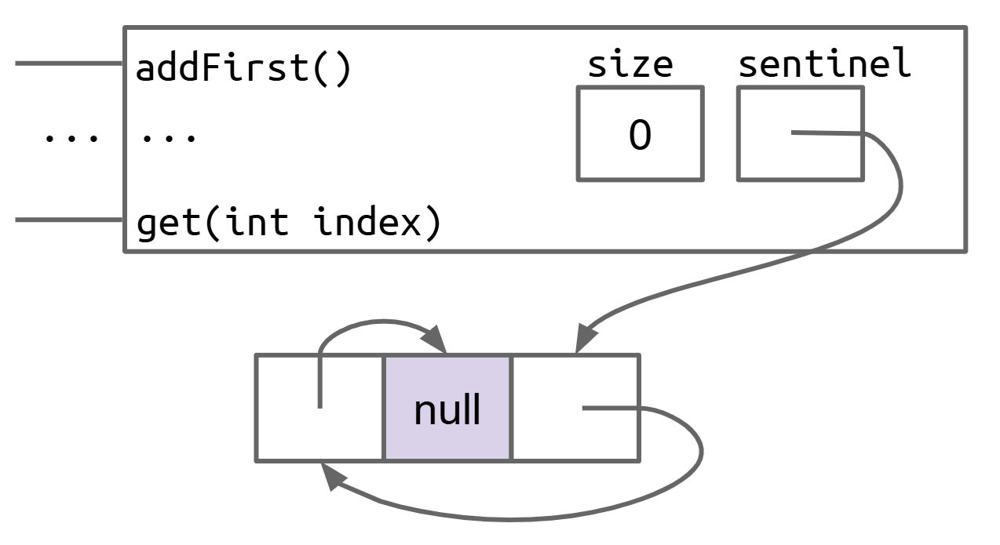
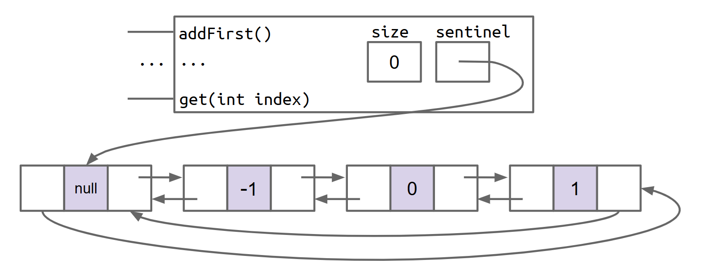
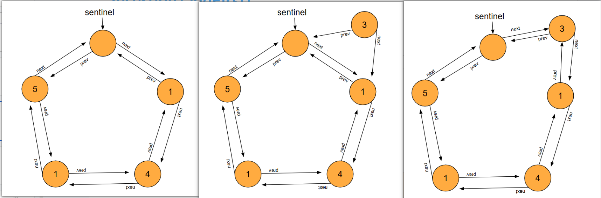

[LinkedListDeque61B.java](./src/core/LinkedListDeque61B.java)

1. 创建类 `LinkedListDeque61B<T>` 实现接口 `Deque61B<T>`，自动生成所有方法签名，并写好空的构造器
2. 构造器中创建哨兵节点，让它的 `next` 和 `prev` 都指向自身，`size` 初始化为 `0`
3. 实现 `addFirst` 和 `addLast`：不循环，`O(1)`
4. 实现 `toList()`：遍历链表，把元素逐个加入 `ArrayList`
5. 测试 `addFirst`、`addLast`、`toList`：跑通提供的测试
6. 实现 `isEmpty` 和 `size`：`O(1)`，`size` 直接从缓存返回
7. 实现 `getFirst` 和 `getLast`：`O(1)`，空列表返回 `null`
8. 实现 `get`（迭代版本）：遍历到指定索引，越界返回 `null`
9. 实现 `getRecursive`：递归版本，越界返回 `null`
10. 实现 `removeFirst` 和 `removeLast`：`O(1)`，空列表返回 `null`

# 构造函数



```java
public LinkedListDeque61B(){
    var node = new Node<T>();
    this.sentinel = node;
    this.sentinel.prev = node;
    this.sentinel.item = null;
    this.sentinel.next = node;

    size = 0;
}
```



# 添加首尾



画图将指针连接正确就好,处理四条线，无论添加还是删除，首步还是尾步原理都是一样的

以`addFirst`为例

```java
public void addFirst(T item) {
    if(item == null) return;

    Node<T> node = new Node<T>(item);

    var tempNode = this.sentinel.next;
    this.sentinel.next = node;
    node.prev = this.sentinel;

    node.next = tempNode;
    tempNode.prev = node;

    size++;
}
```



# get

这里记录递归的实现

```java
@Override
public T getRecursive(int index) {
    if(index < 0 || index > size - 1){
        return null;
    }
    return getRecursive(this.sentinel.next, index);
}

private static <T> T getRecursive(Node<T> node,int index){
    if(index == 0){
        return node.item;
    }
    return getRecursive(node.next, index - 1);
}
```

# 测试

[LinkedListDeque61BTest.java](./src/LinkedListDeque61BTest.java)

```java
public class LinkedListDeque61BTest {
	private final static LinkedListDeque61BTest instance = new LinkedListDeque61BTest();

	@Test
	public void testOneElement() {
		Deque61B<Integer> lld = new LinkedListDeque61B<>();
		lld.addFirst(3);
		Truth.assertThat(lld.getLast()).isEqualTo(lld.getFirst());

		lld = new LinkedListDeque61B<>();
		lld.addLast(5);
		Truth.assertThat(lld.getLast()).isEqualTo(lld.getFirst());

		System.out.println("Good testOneElement");
	}

	@Test
	public void testToList() {

		Deque61B<Integer> lld = new LinkedListDeque61B<>();
		List<Integer> expected = List.of(3, 5, 9, 10);

		lld.addLast(5);
		lld.addLast(9);
		lld.addLast(10);
		lld.addFirst(3);
		List<Integer> actual = lld.toList();
		Truth.assertThat(actual).isEqualTo(expected);
		System.out.println("Good testToList: " + actual);

	}

	@Test
	public void testIsEmptyAndRemove() {
		Deque61B<String> lld = new LinkedListDeque61B<>();
		Truth.assertThat(lld.isEmpty()).isTrue();

		lld.addFirst("Apple");
		lld.addLast("Watermelon");
		lld.addFirst("Strawberry");

		lld.removeFirst();
		Truth.assertThat(lld.toList()).containsExactly("Apple", "Watermelon").inOrder();

		lld.removeFirst();
		lld.removeFirst();

		Truth.assertThat(lld.isEmpty()).isTrue();
		System.out.println("Good testIsEmptyAndRemove");
	}

	@Test
	public void testGet() {
		Deque61B<String> lld = new LinkedListDeque61B<>();

		// [Watermelon, Strawberry, Apple]
		lld.addFirst("Apple");
		lld.addFirst("Strawberry");
		lld.addFirst("Watermelon");

		Truth.assertThat(lld.get(0)).isEqualTo("Watermelon");
		Truth.assertThat(lld.get(1)).isEqualTo("Strawberry");
		Truth.assertThat(lld.get(2)).isEqualTo("Apple");

		Truth.assertThat(lld.getRecursive(0)).isEqualTo("Watermelon");
		Truth.assertThat(lld.getRecursive(1)).isEqualTo("Strawberry");
		Truth.assertThat(lld.getRecursive(2)).isEqualTo("Apple");

		System.out.println("Good testGet");

	}

	public static void main(String[] args) {
		instance.testOneElement();
		instance.testToList();
		instance.testIsEmptyAndRemove();
		instance.testGet();
	}
}
```
