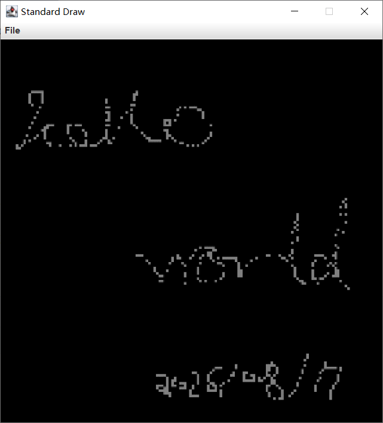
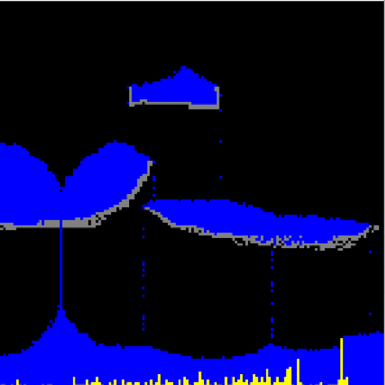

# 项目说明

使用了普林斯顿算法课的第三方依赖，主要是画图,这个包封装了jwt那一套，能够进行界面的开发



粒子坐标轴设计，用于粒子的移动，渲染的时候，遍历所有粒子应该是从下到上，从左到右的遍历

```txt
y
^
|
|   (0,3)  (1,3)  (2,3)  (3,3)
|   (0,2)  (1,2)  (2,2)  (3,2)
|   (0,1)  (1,1)  (2,1)  (3,1)
|   (0,0)  (1,0)  (2,0)  (3,0)
|
+----------------------------------> x
    x=0     x=1     x=2     x=3
```

水流动的效果




# 粒子

通过粒子类型(flavor)来返回不同的颜色(`java.awt.Color`),粒子就像是像素一样。每个单位为1


# Google Truth

```java
Set<String> validStates = new HashSet<>(expectedGrowthStates);

for (String observed : observedStates) {
    Truth.assertWithMessage("""
                    Test Failed: An invalid/impossible state was generated.
                    Unexpected State:
                    %s
                    """, observed)
            .that(validStates)
            .contains(observed);
}
```

```java
assertThat(ret).isAtLeast(min);
assertThat(ret).isAtMost(max);
```

# 第三方库

[algs4 java document](https://algs4.cs.princeton.edu/code/javadoc/edu/princeton/cs/algs4/package-summary.html)
[guava](https://guava.dev/)
[vavr](https://vavr.io/)