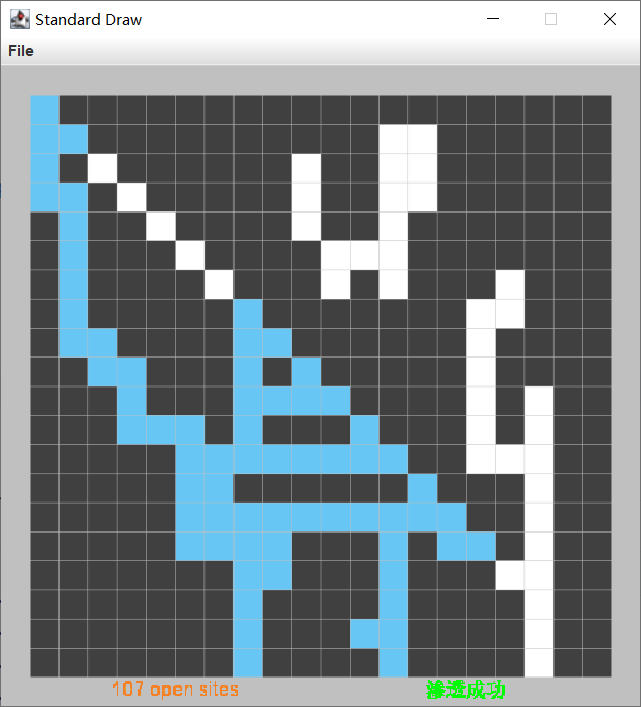
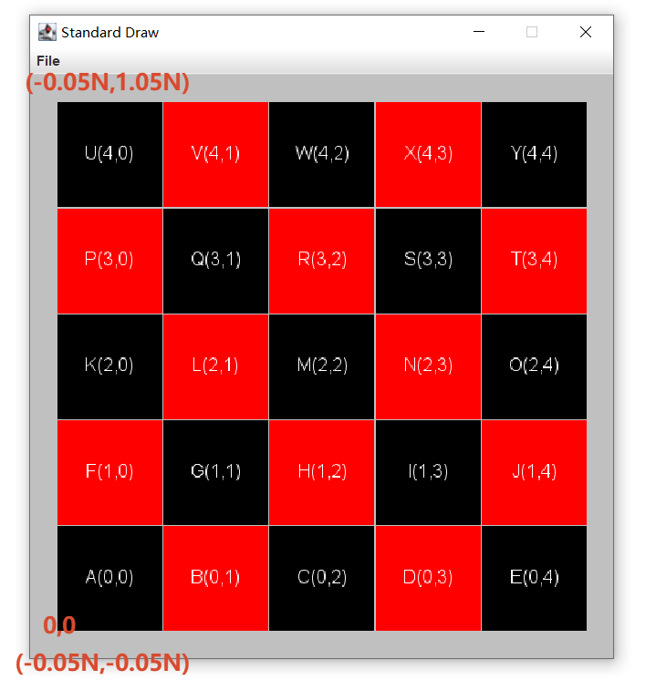
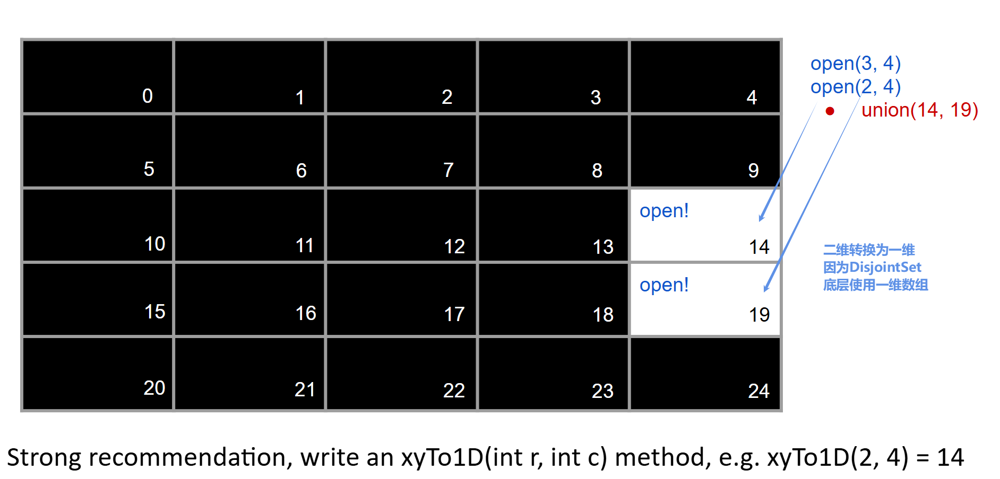
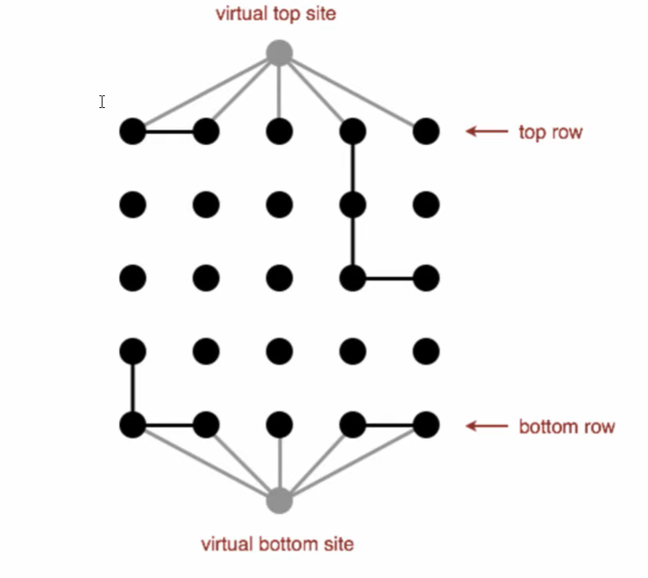
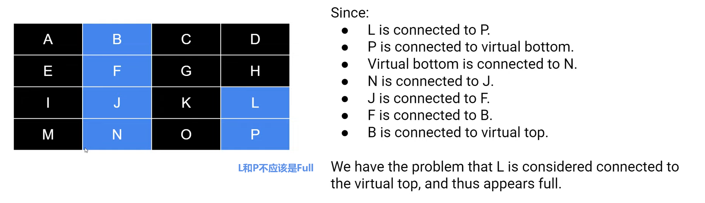
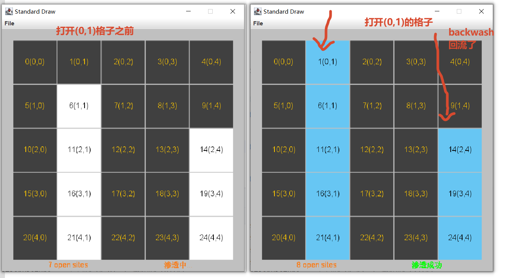
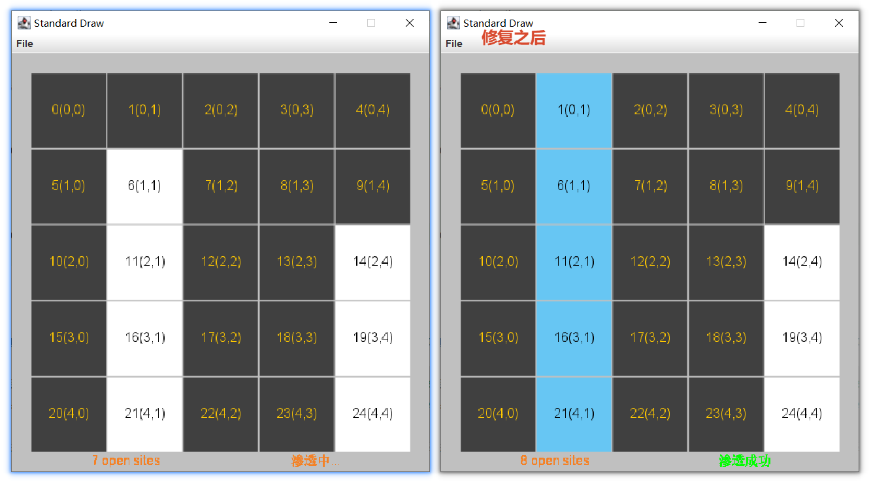
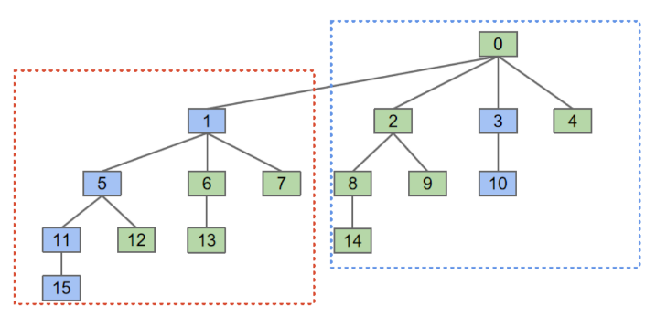
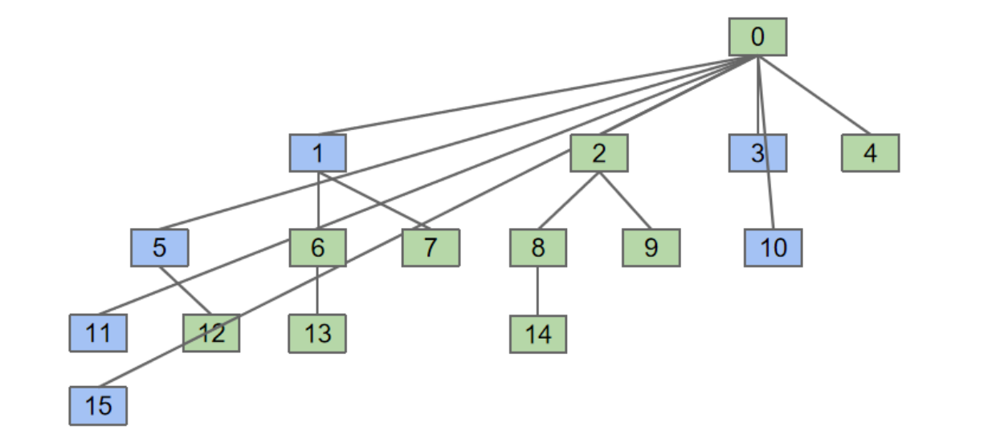
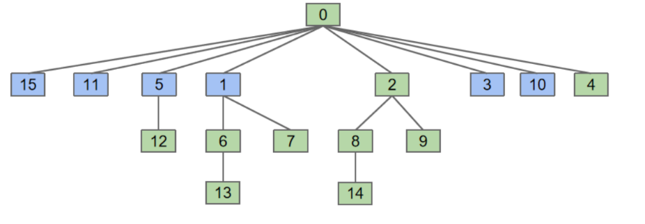

[Description of Project Percolation](https://sp26.datastructur.es/projects/proj3/)

# 最终效果




```txt
─c61b
   ├─config
   │      AppConfig.java    # 配置文件
   │      
   ├─core
   │      IPercolation.java     # 接口
   │      Percolation.java  # 核心：渗透模型 有backwash问题
   │      PercolationCompletion.java    # 完整版：渗透模型
   │      
   ├─disjointset
   │      DisjointSet.java  # 并查集接口
   │      WeightedQuickUnionFindC61B.java    # 自己实现的并查集带有路径压缩
   │      
   └─visualizer
           InteractivePercolationVisualizer.java  # 图形化入口
           PercolationPicture.java  # 绘制渗透系统的格子
           SimpleBoardVisualizer.java   # StdDraw画图模拟

```


# simple board

> StdDraw的基本研究：
> 
> 1. 左下角为坐标轴，不一定为(0,0)开始，这里设置为(-0.05*n,-0.05*n)
> 2. StdDraw的窗口大小不能改变，所以通过setXscale，setYscale等来映射 (0,5),代表从左到右坐标为0 -> 5

[SimpleBoardVisualizer.java](src/main/java/io/github/upangka/c61b/visualizer/SimpleBoardVisualizer.java)
**注意**，画布是从左下角，从下往上画，而二维数组的遍历是从上往下遍历的，这要稍微处理一下。
```java
public class SimpleBoardVisualizer {
    private static final int DEFAULT_DISPLAY = 5;

    static void main() {
        int n = DEFAULT_DISPLAY;
        // 使用缓冲
        StdDraw.enableDoubleBuffering();
        // 等比例间距用乘法
        StdDraw.setXscale(-0.05d * n, 1.05 * n);
        StdDraw.setYscale(-0.05d * n, 1.05 * n);
        StdDraw.clear(Color.LIGHT_GRAY);
        var colors = List.of(Color.BLACK, Color.RED);
        while (true) {

            for (int x = 0; x < n; x++) {
                for (int y = 0; y < n; y++) {
                    // 方便颜色错开
                    int pos = (x + y);
                    StdDraw.setPenColor(colors.get(pos % 2));
                    // 从下往上画
                    StdDraw.filledSquare(0.5d + y, 0.5 + x, 0.49);
                    StdDraw.setPenColor(Color.WHITE);

                    // 显示文字
                    Character c = (char) ('A' + (x * n + y));
                    String content = c + "(%d,%d)".formatted(x, y);
                    StdDraw.text(0.5d + y, 0.5 + x, content);
                }
            }

            StdDraw.show();
            // 1s 60FPS
            StdDraw.pause(16);
        }
    }
}
```



# 二维转一维




# Virtual Sites

One approach to making things fast is to create:
1. Virtual top site connected to all open items in top row.
2. Similar virtual site at bottom.

To check `isFull`:
- Check for a connection to top site.

To check percolates:
- Check for connection between top and bottom sites.




# Backwash问题

当你同时使用顶部和底部虚拟节点时，会出现一种现象：系统渗透后，所有与底部虚拟节点连通的开放格子，都会通过**底部 → 虚拟底部 → 虚拟顶部 → 顶部的路径**，被错误地认为是“满的”。
也就是说，原本只是“与底部连通但不与顶部连通”的格子，在系统渗透后会被错误地标记为“满”。这就是 `backwash`（回流）。它会让你在执行 `isFull` 时得到错误的结果——那些只在底部连通而不在顶部的格子也会被标记为“满”。

[backwash video hint 2](https://www.youtube.com/watch?v=gTqM4WvM9D8)



Hint:

- When checking percolates, we call `isConnected(virtualTop,virtualBottom)` on some DisjointSets object.
  - In the disjoint sets object, we want M,N,O and P to be connected to the virtual bottom.
- When checking `isFull`, we call `isConnected(virtualTop,X)` on some DisjointSets object:
  - In the disjoint sets object, we do NOT want M,N,O and P to be connected to the virtual bottom.


[Percolation.java](src/main/java/io/github/upangka/c61b/core/Percolation.java)



用同一个并查集同时处理了“顶部连通”和“底部连通”两种关系。一旦系统渗透了，`virtualTop` 和 `virtualBottom` 就通过一条完整的开放路径连通了。这时，`virtualTop` 通过这条路径“间接”连接到了所有与底部连通的开放格子。因此，`isFull` 会错误地返回 `true`，认为这些底部格子也是“满的”——这就是回流。
简单来说：用一个并查集同时回答了**是否与顶部连通**和**系统是否渗透**两个问题，而`渗透发生后，这两个问题互相干扰了`。

```java
public void open(int x, int y) {
    sites[x][y] = true;

    int p = xyTo1D(x, y);
    
    // 处理邻居的联通
    getNeighbors(x, y).forEach(point -> {
        if (sites[point.x][point.y]) {
            int q = xyTo1D(point.x, point.y);
            unionFinder.connnect(p, q);
        }
    });
    
    //⚠️ 这里同时处理顶部和底部
    // 处理顶部
    if (x == 0) {
        unionFinder.connnect(virtualTop, p);
    }
    // 处理底部
    if(x == _n - 1) {
        unionFinder.connnect(virtualBottom, p);
    }
}
```

[PercolationCompletion.java](src/main/java/io/github/upangka/c61b/core/PercolationCompletion.java) 使用两个并查集:

1. **`ufFull`**：只连接顶部 `virtualTop`，**不连接**底部 `virtualBottom`。专门用于 `isFull()` 的判断。**所有 `open` 操作中，与邻居的 `union` 和与 `virtualTop` 的 `union` 都在这个并查集中进行。**
2. **`ufPercolates`**：同时连接顶部 `virtualTop` 和底部 `virtualBottom`，专门用于 `percolates()` 的判断。**所有 `open` 操作中，与邻居的 `union` 以及与顶部和底部的 `union`，都在这个并查集中进行。**

这样，`isFull()` 查询的并查集不包含底部节点，就不会受到回流影响；`percolates()` 查询的并查集包含了完整的连通信息，可以正常判断是否渗透。

```java
/** 添加虚拟节点之后，需要两个并查集来分别处理渗透和full的问题 */
/** ufPercolation 处理 是否渗透，考虑全部格子 */
private final DisjointSet ufPercolation;
/** ufFull只处理虚拟顶部和其他格子，不考虑虚拟底部，处理格子是否full */
private final DisjointSet ufFull;

public void open(int x, int y) {
    sites[x][y] = true;

    int p = xyTo1D(x, y);

    getNeighbors(x, y).forEach(point -> {
        if (sites[point.x][point.y]) {
            int q = xyTo1D(point.x, point.y);
            ufPercolation.connnect(p, q);
            ufFull.connnect(p, q);
        }
    });

    // 处理顶部
    if (x == 0) {
        ufPercolation.connnect(virtualTop, p);
        ufFull.connnect(virtualTop, p);
    }
    // 处理底部
    if(x == _n - 1) {
        ufPercolation.connnect(virtualBottom, p);
        // ufFull并查集不处理底部
    }
}
```




---

# 自己实现并查集

[WeightedQuickUnionFindC61B](./src/main/java/io/github/upangka/c61b/disjointset/WeightedQuickUnionFindC61B.java)底层是通过调用`findRoot`做**全路径压缩**

```java
private int findRoot(int p) {
    validate(p);
    List<Integer> accessEls = new ArrayList<>();
    int root = p;
    while (!isRoot(root)) {
        accessEls.add(root);
        root = parent[root];
    }

    // 完整路径压缩
    for (Integer access : accessEls) {
        parent[access] = root;
    }

    return root;
}
```

压缩测试[WeightedQuickUnionFindC61BTest.java](./src/test/java/io/github/upangka/c61b/disjointset/WeightedQuickUnionFindC61BTest.java)

```java
// 未调用isConnection的时候
var expected = "[-16, 0, 0, 0, 0, 1, 1, 1, 2, 2, 3, 5, 5, 6, 8, 11]";
Truth.assertThat(ds.toString()).isEqualTo(expected);
// 会产生路径压缩
Truth.assertThat(ds.isConnection(10,15)).isTrue();
expected = "[-16, 0, 0, 0, 0, 0, 1, 1, 2, 2, 0, 0, 5, 6, 8, 0]";
Truth.assertThat(ds.toString()).isEqualTo(expected);
```





