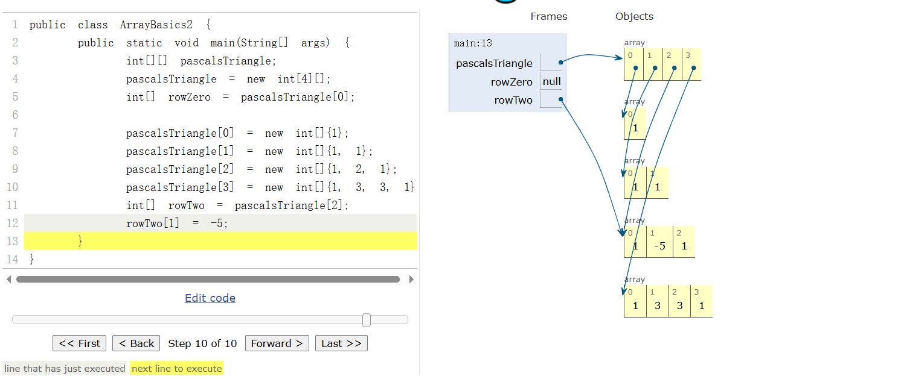
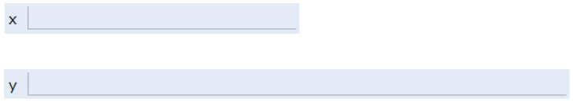
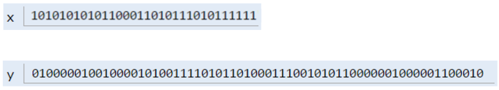
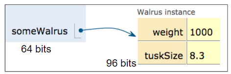
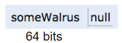

Java的泛型： 好的编程语言和好的数据结构，不是给你越多功能越好，而是帮你减少犯错的可能。

```python
# python
L = []
L.append("a")
L.append(3)
```

```java
// java 4.0
List L = new ArrayList();
L.add("a");
L.add("b");
String x = L.get(0);  // 会编译报错

// Java 5.0 开始
List<String> L = new ArrayList<>();
L.add("a");
L.add("b");
String x = L.get(0);
```

# 数组的初始化

```java
x = new int[3];
y = new int[]{1, 2, 3, 4, 5};
int[] z = {9, 10, 11, 12, 13};
```

## 二维数组

在 Java 中，二维数组的本质是"数组的数组"（Array of Arrays），它不要求第二维度长度一致，这叫不规则数组（Ragged Array）或交错数组。

```java
int[][] pascalsTriangle;
pascalsTriangle = new int[4][];
int[] rowZero = pascalsTriangle[0];

pascalsTriangle[0] = new int[]{1};
pascalsTriangle[1] = new int[]{1, 1};
pascalsTriangle[2] = new int[]{1, 2, 1};
pascalsTriangle[3] = new int[]{1, 3, 3, 1};
int[] rowTwo = pascalsTriangle[2];
rowTwo[1] = -5;
```

[java_visualize](<https://cscircles.cemc.uwaterloo.ca/java_visualize/#code=public+class+ArrayBasics2+%7B%0A%09public+static+void+main(String%5B%5D+args)+%7B%0A%09%09int%5B%5D%5B%5D+pascalsTriangle%3B%0A%09%09pascalsTriangle+%3D+new+int%5B4%5D%5B%5D%3B%0A%09%09int%5B%5D+rowZero+%3D+pascalsTriangle%5B0%5D%3B%0A%09%09%0A%09%09pascalsTriangle%5B0%5D+%3D+new+int%5B%5D%7B1%7D%3B%0A%09%09pascalsTriangle%5B1%5D+%3D+new+int%5B%5D%7B1,+1%7D%3B%0A%09%09pascalsTriangle%5B2%5D+%3D+new+int%5B%5D%7B1,+2,+1%7D%3B%0A%09%09pascalsTriangle%5B3%5D+%3D+new+int%5B%5D%7B1,+3,+3,+1%7D%3B%0A%09%09int%5B%5D+rowTwo+%3D+pascalsTriangle%5B2%5D%3B%0A%09%09rowTwo%5B1%5D+%3D+-5%3B%0A%09%7D%0A%7D+&mode=display&disableNesting=1&verticalLists=1&curInstr=0>)



# 引用

[References, Recursion, and Lists](https://cs61b-2.gitbook.io/cs61b-textbook-spring-2026/3.-references-recursion-and-lists#declaring-a-variable-simplified)

Java 把数据类型分为两种：

1. 基本类型（8 种）：`int`、`double`、`boolean` 等，**变量直接存值**。
2. 引用类型：类（`Walrus`、`Dog`）、`数组`、接口等，变量存的不是对象本身，而是**对象的地址**。

> 基本数据类型

```java
int x;
double y;
```

int 32bit, double是64bit，分别分配对应的空间。



```java
x = -1431195969;
y = 567213.112;
```

赋值直接存储值的二进制



> Reference Type Variable Declarations（引用类型变量）
>
> 1. 引用类型变量永远是 64 位，存的是地址，不是对象本身。
> 2. `null` 就是 64 位全零，表示"没指向任何对象"。
> 3. `new` 返回的是地址，这个地址被存进变量里。

**box and pointer**

```java
Walrus someWalrus;
someWalrus = new Walrus(1000, 8.3);
```



```java
Walrus someWalrus = null
```



# == vs. Arrays.equals

`==`可以理解为变量存储的二进制的比较

```java
int[] x = new int[]{0, 1, 2, 95, 4};
int[] y = new int[]{0, 1, 2, 95, 4};
System.out.println(x == y); #false
```

使用`Arrays.equals`来比较两个数组的内容

```java
int[] x = new int[]{0, 1, 2, 95, 4};
int[] y = new int[]{0, 1, 2, 95, 4};
System.out.println(Arrays.equals(x, y));  // true
```

二维数组使用

```java
int[][] x = new int[][]{
    {1},
    {1, 1},
    {1, 2, 1},
    {1, 3, 3, 1}};

int[][] y = new int[][]{
    {1},
    {1, 1},
    {1, 2, 1},
    {1, 3, 3, 1}};
System.out.println(Arrays.deepEquals(x, y)); // true
```
