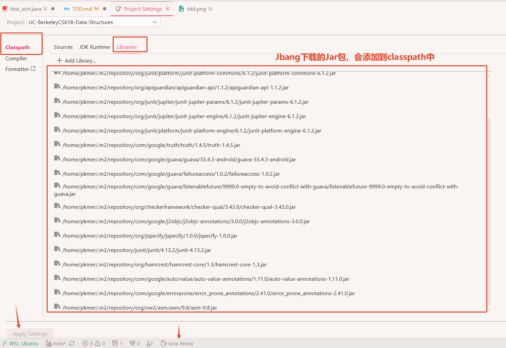
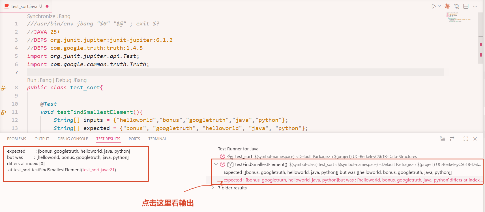
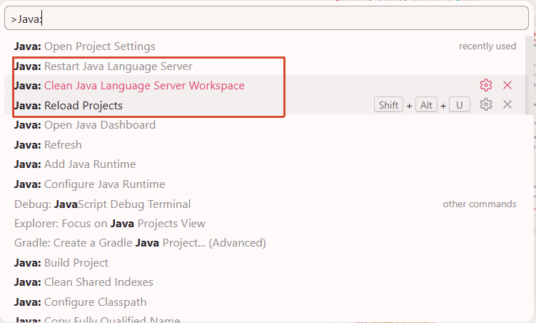
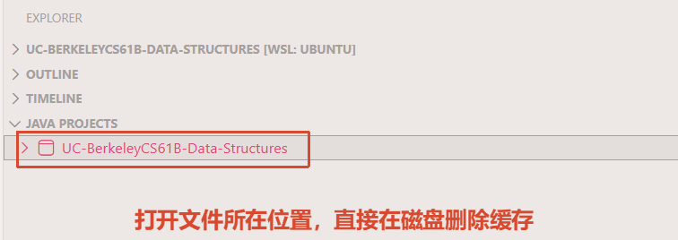

[Google Truth ](https://truth.dev/)
[junit](https://docs.junit.org/6.1.2/overview.html)

```java
///usr/bin/env jbang "$0" "$@" ; exit $?
//JAVA 25+
//DEPS com.google.truth:truth:1.4.5

import com.google.common.truth.Truth;

class Sort{
    public static void sort(String[] inputs){

    }
}


void main(String... args) {
    String[] inputs = {"helloworld","bonus","googletruth","java","python"};
    String[] expected = {"bonus", "googletruth", "helloworld", "java", "python"};

    Sort.sort(inputs);
    // Arrays.sort(inputs);
    Truth.assertThat(inputs).isEqualTo(expected);
}

```

```sh
Exception in thread "main" expected        : [bonus, googletruth, helloworld, java, python]
but was         : [helloworld, bonus, googletruth, java, python]
differs at index: [0]
        at sort.main(sort.java:20)
```

# Junit测试

> ⚠️**重要**: `Compact Source File`现在不支持`@Test`，所以还是要以类的形式存在。但是Jbang还是可以正常使用的。

这里使用的JUnit6，`org.junit.jupiter:junit-jupiter:6.1.2`

[Enable testing and adding test framework JARs to your project](https://code.visualstudio.com/docs/java/java-testing#_enable-testing-and-adding-test-framework-jars-to-your-project)

> Starting with Test Runner for Java version 0.34.0, you can enable a test framework for your unmanaged folder project (a project without any build tools(maven,Gradle))

Jbang这种快速开发天生适合这个，Jbang能够快速引入第三方jar包，添加到项目中的classpath中



[tdd](./code/tdd/)实际测试效果,点击右边的能够是人阅读的效果，光是字符那只是协议的输出



VSCode有时候抽风，大部分是缓存的影响的，只要删除缓存就可以了



有时候`JAVA PROJECTS`会出现好几个相同的项目，选中项目右键选择`Reveal in Explore`直接进行删除，然后`Developer: reload window`



# TDD

Test Driven Development
