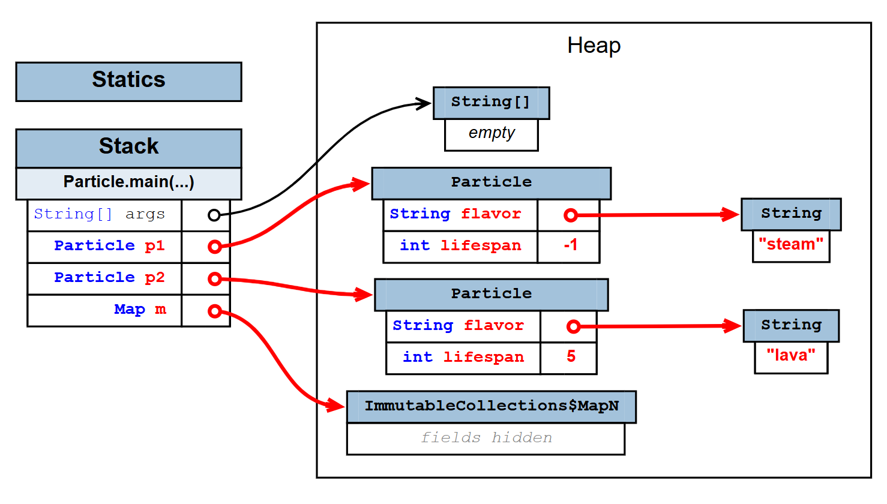

# Class Creation

Translate the following Python `Planet` class into Java. Make sure to use correct Java syntax and naming
conventions (e.g. `camelCase` for methods). Assume `x`, `y`, and mass are doubles.

[Planet.py](./code/worksheet/Planet.py)

```python
from __future__ import annotations
import math

class Planet:
    x: float
    y: float
    mass: float

    def __init__(self,x,y,mass):
        self.x = x
        self.y = y
        self.mass = mass

    def distance_to(self,other: Planet):
        return math.sqrt(
            (other.x - self.x) **2 + (other.y - self.y)**2
        )

    @staticmethod
    def total_mass(planets: list[Planet]):
        total = 0
        for p in planets:
            total += p.mass
        return total

p1 = Planet(5,10,100)
p2 = Planet(1,2,200)
print(p1.distance_to(p2))
print(Planet.total_mass([p1,p2]))
```

对应的Java实现[Planet.java](./code/worksheet/Planet.java)

```java
import java.util.List;

///usr/bin/env jbang "$0" "$@" ; exit $?
//JAVA 25+

public class Planet {
	double x;
	double y;
	double mass;

	public Planet(double x, double y, double mass) {
		this.x = x;
		this.y = y;
		this.mass = mass;
	}

	public double distanceTo(Planet other) {
		double dx = other.x - this.x;
		double dy = other.y - this.y;
		return Math.sqrt(dx * dx + dy * dy);
	}

	public static double totalMass(List<Planet> planets) {
		return planets.stream()
			.mapToDouble(p -> p.mass)
			.sum();

	}
}

void main(String... args) {
	var p1 = new Planet(5, 10, 100);
	var p2 = new Planet(1, 2, 200);
	IO.println(p1.distanceTo(p2));
	IO.println(Planet.totalMass(List.of(p1, p2)));
}
```

# List Exercises

## (a) common

The code reference below shows the equivalent Java code for common List operations.

[list_demo.py](./code/worksheet/list_demo.py)

```python
lst = []
lst.append("zero")
lst.append("one")

lst[0] = "zed"
print(len(lst))

if 'one' in lst:
    print("one in lst")

for elem in lst:
    print(elem)
```

[list_demo.java](./code/worksheet/list_demo.java)

```java
///usr/bin/env jbang "$0" "$@" ; exit $?
//JAVA 25+

void main(String... args) {
	var lst = new ArrayList<String>();
	lst.add("zero");
	lst.add("one");

	lst.set(0, "zed");
	System.out.println(lst.size());

	if (lst.contains("one")) {
		System.out.println("one in lst");
	}

	lst.stream().forEach(IO::println);

}
```

Fill in the method below which takes in two lists of integers and returns a new list containing the common
items of the two given lists. Do not use the `retainAll` method

[lst_exercise.py](./code/worksheet/lst_exercise.py)

```python

def common(L1: list[int],L2: list[int]):
    ret = []
    for item in L1:
        if item in L2 and item not in ret:
            ret.append(item)
    return ret

L1 = [1, 2, 3, 4]
L2 = [3, 4, 5, 6]

print(common(L1,L2))
```

[lst_exercise.java](./code/worksheet/lst_exercise.java)

```java
///usr/bin/env jbang "$0" "$@" ; exit $?
//JAVA 25+

List<Integer> common(List<Integer> L1, List<Integer> L2) {
	var ret = new ArrayList<Integer>();
	for (Integer item : L1) {
		if (L2.contains(item) && !ret.contains(item)) {
			ret.add(item);
		}
	}
	return ret;
}

void main(String... args) {
	List<Integer> ret = common(
			List.of(1, 2, 3, 4),
			List.of(3, 4, 5, 6));
	System.out.println(ret);
}
```

## common

Fill in the method below which capitalizes all strings in the given list in place. Note that `"cat".toUpperCase()` returns `"CAT"`.

[capitalizes.py](./code/worksheet/capitalizes.py)

```python

def capitalize(L: list[str]):
    for idx in range(len(L)):
        L[idx] = L[idx].upper()

L = ["HeLLo", "WoRLd"]
capitalize(L)
print(L)
```

[capitalizes.java](./code/worksheet/capitalizes.java)

```java
///usr/bin/env jbang "$0" "$@" ; exit $?
//JAVA 25+

void capitalize(List<String> L) {
	for (int i = 0; i < L.size(); i++) {
		L.set(i, L.get(i).toUpperCase());
	}
}

void main(String... args) {
	var L = new ArrayList<>(List.of("HeLLo", "WoRLd"));
	capitalize(L);
	System.out.println(L);
}
```

# Map Exercises

**buildLessThanMap**

The code reference below shows the equivalent Java code for common Map operations.

[map_demo.py](./code/worksheet/map_demo.py)

```python
d = {}
d["hello"] = "hi"
d["hello"] = "goodbye"

print(d["hello"])
print(len(d))

if "hello" in d:
 print("\"hello\" in d")

for key in d.keys():
 print(key)
```

[map_demo.java](./code/worksheet/map_demo.java)

```java
///usr/bin/env jbang "$0" "$@" ; exit $?
//JAVA 25+

void main(String... args) {
	var d = new HashMap<String, String>();
	d.put("hello", "hi");
	d.put("hello", "goodbye");

	System.out.println(d.get("hello"));
	System.out.println(d.size());

	if (d.containsKey("hello")) {
		System.out.println("\"hello\" in d");
	}

	for (String key : d.keySet()) {
		System.out.println(key);
	}
}
```

Translate the following Python function into Java. The function takes a list of integers and returns a map where the keys are the integers from the list, and the values are lists containing all integers from the original list that are strictly less than the key (without duplicates). Don't worry about order

[map_exercise.py](./code/worksheet/map_exercise.py)

```python
def build_less_than_map(L: list[int]):
    result = {}
    for x in L:
        if x not in result:
            result[x] = []
        for y in L:
            if y < x:
                if y not in result[x]:
                    result[x].append(y)
    return result

L = [4, 1, 3, 3]
m = build_less_than_map(L)
print(m)
```

[map_exercise.java](./code/worksheet/map_exercise.java)

```java
///usr/bin/env jbang "$0" "$@" ; exit $?
//JAVA 25+

Map<Integer, List<Integer>> build_less_than_map(List<Integer> lst) {
	var ret = new HashMap<Integer, List<Integer>>();

	for (Integer key : lst) {
		List<Integer> valLst = ret.computeIfAbsent(key, ArrayList<Integer>::new);

		for (Integer val : lst) {
			if (key > val && !valLst.contains(val)) {
				valLst.add(val);
			}
		}
	}

	return ret;
}

void main(String... args) {
	var ret = build_less_than_map(List.of(4, 1, 3, 3));
	System.out.println(ret);
}
```

# Positive Filter

Fill in the function below, which takes in a list of integers and returns a new array containing only the positive integers from the original list

[positive_filter.java](./code/worksheet/positive_filter.java)

```java
///usr/bin/env jbang "$0" "$@" ; exit $?
//JAVA 25+

/**
 * Returns an array containing only the positive
 * integers from the given list
 */
int[] filterPositive(List<Integer> L) {
	return L.stream()
		.filter(x -> x > 0)
		.mapToInt(Integer::intValue)
		.toArray();
}

void main(String... args) {
	int[] ret = filterPositive(List.of(3, -1, 0, 2, -5, 7));
	System.out.println(Arrays.toString(ret));
}
```

# Particle References

What will the code below print?

[Particle.java](./code/worksheet/Particle.java)

```java

///usr/bin/env jbang "$0" "$@" ; exit $?
//JAVA 25+

import java.util.Map;
public class Particle {
    public String flavor;
    public int lifespan;

    public Particle(String f, int l) {
        flavor = f;
        lifespan = l;
    }

    public static void boil(Particle p) {
        p.flavor = "steam";
    }

    public static void decrement(int x) {
        x = x - 1;
    }

    public static void action(Map<Integer, Particle> m) {
        m.get(2).flavor = "lava";
        m.get(2).lifespan = 5;
    }

    public static void main(String... args) {
        Particle p1 = new Particle("water", -1);
        Particle p2 = new Particle("sand", -1);
        Map<Integer, Particle> m = Map.of(1, p1, 2, p2);
        boil(p1);
        IO.println(p1.flavor);
        decrement(p1.lifespan);
        IO.println(p1.lifespan);
        action(m);
        IO.println(p2.lifespan);
        IO.println(p2.flavor);
    }
}
```

```txt
steam
-1
5
lava
```


