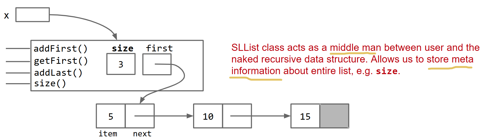
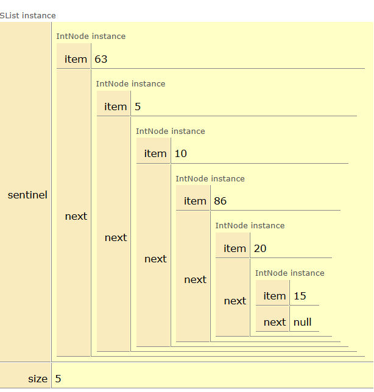

# IntNode

节点就是节点，它只管存数据和指向下一个节点。操作节点的方法，应该由另一个类`SList`来管

```java
class IntNode{
    private int item;
    private IntNode next;

    public IntNode(int item,IntNode next){
        this.item = item;
        this.next = next;
    }
}
```

# SList

SList就像是一个中介（middle man）在提供抽象方法的同时，也能提供保留一些**元数据(meta infomation)**，比如`size`,`maxnum`,`minnum`



[slist_v1.java](./code/slist/slist_v1.java)

1. 引入`sentinel`哨兵，处理空`SList`的时候的优雅的`addLast`
2. 引入缓存`size`，避免每次都遍历链表获取
3. 在代码结构上,将`IntNode`处理为内部类，并且`IntNode`不需要访问外部类声明为`static innerclass`

```java
///usr/bin/env jbang "$0" "$@" ; exit $?
//JAVA 25+
//JAVA_OPTIONS -ea
class SList {

	private static class IntNode {
		private int item;
		private IntNode next;

		public IntNode(int item, IntNode next) {
			this.item = item;
			this.next = next;
		}
	}

	private IntNode sentinel;
	private int size;

	public SList() {
		sentinel = new IntNode(63, null);
		this.size = 0;
	}

	public SList(int item) {
		sentinel = new IntNode(63, null);
		this.sentinel.next = new IntNode(item, null);
		this.size = 1;
	}

	public void addFirst(int item) {
		sentinel.next = new IntNode(item, sentinel.next);
		this.size += 1;
	}

	public int getFirst() {
		return sentinel.next.item;
	}

	public void addLast(int item) {
		var current = sentinel;
		while (current != null && current.next != null) {
			current = current.next;
		}

		current.next = new IntNode(item, current.next);
		size++;
	}

	public int size() {
		return this.size;
	}

	public void print() {
		var current = sentinel.next;
		int i = 0;
		while (current != null) {
			if (i > 0) {
				System.out.print(" -> ");
			}
			i += 1;
			System.out.print(current.item);
			current = current.next;
		}

		assert i == size : "内部错误";
		System.out.printf("%n一共%d个元素%n", i);
	}
}

void main(String... args) {
	SList L1 = new SList(86);
	L1.addLast(20);
	L1.addFirst(10);
	L1.addFirst(5);
	L1.addLast(15);

	assert L1.size() == 5 : "元素数量不对";
	L1.print();

}
/**
5 -> 10 -> 86 -> 20 -> 15
一共5个元素
*/
```


