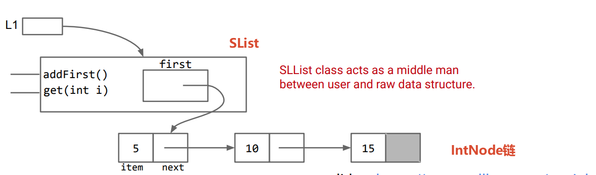

# IntNode

节点就是节点，它只管存数据和指向下一个节点。操作节点的方法，应该由另一个类`SList`来管

```java
class IntNode{
    private int item;
    private IntNode next;

    public IntNode(int item,IntNode next){
        this.item = item;
        this.next = next;
    }
}
```

# SList



[slist_v1.java](./code/slist/slist_v1.java)

```java
class SList {

	private class IntNode {
		private int item;
		private IntNode next;

		public IntNode(int item, IntNode next) {
			this.item = item;
			this.next = next;
		}
	}

	private IntNode first;

	public SList(int item) {
		first = new IntNode(item, first);
	}

	public void addFirst(int item) {
		first = new IntNode(item, first);
	}

	public int getFirst() {
		return first.item;
	}

	public void print() {
        // ...看具体文件实现...
	}
}

void main(String... args) {
	SList L1 = new SList(15);
	L1.addFirst(10);
	L1.addFirst(5);

	System.out.println(L1.getFirst());
    L1.print();
}
```
