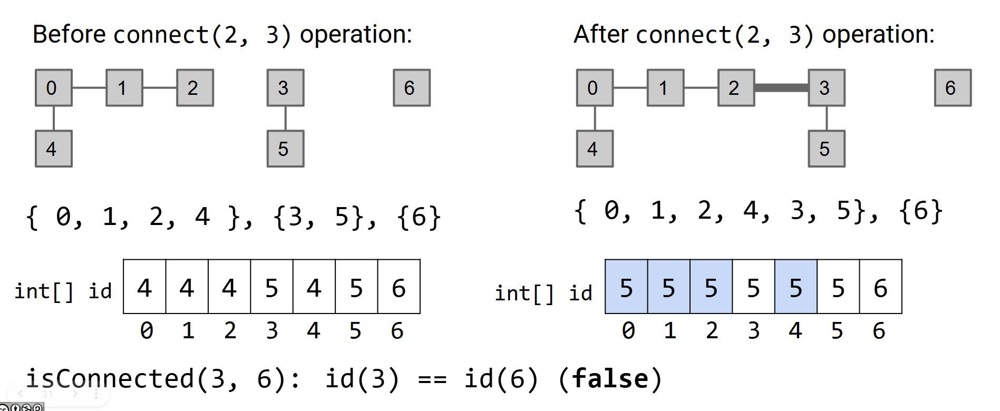
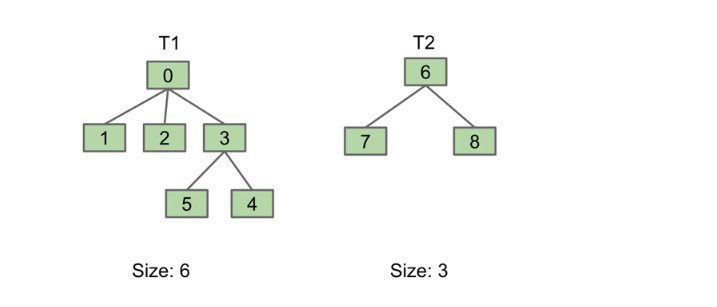

# Disjoint Set(Union Find)

A Disjoint-Sets (or Union-Find) data structure keeps track of a fixed number of elements partitioned into a number of disjoint sets. The data structure has two operations:

> 这个集合只做两件事
>
> 如何快速判断两个元素是否属于同一个集合，以及如何高效地把两个集合合并在一起。

1. `connect(x, y)`：把 `x` 和 `y` 连接起来,也叫union
2. `isConnected(x, y)`：判断 `x` 和 `y` 是否连通。

"Connections can be transitive" 说明 `isConnected` 不要求 `x` 和 `y` 之间必须有直接的 `connect` 调用，只要它们之间存在一条经过其他节点的路径，就认为它们连通。

[DisjointSet.java](./code/disjointset/interfaces/DisjointSet.java)

```java
///usr/bin/env jbang "$0" "$@" ; exit $?
//JAVA 25+

package interfaces;

public interface DisjointSet {

	void connnect(int p, int q);

	boolean isConnection(int p, int q);
}
```

# QuickFind

初始化的时候设置为当前的位置，连通则`id[p] = id[q]`。



[QuickFind](./code/disjointset/quickfind/QuickFind.java)

```java
///usr/bin/env jbang "$0" "$@" ; exit $?
//JAVA 25+
//DEPS com.google.truth:truth:1.4.5
//SOURCES ../interfaces/DisjointSet.java

package quickfind;

import interfaces.DisjointSet;

import com.google.common.truth.Truth;

public class QuickFind implements DisjointSet {
	public final int[] id;

	public QuickFind(int n) {
		this.id = new int[n];
		for (int i = 0; i < id.length; i++) {
			id[i] = i;
		}
	}

	@Override
	public void connnect(int p, int q) {
		// id[p] = id[q]
		int pid = id[p];
		int qid = id[q];

		for (int i = 0; i < id.length; i++) {
			if (pid == id[i]) {
				id[i] = qid;
			}
		}
	}

	@Override
	public boolean isConnection(int p, int q) {
		return id[p] == id[q];
	}

	public static void main(String[] args) {
		final int SIZE = 7;
		var df = new QuickFind(SIZE);
		doLab(df);
		Truth.assertThat(df.id).isEqualTo(new int[] { 5, 5, 5, 5, 5, 5, 6 });
		IO.println("Good Example");
	}

	public static void doLab(DisjointSet ds) {
		ds.connnect(0, 1);
		ds.connnect(1, 2);
		ds.connnect(0, 4);
		ds.connnect(3, 5);
		Truth.assertThat(ds.isConnection(2, 4)).isEqualTo(true);
		Truth.assertThat(ds.isConnection(3, 0)).isEqualTo(false);
		ds.connnect(2, 3);
		Truth.assertThat(ds.isConnection(3, 0)).isEqualTo(true);
	}
}
```

# Quick Union

[QuickUnion.java](./code/disjointset/quickunion/QuickUnion.java)

```java
///usr/bin/env jbang "$0" "$@" ; exit $?
//JAVA 25+

package quickunion;

import java.util.Arrays;
import interfaces.DisjointSet;

public class QuickUnion implements DisjointSet {
	public final int[] parent;

	public QuickUnion(int n) {
		this.parent = new int[n];
		Arrays.fill(this.parent, -1);
	}

	private int findRoot(int p) {

		int r = p;
		while (parent[r] != -1) {
			r = parent[r];
		}

		return r;

	}

	@Override
	public void connnect(int p, int q) {
		var rp = findRoot(p);
		var rq = findRoot(q);
		if (rp != rq) {
			parent[rp] = rq;
		}
	}

	@Override
	public boolean isConnection(int p, int q) {
		return findRoot(p) == findRoot(q);
	}

}
```

# Weighted Quick Union



[WeightedQuickUnion.java](./code/disjointset/quickunion/WeightedQuickUnion.java)

1. 记得更新大小

```java
///usr/bin/env jbang "$0" "$@" ; exit $?
//JAVA 25+
//SOURCES ../interfaces/DisjointSet.java
//DEPS com.google.truth:truth:1.4.5

package quickunion;

import java.util.Arrays;

import com.google.common.truth.Truth;

import interfaces.DisjointSet;

public class WeightedQuickUnion implements DisjointSet {
	private final int parent[];

	public WeightedQuickUnion(int n) {
		this.parent = new int[n];
		Arrays.fill(parent, -1);
	}

	@Override
	public void connnect(int p, int q) {
		int pr = findRoot(p);
		int qr = findRoot(q);

		if (pr != qr) {
			// 通过size进行判断
			if (Math.abs(parent[pr]) <= Math.abs(parent[qr])) {
				int size = parent[pr];
				parent[pr] = qr;
				parent[qr] = parent[qr] + size;
			} else {
				int size = parent[qr];
				parent[qr] = pr;
				parent[pr] = parent[pr] + size;
			}
		}
	}

	@Override
	public boolean isConnection(int p, int q) {
		return findRoot(p) == findRoot(q);
	}

	private int findRoot(int p) {
		int r = p;
		while (parent[r] > -1) {
			r = parent[r];
		}

		return r;
	}

	public static void main(String[] args) {
		var ds = new WeightedQuickUnion(9);
		// [-1, -1, -1, -1, -1, -1, -1, -1, -1]
		IO.println(Arrays.toString(ds.parent));

		/**
		 0
		 / \
		 1   2
		 */
		ds.connnect(1, 0);
		ds.connnect(2, 0);
		// [-3, 0, 0, -1, -1, -1, -1, -1, -1]
		IO.println(Arrays.toString(ds.parent));
		Truth.assertThat(ds.isConnection(1, 2)).isEqualTo(true);

		/**
		  3
		 / \
		5   4
		 */
		ds.connnect(5, 3);
		ds.connnect(4, 3);
		// [-3, 0, 0, -3, 3, 3, -1, -1, -1]
		IO.println(Arrays.toString(ds.parent));
		Truth.assertThat(ds.isConnection(4, 5)).isEqualTo(true);
		/**
		      0
		    / | \
		   1  2  3
		        / \
		       5   4
		 */

		ds.connnect(5, 2);
		// [-6, 0, 0, 0, 3, 3, -1, -1, -1]
		IO.println(Arrays.toString(ds.parent));
		Truth.assertThat(ds.isConnection(1, 4)).isEqualTo(true);

		/**
		 6
		/ \
		7   8
		*/
		ds.connnect(7, 6);
		ds.connnect(8, 6);
		// [-6, 0, 0, 0, 3, 3, -3, 6, 6]
		IO.println(Arrays.toString(ds.parent));

		/**
		       0
		    / | \  \
		   1  2  3    6
		        / \  / \
		       5   4 7  8
		 */
		ds.connnect(1, 8);
		// [-9, 0, 0, 0, 3, 3, 0, 6, 6]
		IO.println(Arrays.toString(ds.parent));
		Truth.assertThat(ds.isConnection(7, 5)).isEqualTo(true);
		Truth.assertThat(Math.abs(ds.parent[0])).isEqualTo(ds.parent.length);
		IO.println("Good Examples");
	}

}
```
