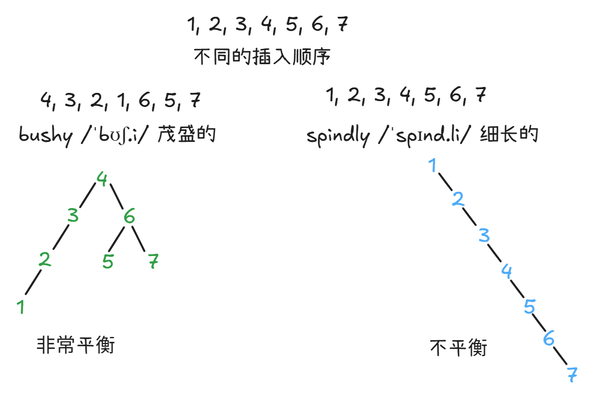

# B-Trees

[BST](./README.md)的平衡性依赖插入顺序



随机的插入，往往能够得到比较好的茂盛（平衡性）[在线演示](https://joshh.ug/61b/bst.html)。但是在实际场景中，如比如插入与日期时间相关的具有顺序性，很容易将BST退化为链表的形式:

```java
add("01-Jan-2019, 10:31:00")
add("01-Jan-2019, 18:51:00")
add("02-Jan-2019, 00:05:00")
add("02-Jan-2019, 23:10:00")
```

而B-Trees的出现就是为了树木的平衡性不受插入顺序的影响。

# B-Tree与B+Tree的区别

B+Tree 是在 B-Tree 的基础上，针对数据库和文件系统的实际应用（尤其是“范围查询”和“磁盘读取特性”）做了专门优化 。由于所有的数据都在叶子节点，并且叶子节点是连起来的，当需要查询一个区间（比如 10 到 20）时，B+Tree 会快得多，这正是数据库里最常见的操作之一

## 分裂机制完全相同

> 它们都遵循“**节点满了就分裂，并把中间元素上推**”这一规则，因此都拥有“所有叶子节点在同一深度”这个最重要的平衡特性。在计算机科学中，B+Tree 通常被视为 B-Tree 的一个变体。

当向 B-Tree 或 B+Tree 插入数据导致节点溢出时，它们的分裂步骤是完全相同的：

1. 将溢出节点从中间一分为二。
2. 将中间位置的键（Key）提升到父节点。
3. 如果父节点也因此溢出，则继续向上递归分裂。
4. 如果根节点也分裂了，则树的高度增加一层。

| 对比维度                               | B-Tree                           | B+Tree                                                |
| :------------------------------------- | :------------------------------- | :---------------------------------------------------- |
| **分裂的核心规则**                     | 完全相同：满了就分裂，上推中间键 | 完全相同：满了就分裂，上推中间键                      |
| **分裂后，中间键在子节点中是否保留？** | ❌ **移除**（只留在父节点）      | ✅ **保留**（通常在右子节点，且右子节点保留一份副本） |
| **叶子节点深度**                       | 始终相同（完全平衡）             | 始终相同（完全平衡）                                  |
| **根节点分裂时**                       | 高度增加，所有节点深度+1         | 高度增加，所有节点深度+1                              |

理解了B-Tree 分裂逻辑，就已经理解了 B+Tree 维持平衡的核心机制。后续在数据库中看到 B+Tree 时，可以把它理解为一个**在 B-Tree 平衡思想基础上做了范围查询优化的版本**。

## 核心区别: 数据存放的位置

- **B-Tree**：数据和“索引”**不分开**。在一个 B-Tree 节点中，**既有指向子节点的指针，也存储着具体的键值对** 。查找时，如果在中间节点就找到了 key，就可以直接返回数据，不需要走到叶子节点。
- **B+Tree**：**索引和数据是分离的**。它的**内部节点（非叶子节点）只存储用来“指路”的键（Key），不存储实际的数据（Value）**。所有的数据都**只存放在最底层的叶子节点**上

| 特性             | B-Tree                                                       | B+Tree                                                                                      |
| :--------------- | :----------------------------------------------------------- | :------------------------------------------------------------------------------------------ |
| **数据存储位置** | 所有节点（包括中间节点）都存数据                             | **数据只存储在叶子节点**，内部节点只存索引（Key）                                           |
| **叶子节点结构** | 叶子节点之间是独立的，没有额外链接                           | 所有叶子节点通过**链表**连接，形成一个有序链表                                              |
| **查询性能**     | 不稳定：查到的数据可能在根节点（快），也可能在叶子节点（慢） | **稳定**：任何查找都必须从根节点一路走到叶子节点，每次查询经历的路径（高度）都一样长        |
| **查询效率**     | <span style="color: red;">适合基于键值的单点查询</span>      | <span style="color: red;">对范围查询非常友好</span>，例如查询 `WHERE age BETWEEN 18 AND 25` |
