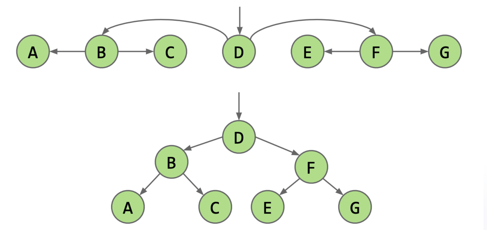

# BST(Binary Search Tree)

二叉搜索树：首先可以将它理解为是链表的一种变体。因为二分查找在链表上不能工作，将链表进行更改，形成二叉搜索树(Binary Search Tree-BST)

## 性质

1. 每个节点最多有两个子节点（左、右）。
2. **BST 性质**：左子树所有节点都小于当前节点，右子树所有节点都大于当前节点。
3. 这个性质保证了查找时每次都能排除一半，所以平衡状态下查找是 `O(log N)`。
