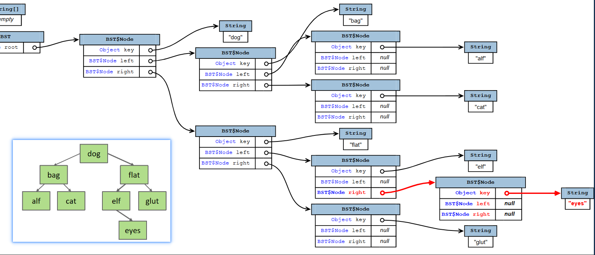

# BST(Binary Search Tree)

二叉搜索树：首先可以将它理解为是链表的一种变体。因为二分查找在链表上不能工作，将链表进行更改，形成二叉搜索树(Binary Search Tree-BST)


## 性质

1. 每个节点最多有两个子节点（左、右）。
2. **BST 性质**：左子树所有节点都小于当前节点，右子树所有节点都大于当前节点,没有相等的元素。
3. 这个性质保证了查找时每次都能排除一半，所以平衡状态下查找是 `O(log N)`。

## Hibbard deletion

Hibbard deletion `/ˈhɪb.ərd dɪˈliː.ʃən/` 希巴德删除法

> **核心思想**
>
> 当要删除的节点有两个子节点时，用它的前驱（左子树中最大的节点）或后继（右子树中最小的节点）来替代它，然后删除那个前驱/后继节点。

插入之后


---

# 泛型补充

**区别核心：**

- `class BST<T extends Comparable<T>>`  
  T 必须实现 `Comparable<T>`，即 T 能和自己比较。

- `class BST<T extends Comparable<? super T>>`  
  T 必须实现 `Comparable<T>` **或** T 的某个父类实现了 `Comparable<该父类>`，即允许 T 通过父类的比较逻辑来比较自己。

---

**举例说明：**

假设有父类 `Animal implements Comparable<Animal>`，子类 `Dog extends Animal`。

- `BST<Dog>` 用 `T extends Comparable<T>` → **不通过**，因为 `Dog` 没有实现 `Comparable<Dog>`（它实现的是 `Comparable<Animal>`）。

- `BST<Dog>` 用 `T extends Comparable<? super T>` → **通过**，因为 `Dog` 的父类 `Animal` 实现了 `Comparable<Animal>`，而 `Animal` 是 `Dog` 的父类型（`? super Dog` 匹配 `Animal`）。

---

**实际影响：**

| 声明                                   | 能否存 Dog                         | 比较时用谁                                                           |
| -------------------------------------- | ---------------------------------- | -------------------------------------------------------------------- |
| `BST<T extends Comparable<T>>`         | 否（Dog 不实现 Comparable\<Dog\>） | 直接调 `T.compareTo(T)`                                              |
| `BST<T extends Comparable<? super T>>` | 是                                 | 调 `T.compareTo(T)` 实际执行的是父类的 `compareTo`，参数可以接受 `T` |

---

**Java 25 建议：**

用 `class BST<T extends Comparable<? super T>>` 更通用，符合 PECS 原则（Producer Extends, Consumer Super），能接受更多类型。

---

**等价写法（Java 25 也支持）：**

```java
class BST<T extends Comparable<? super T>>

```
