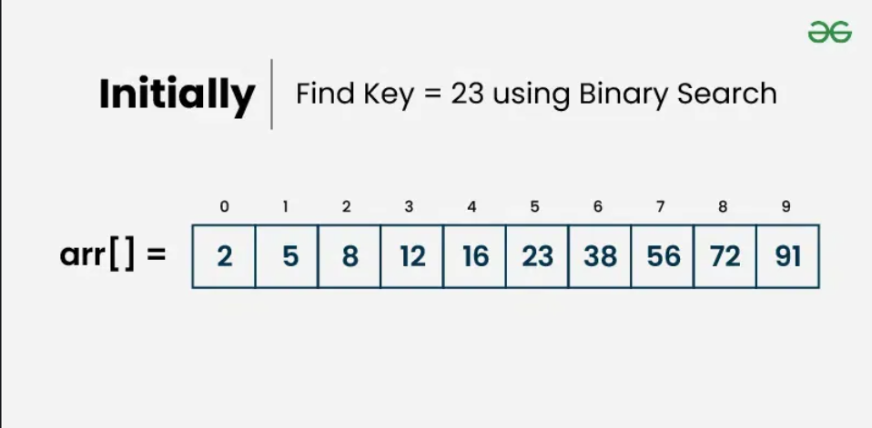

# Binary Search

> 基于排好序的数组做二分查找(`Binary Search`)，但是注意如果数据是链表，则二分查找则不好做，需要`Binary Search Tree`数据结构的支持。



[binary_search.java](./code/binary_search.java)

1. 计算`mid`的时候，要加上`low`： `mid = low + (hight - low) / 2`

```java
///usr/bin/env jbang "$0" "$@" ; exit $?
//JAVA 25+
//DEPS com.google.truth:truth:1.4.5


import com.google.common.truth.Truth;

public int binarySearch(int arr[], int low, int hight, int target) {
	System.out.println("Search arr => [%d,%d]".formatted(low, hight));
	if (low > hight) {
		return -1;
	}

	int mid = low + (hight - low) / 2;

	if (target == arr[mid]) {
		System.out.println("Find the target(%d) at index of %d".formatted(target, mid));
		return mid;
	} else if (target < arr[mid]) {
		System.out.println("To search left of arr[%d]".formatted(mid));
		return binarySearch(arr, low, mid - 1, target);
	} else {
		System.out.println("To search right of arr[%d]".formatted(mid));
		return binarySearch(arr, mid + 1, hight, target);
	}
}

final int TARGET = 23;
final int EXPECTED = 5;

void main(String... args) {
	// 排好序的数组
	int[] arr = { 2, 5, 8, 12, 16, 23, 38, 56, 72, 91 };
	int ret = binarySearch(arr, 0, arr.length - 1, TARGET);
	Truth.assertThat(ret).isEqualTo(EXPECTED);
	IO.println("GOOD EXAMPLE");
}
```

输出

```txt
Search arr => [0,9]
To search right of arr[4]
Search arr => [5,9]
To search left of arr[7]
Search arr => [5,6]
Find the target(23) at index of 5
GOOD EXAMPLE
```

# Reference

1. [binary search](https://www.geeksforgeeks.org/dsa/binary-search/)
