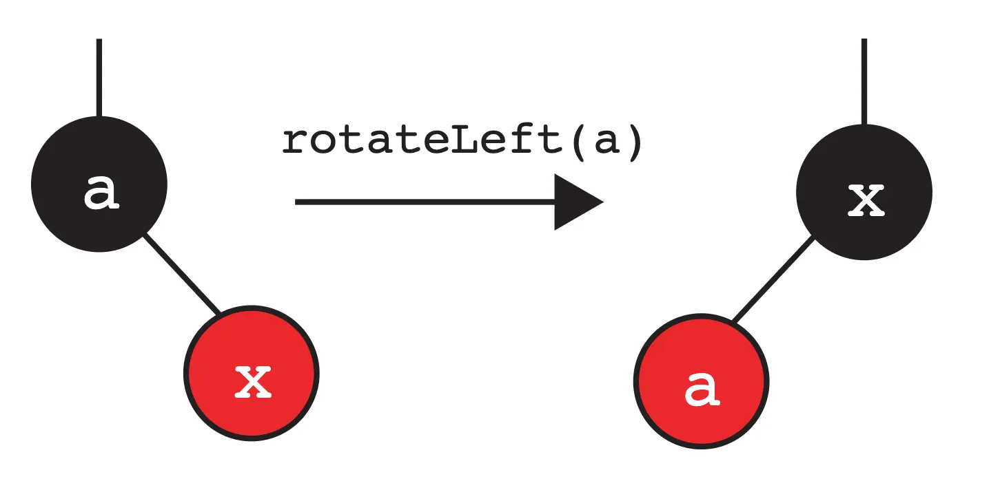
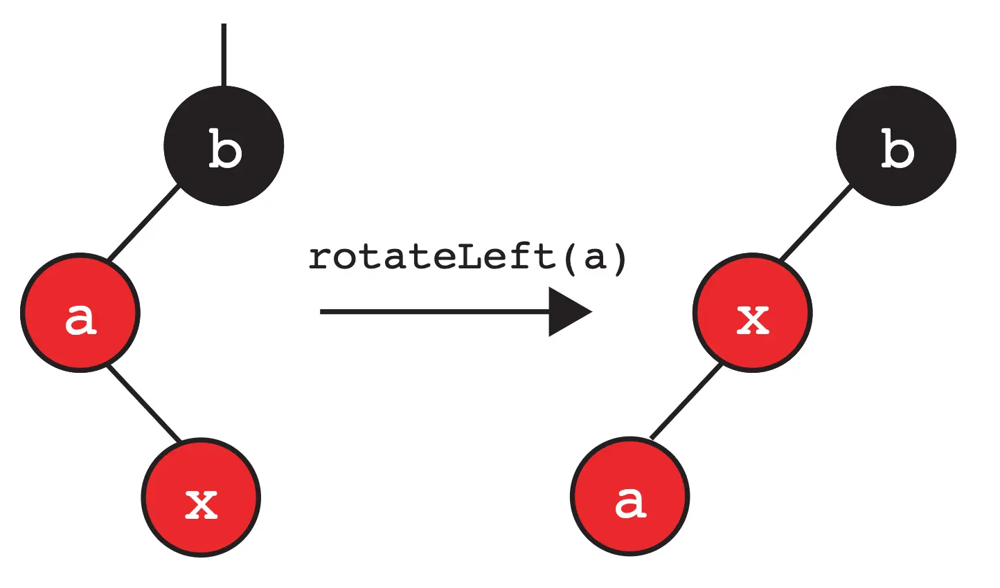
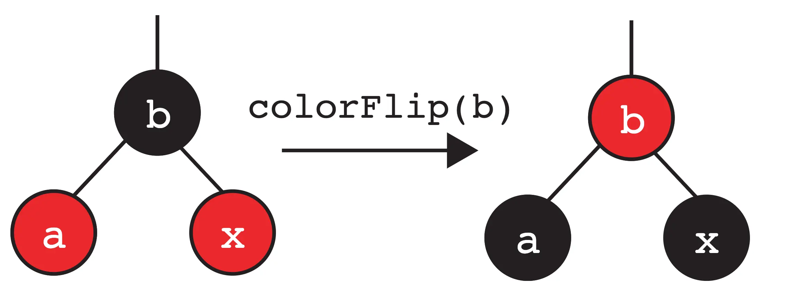
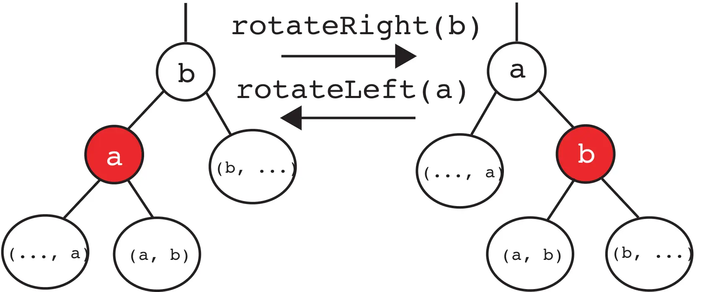

[LLRBs Demo](https://docs.google.com/presentation/d/1jgOgvx8tyu_LQ5Y21k4wYLffwp84putW8iD7_EerQmI/edit?slide=id.g4d0f5fdd87_0_127#slide=id.g4d0f5fdd87_0_127)

At its core, LLRBs are just a binary search tree, but there are a few additional invariants related to “coloring” each node red or black. This “coloring” creates a one-to-one mapping between 2-3 trees and LLRBs! 

**In particular, every 2-3 tree corresponds to exactly one LLRB, and vice-versa.**

> Rules

1. Right red link -> rotate left.
2. Two consecutive left links -> rotate right
3. Red left and red right -> color flip.

在 LLRB 的旋转（左旋或右旋）中，两个节点会**交换颜色**。新根的节点会继承原来根节点的颜色，而原来的根节点会变成红色。这个操作的目的是：在改变树的结构时，`保持这条路径上的“黑色节点数量”不变`。

---



color flip颜色翻转则不同于颜色交换




# Rotate Left And Right



LL RB 树在插入后可能出现的“违规状态”。这些状态之间**有先后依赖关系**：

1. 先解决“右倾”问题：如果出现了右倾的红色链接，必须先左旋，把它转成左倾。如果不先处理右倾，后续的“连续左倾”和“双红”判断可能基于一个错误的树形结构，导致修复操作不再对应任何有效的 2-3 树状态。
2. 再解决“连续左倾”问题：左旋后可能产生两个连续的左倾红色链接，这时需要右旋来修正它。
3. 最后解决“双红”问题：前面的旋转修正了树形后，可能会出现一个节点有两个红色子节点的情况，这时用颜色翻转来模拟 2-3 树 4-节点的分裂。

```java
private RBTreeNode<T> fixUp(RBTreeNode<T> node) {
    // 情况1：右倾红色链接 → 左旋
    if (isRed(node.right) && !isRed(node.left)) {
        node = rotateLeft(node);
    }

    // 情况2：连续左倾红色链接 → 右旋
    if (hasTwoConsecutiveRedLeftLinks(node)) {
        node = rotateRight(node);
    }

    // 情况3：两个红色子节点 → 颜色翻转（模拟4-节点分裂）
    if (isRed(node.left) && isRed(node.right)) {
        flipColors(node);
    }
    return node;
}
```