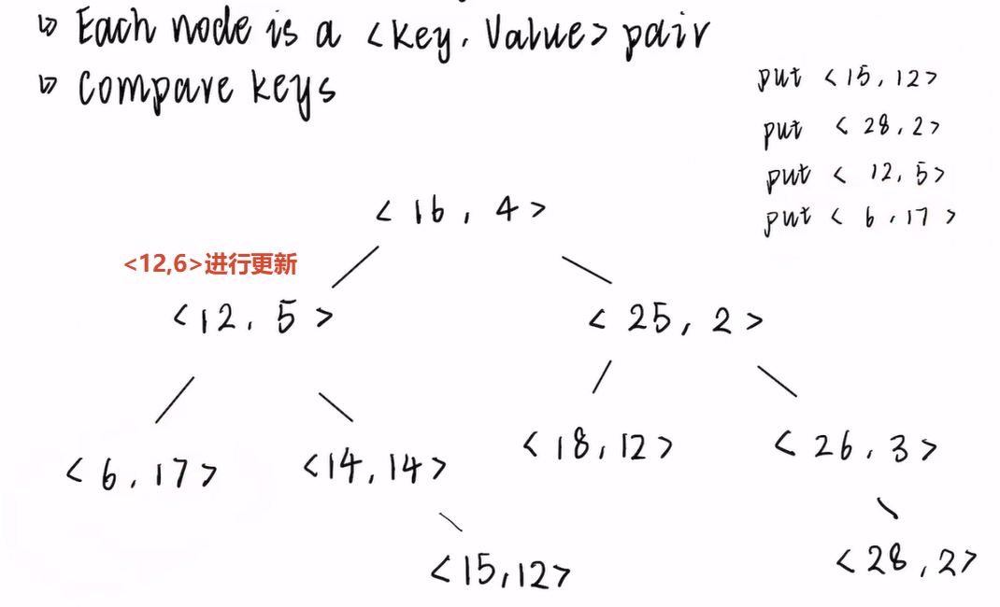

# BSTMap

A BST-based implementation of Map(a basic tree-based)


# 关于size的处理

在增加新元素的时候，`size++`,我最初的想法是在Java中内部类能够访问外部类的属性，原本打算在内部类处理size++，但是这样方法就不能是静态方法了，内部类也不能处理成静态内部类。

```java
private <K extends Comparable<? super K>, V> BSTNode<K,V> insert(BSTNode<K,V> bstNode,K sk,V val) {
    // Always insert at leaf node
    if (bstNode == null) {
        // 在这里添加size++
        BSTMap.this.size += 1;
        return new BSTNode<K, V>(sk, val);
    }
    // ...
}
```

下面是标记处理size时机：

| 方法                      | 可读性   | 性能    | 推荐程度                       |
|-------------------------|----------|---------|--------------------------------|
| 先 `containsKey` 再 `insert` | ⭐⭐⭐⭐⭐   | ⭐⭐⭐⭐⭐  | ✅ 强烈推荐                     |
| 用 `boolean[]` 作为输出参数      | ⭐⭐⭐     | ⭐⭐⭐⭐⭐  | ❌ 不推荐（过于 trick）         |
| 用自定义 `InsertResult` 类     | ⭐⭐⭐     | ⭐⭐⭐⭐⭐  | ⚠️ 可行，但在此场景下过设计     |
|                         |       |       |                            |

# 迭代器的实现

版本一: 在构建迭代器的时候，已经收集了所有元素，缺点也很明显，就是如果有大量元素，会造成不必要的内存浪费。
```java
private class BSTMapIterator implements Iterator<K> {
        private K[] keys;
        private int index;

        private BSTMapIterator() {
            this.keys = (K[]) new Comparable[size()];
            this.index = 0;
            inorderInit();
        }

        private void inorderInit() {
            Deque<BSTNode<K, V>> stack = new ArrayDeque<>();
            var current = root;
            int idx = 0;
            while (current != null || !stack.isEmpty()) {
                // 一路向左遍历
                while (current != null) {
                    stack.push(current);
                    current = current.left;
                }
                // 访问
                current = stack.pop();
                keys[idx++] = current.key;
                current = current.right;
            }

        }
        
        @Override
        public boolean hasNext() {
            return index < keys.length;
        }
        
        @Override
        public K next() {
            return keys[index++];
        }
    }
```

版本二: 使用栈进行优化，每当取走一个元素的时候才进行处理

```java
private class BSTMapIteratorV2 implements Iterator<K> {
    private Deque<BSTNode<K, V>> stacks = new ArrayDeque<>();

    private BSTMapIteratorV2() {
        pushLeft(root);
    }

    private void pushLeft(BSTNode<K, V> node) {
        while(node != null){
            stacks.push(node);
            node = node.left;
        }
    }

    @Override
    public boolean hasNext() {
        return !stacks.isEmpty();
    }


    @Override
    public K next() {
        if(!hasNext()){
            throw new NoSuchElementException();
        }
        var current = stacks.pop();
        pushLeft(current.right);
        return current.key;
    }
}
```


# ULLMap的递归

```java
Entry get(K sk){
    if(sk != null && sk.equals(key)){
        return this;
    }
    if(next == null){
        return null;
    }
    return next.get(sk);
}
```

`put`方法进行更新和新增

```java
 public void put(K key, V value) {

    var entry = sentinel.get(key);
    if(entry == null){
        sentinel.next = new Entry(key,value,sentinel.next);
        size += 1;
    }else{
        entry.value = value;
    }

}
```


# 性能测试：

> 要观察的目的

| Map 实现  | 理论插入复杂度   | 预期表现                      |
| :-------- | :--------------- |:--------------------------|
| `ULLMap`  | O(N)             | 最慢，数据量大时会急剧变慢,甚至会出现栈溢出错误  |
| `BSTMap`  | O(log N)（平均） | 中等，但可能受树平衡性影响             |
| `TreeMap` | O(log N)         | 和 `BSTMap` 类似，但实现更优化（红黑树） |
| `HashMap` | O(1)（平均）     | 最快，且增长最平缓                 |


> 推荐的数据规模

| 测试场景     | 字符串长度 | 插入数量  | 目的                                          |
| :----------- | :--------- | :-------- | :-------------------------------------------- |
| **小规模**   | 10         | 10,000    | 热身，确保程序能跑                            |
| **中等规模** | 10         | 100,000   | 开始看到性能差异                              |
| **大规模**   | 10         | 500,000   | 看到明显的 O(N) vs O(log N) 差异              |
| **更大规模** | 10         | 1,000,000 | 观察 TreeMap 和 BSTMap 的差距（如果内存允许） |

平衡`生成随机字符串的开销`和`比较字符串的开销（compareTo 需要逐字符比较）`
如果字符串太短（比如 1 个字符），compareTo 很快，但随机碰撞的概率会很高，影响测试的准确性。如果太长（比如 100 个字符），生成字符串本身会成为性能瓶颈

>  [InsertRandomSpeedTest.java](src/test/java/cs61b/InsertRandomSpeedTest.java)实际测试

```txt
This program inserts random Strings of length L into different types of maps as <String, Integer> pairs.
Please enter desired length of each string: 10

Enter # strings to insert into the maps: 10000
ULLMap: 0.27 sec
BSTMap: 0.01 sec
TreeMap: 0.01 sec
HashMap: 0.00 sec
Would you like to try more timed-tests? (y/n)y

Enter # strings to insert into the maps: 100,000
ULLMap: StackOverflowError
BSTMap: 0.09 sec
TreeMap: 0.06 sec
HashMap: 0.03 sec
Would you like to try more timed-tests? (y/n)y

Enter # strings to insert into the maps: 500,000
ULLMap: StackOverflowError
BSTMap: 0.64 sec
TreeMap: 0.46 sec
HashMap: 0.19 sec
Would you like to try more timed-tests? (y/n)y

Enter # strings to insert into the maps: 1,000,000
ULLMap: StackOverflowError
BSTMap: 1.26 sec
TreeMap: 1.03 sec
HashMap: 0.38 sec
Would you like to try more timed-tests? (y/n)n
```

1. `HashMap` 确实最快`（O(1)）`
2. `TreeMap` 和 `BSTMap` 差不多（都是 `O(log N)`）
3. `BSTMap` 稍慢于 `TreeMap`，因为 `TreeMap` 是高度优化的红黑树

HashMap 和 TreeMap 解决的是不同的问题。 HashMap 解决的是“快速查找”问题，TreeMap 解决的是“有序查找”问题。如果你只需要通过 key 快速找到 value，用 HashMap；如果你需要有序的 key 集合，或者需要区间查询等操作，用 TreeMap。

`TreeMap` 的优势在于它**维护了键的顺序**，因此支持一些 `HashMap` 做不到的操作：

| 操作 | 说明 |
| :--- | :--- |
| `firstKey()` | 获取最小的 key |
| `lastKey()` | 获取最大的 key |
| `headMap(key)` | 获取所有小于某个 key 的映射 |
| `tailMap(key)` | 获取所有大于某个 key 的映射 |
| `subMap(fromKey, toKey)` | 获取一个范围内的映射 |
| `ceilingKey(key)` | 获取大于等于某个 key 的最小 key |
| `floorKey(key)` | 获取小于等于某个 key 的最大 key |
| `higherKey(key)` | 获取严格大于某个 key 的最小 key |
| `lowerKey(key)` | 获取严格小于某个 key 的最大 key |


[TreeMapDemo.java](src/test/java/demo/TreeMapDemo.java)