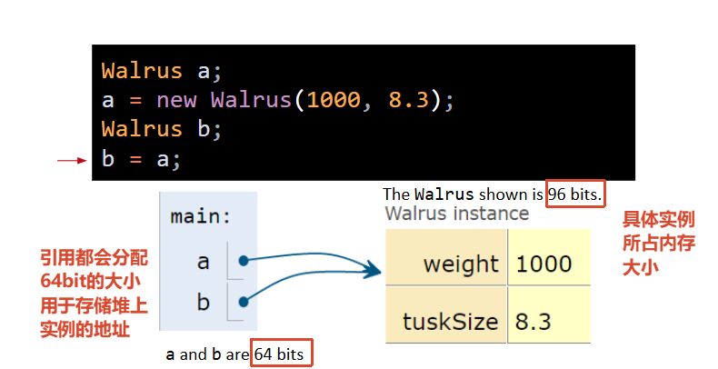
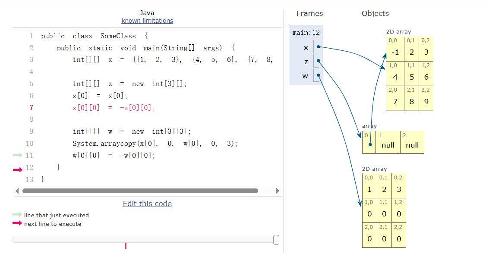

# AI时代下学习这门课意义

Given LLM capabilities, you may ask: Why are we bothering to learn to write code?

- Rocket engineers don’t weld.
-  Civil engineers don’t pour concrete.

**AI能写代码，不等于你不需要懂代码**。

就像：

- 火箭工程师不需要亲自拿焊枪去焊金属板——但他必须懂焊接的原理，才能设计出能焊得出来的火箭。

- 土木工程师不需要自己推着小车倒水泥——但他必须懂混凝土的强度、凝固时间，才能设计出不会塌的大楼。

同理，你以后可以用AI帮你生成代码，但你必须懂编程的核心逻辑，才能：

- 判断AI给的代码对不对
- 发现AI代码里的bug
- 知道该让AI写什么
- 把AI生成的东西整合到一个大系统里

你学的是**工程思维**，不是**打字速度**。如果你只会“让AI帮你写代码”，但看不懂它在写什么，那你就不是工程师——你是AI的测试员。


# Reference Type And Instance



# array

```java
public class SomeClass {
	  public static void main(String[] args) {
	    int[][] x = {{1, 2, 3}, {4, 5, 6}, {7, 8, }};
	 
	    int[][] z = new int[3][];
	    z[0] = x[0];
	    z[0][0] = -z[0][0];
	 
	    int[][] w = new int[3][3];
	    System.arraycopy(x[0], 0, w[0], 0, 3);
	    w[0][0] = -w[0][0];
	  }
	}
```

