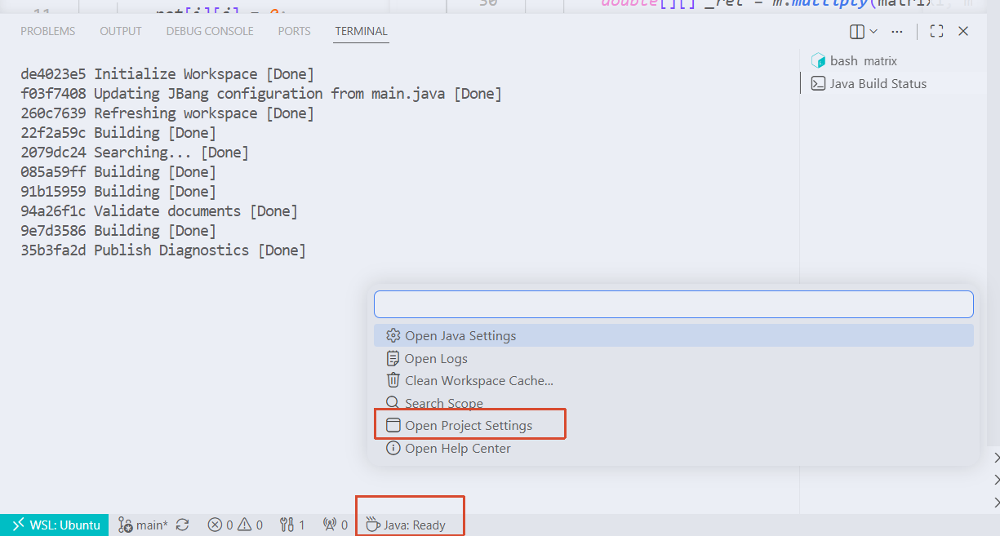

# 打开项目

直接`code`代码项目，跳出terminal让插件生效。



# 运行Java代码

```sh
j! hello.java
jbang hello.java

# 指定版本
jbang --java 25 hello.java
j! --java 25 hello.java
```

# Java文件格式

`jbang init xxx.java`生成的文件，顶部有下面

```java
///usr/bin/env jbang "$0" "$@" ; exit $?
```

可以直接运行

```sh
./xxx.java
```

## 文件顶部配置

**注意没有空格**

```java
///usr/bin/env jbang "$0" "$@" ; exit $?
//JAVA 25+
//DEPS org.projectlombok:lombok:1.18.46
//DEPS tools.jackson.core:jackson-databind:3.2.1
//REPOS aliyun=https://maven.aliyun.com/repository/central
// 处理lombok注解
//JAVAC_OPTIONS -proc:full
// assert断言
//JAVA_OPTIONS -ea
```

# 清理缓存

代码修改之后，并没有生效，需要`jbang cache clear`

# 查看下载jar包

运行的时候会自动下载，查看日志信息

```sh
jbang -x xxx.java
```

# jbang debug

首先在命令行执行

```sh
$ jbang run --debug src/dev/jbang/fmt/Main.java /home/pkmer/projects/advprog/modern-java/io/github/upangka/hello.java
```

会输出

```sh
Listening for transport dt_socket at address: 4004
```

在vscode中配置launch.json

```json
{
  "type": "java",
  "name": "Debug (Launch) - Main",
  "request": "attach",
  "hostName": "localhost",
  "port": 4004
}
```
