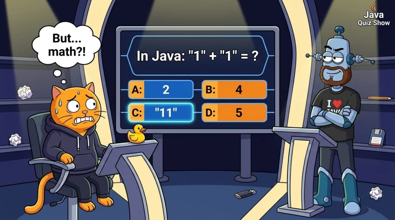

如果你曾把程序员的工作想象成某种不可思议又神秘的东西，现在是时候打破这个迷思了！编程并不是秘术，而是很棒且非常有趣的工作。现在你就会见识到。

计算机程序是用编程语言编写的——它是计算机能理解的一套特殊规则和词汇。今天你将认识 Java 语言：你会写下你的第一个程序，搞清楚什么是命令，并让计算机听你的话（当然，取决于它愿不愿意）。😅

程序就是一组（列表）命令。先执行第一条命令，然后第二条、第三条，依此类推。当所有命令执行完，程序就结束。
