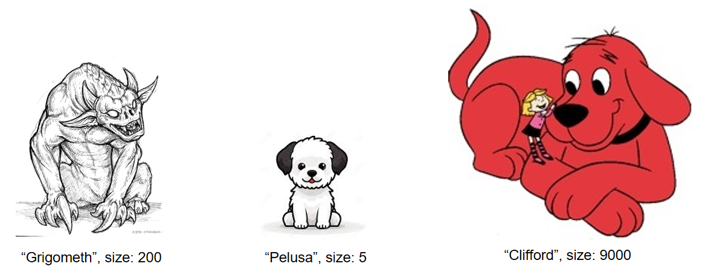
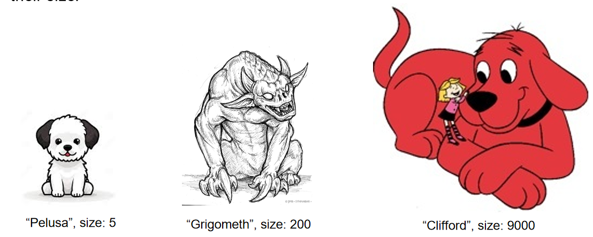
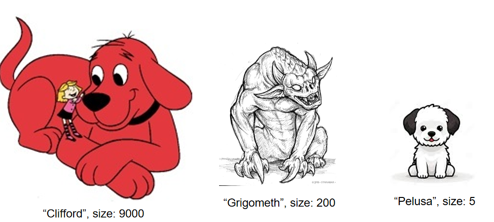

# Comparable自然顺序

`Natural order` 指的是一个类本身定义好的、默认的排序方式。当一个类实现了 `Comparable` 接口并重写了 `compareTo` 方法，它就拥有了一个“自然顺序”。

```java
static record Dog(String name, int size) implements Comparable<Dog> {
    @Override
    public int compareTo(Dog o) {
        return size - o.size;  // 按 size 升序 → 这是 Dog 的自然顺序
    }
}
```

[dog_natural_order.java](./code/dog_natural_order.java)

```java
static record Dog(String name, int size) implements Comparable<Dog> {

	@Override
	public int compareTo(Dog o) {
		return size - o.size; // 按 size 升序 → 这是 Dog 的自然顺序
	}
}

void main(String... args) {
	var dogs = new ArrayList<Dog>() {
		{
			add(new Dog("Grigometh", 200));
			add(new Dog("Pelusa", 5));
			add(new Dog("Clifford", 9000));
		}
	};

	dogs.sort(null);
	System.out.println(Collections.max(dogs));
	System.out.println(dogs);
}
/**
 Dog[name=Clifford, size=9000]
[Dog[name=Pelusa, size=5], Dog[name=Grigometh, size=200], Dog[name=Clifford, size=9000]]
 */
```



对应的python的代码[dog_natural_order.py](./code/dog_natural_order.py)

```python
from __future__ import annotations
class Dog:
	def __init__(self,name: str,size: int):
		self.name = name
		self.size = size

	def __gt__(self, other: Dog):
		return self.size > other.size

	def __repr__(self):
		return  f"Dog[name={self.name}, size={self.size}]"

	__str__ = __repr__


dogs = [Dog("Grigometh", 200),Dog("Pelusa", 5),Dog("Clifford", 9000)]

print(max(dogs))
print(sorted(dogs))

# Dog[name=Clifford, size=9000]
# [Dog[name=Pelusa, size=5], Dog[name=Grigometh, size=200], Dog[name=Clifford, size=9000]]
```

# 允许其他排序

在python中接受一个函数,用于根据其他字段进行排序，下面的案例根据`name`的字母自然顺序进行排序

[dog_order.py](./code/dog_order.py)

```python
func1 = lambda dog: dog.name

def func2(dog: Dog):
    return dog.name

print(max(dogs,key = func1))
print(sorted(dogs,key = func2))

# Dog[name=Pelusa, size=5]
# [Dog[name=Clifford, size=9000], Dog[name=Grigometh, size=200], Dog[name=Pelusa, size=5]]
```



对应的Java实现，我们需要提供一个实现了`Comparator`的接口的类实例

匿名类[dog_order.java](./code/dog_order.java)

```java
	// 方式1：匿名类
	var nameComparator = new Comparator<Dog>() {

		@Override
		public int compare(Dog o1, Dog o2) {
			return o1.name().compareTo(o2.name());
		}
	};


	System.out.println(Collections.max(dogs,nameComparator));
	dogs.sort(nameComparator);
	System.out.println(dogs);
```

lambda的方式其实就是上面匿名类实现的语法糖[dog_order_lambda.java](./code/dog_order_lambda.java)

```java
// 方式2：lambda语法糖

System.out.println(Collections.max(dogs,(dog,otherDog) -> dog.name().compareTo(otherDog.name())));
dogs.sort((dog,otherDog) -> dog.name().compareTo(otherDog.name()));
System.out.println(dogs);
```

实现一个类[dog_order_class.java](./code/dog_order_class.java)，提供一个实例

```java
// 实现一个类
static final class NameComparator implements Comparator<Dog>{
	@Override
	public int compare(Dog o1, Dog o2) {
		return o1.name().compareTo(o2.name());
	}
}

// 定义一个全局实例
public static final NameComparator NAME_COMPARATOR = new NameComparator();

void main(String... args) {
	var dogs = ...

	// 方式3：定义一个实现类，提供一个实例

	System.out.println(Collections.max(dogs,NAME_COMPARATOR));
	dogs.sort(NAME_COMPARATOR);
	System.out.println(dogs);
}
```
