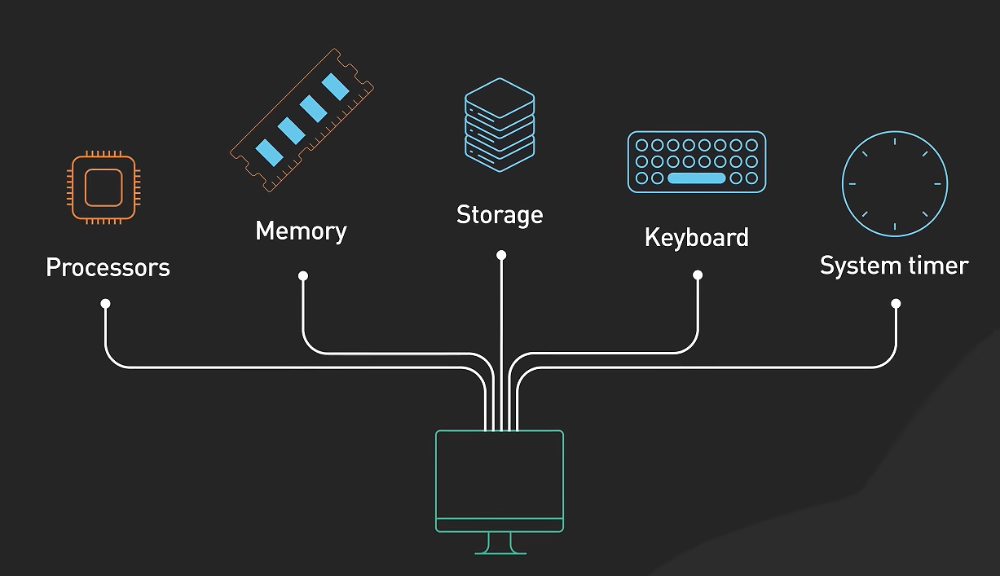

# BIOS

1. **BIOS**: Basic Input Output System 基本输入输出系统，是一段程序代码
2. **ROM**: Read-Only Memory,只读存储器，是一种在断电后数据不会丢失的**存储芯片**
3. **Fireware**:(固件)它的程序被"固定"在硬件里，不像硬盘上的软件那样可以随意删除或替换

> Programs that are permanently stored on a chip are referred to as firmware.
>
> ROM（硬件芯片） + BIOS 程序（软件） = Firmware（固件）

就像是DVD光盘 + 里面刻录的电影 = Fireware

```
┌─────────────────────────────────────┐
│           主板                      │
│  ┌─────────────────────────────┐    │
│  │  BIOS ROM 芯片              │    │
│  │  （里面存着 BIOS 程序）      │    │
│  └─────────────────────────────┘    │
│         ▲                           │
│         └── 这块芯片是硬件           │
└─────────────────────────────────────┘
```

post(power on self test)



# 地址线、内存、寻址

地址线、内存、寻址是计算机硬件的底层核心

```
CPU 芯片                          内存条（RAM）
┌──────────────┐                 ┌──────────────┐
│              │                 │              │
│  8086 CPU    │  地址线 A0~A19  │  内存单元0   │
│              │ ──────────────> │  内存单元1   │
│              │   20根电线      │  内存单元2   │
│              │                 │  ...         │
│              │                 │  内存单元     │
│              │                 │  1048575     │
└──────────────┘                 └──────────────┘
```

电线只能传两种状态：0 或 1。每根地址线相当于一根电线，它只能传输高电压（代表 1） 或 低电压（代表 0）。所以 n 根地址线可以组合出 `2ⁿ` 种不同的电压组合，每一种组合就是一个"地址数字"。

20 条地址线 → 2²⁰ = 1,048,576 种组合 → 能访问 1,048,576 个内存单元。
1,048,576 个内存单元 × 1 字节 = 1,048,576 字节 = `1 MB`。

## 16 位寄存器的"困局"

**8086 的寄存器只有 16 位**

- 一个 16 位寄存器最多能存 `2¹⁶ = 65,536` 个不同的值
- 也就是说，**一个寄存器最多只能"指名" 65,536 个内存单元**
- 也就是最多只能访问 **64 KB** 内存

> **问题：** 8086 有 20 条地址线，可以访问 1 MB 内存，但寄存器只有 16 位，只能访问 64 KB。

Intel 的解决方案：段基址×16 + 偏移。**用两个 16 位寄存器拼出一个 20 位地址**

公式：`物理地址 = 段寄存器 × 16 + 偏移地址`

- 段寄存器是 16 位（例如 `0x1234`）
- 左移 4 位 = 乘以 16 = 在后面补 4 个 0
- 这样 16 位就变成了 20 位（`0x1234` → `0x12340`）
- 再加上偏移地址（16 位），最多可以进位到 20 位以上

```
段寄存器 DS = 0x07C0
偏移地址 BX = 0x0000

物理地址 = 0x07C0 × 16 + 0x0000
         = 0x07C00 + 0x0000  # 十六进制表示，已经往左移动了4个bit
         = 0x07C00
```

整体流程：

```
CPU 想访问内存 0x07C00
         ↓
程序员写代码: mov ax, [0x7C00]
         ↓
CPU 内部：
    DS 默认 = 0x0000
    偏移 = 0x7C00
    物理地址 = 0x0000 × 16 + 0x7C00 = 0x7C00
         ↓
CPU 把 20 位地址 0x07C00 放到 20 根地址线上
         ↓
20 根地址线分别输出高/低电压
         ↓
内存收到这个地址组合
         ↓
把该地址里的数据通过数据线传回 CPU
```

## 寄存器

|                  | 官方术语                         | 对应的寄存器（举例）   | 作用                                    |
| :--------------- | :------------------------------- | :--------------------- | :-------------------------------------- |
| **存储基地址**   | **段寄存器（Segment Register）** | CS, DS, ES, SS         | 告诉 CPU “**从哪一块区域的起点**开始找” |
| **存储偏移地址** | **通用寄存器 / 指针寄存器**      | BX, BP, SI, DI, SP, IP | 告诉 CPU “**从起点往后走多少步**”       |

# 8086与x86科普

8086 是 Intel 公司的一款 CPU 型号，8086 是"80"系列的第 6 款产品。80386 是第 386 款

8086 奠定了"x86 架构"的基础！

8086 引入的两个核心特性，影响了此后 40 多年所有 PC 处理器：

| 特性             | 说明                                                             |
| :--------------- | :--------------------------------------------------------------- |
| **16 位寄存器**  | AX、BX、CX、DX... 这些名字从 8086 开始一直用到现在               |
| **分段内存模型** | "段基址 × 16 + 偏移"这套公式从 8086 开始                         |
| **指令集**       | `mov`、`add`、`jmp`、`call` 这些指令的二进制编码从 8086 开始定型 |

**换句话说：**现在写的汇编代码，本质上还是 8086 时代的"语言"。

> x86 是一个"家族名称"
>
> x86 是指 Intel 公司所有"80x86"系列 CPU 的总称，以及兼容这些 CPU 指令集的所有处理器

字母 `x` 是"变量"，代表 `80x86` 系列 `x86` = 8086, 80186, 80286, 80386, 80486...

```
                   Intel CPU 家族
                        │
        ┌───────────────┴───────────────┐
        │                               │
   ┌────┴────┐                    ┌────┴────┐
   │  x86 系列 │                    │ 其他系列 │
   │（PC 主流）│                    │（嵌入式）│
   └────┬────┘                    └─────────┘
        │
   ┌────┴─────────────────────────────┐
   │                                  │
   ▼                                  ▼
8086 ──→ 80186 ──→ 80286 ──→ 80386 ──→ 80486
                                    │
                                    ▼
                              Pentium（奔腾）
                                    │
                                    ▼
                              Core（酷睿）系列
```

**注意：** Pentium 之后 Intel 不再用"80x86"的数字命名方式，但**指令集依然是 x86 的**，所以 Pentium 也属于 x86 架构。

# 参考

1. [
   How Does Linux Boot Process Work?](https://www.youtube.com/watch?v=XpFsMB6FoOs)
