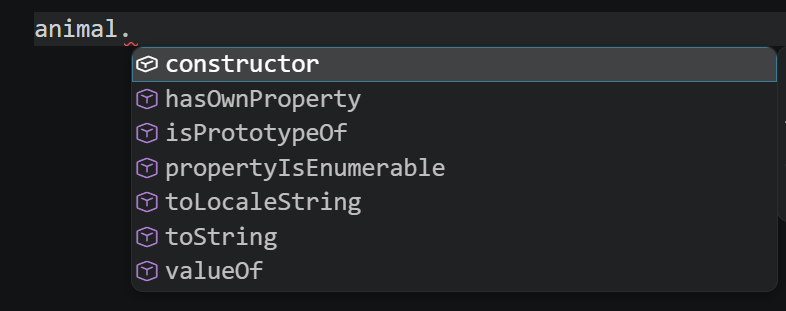

# Prototype Inheritance

**Prototypes are JavaScript's fundamental inheritance mechanism.**

Java是类式继承（class-based），你用class定义蓝图，用new创建实例，继承关系在编译时确定。而JavaScript是原型式继承（prototype-based）——没有"类"的概念（ES6的class只是语法糖，底层依然是原型）。对象直接继承自另一个原型对象，继承关系是动态的、可以在运行时修改。

# Object.prototype

在Java中Object是所有类的基类，但是在JS中他是一个构造函数，可以使用`new Object()`来创建一个对象，但是平常我们都使用字面量`{}`来快速创建对象。

在TS中Object被当成类型。

```ts
// 等效
// let animal: Record<string, any> & Object = new Object();
let animal: Record<string, any> & Object = {};
animal.name = "Good";
console.log(animal); // { name: 'Good' }
console.log(typeof Object); // function

console.log(animal.hasOwnProperty("name")); // true
```

从下面的图片图片中可以看到`animal`对象默认就有一些方法，是因为对象默认通过`__proto__`继承了`Object.prototype`对象，而该对象默认共享了这些方法。


```ts
console.log(animal.__proto__ === Object.prototype); // true
console.log(typeof Object.prototype, Object.prototype); // object [Object: null prototype] {}
Object.getOwnPropertyNames(Object.prototype).forEach((propertyName) => {
  if (!propertyName.startsWith("__")) {
    // 处理ts报错
    const key = propertyName as keyof typeof Object.prototype;
    console.log(propertyName, " =>", typeof Object.prototype[key]);
  }
});
/**输出的方法
constructor  => function
hasOwnProperty  => function
isPrototypeOf  => function
propertyIsEnumerable  => function
toString  => function
valueOf  => function
toLocaleString  => function
*/
```

`Object`是函数，`Object.prototype`是一个对象，这个对象里面有很多共享的方法，JS中的其他对象都继承这个对象，所以`animal.__proto__ === Object.prototype`为`true`

# Function.prototype

"prototype" 这个字符串既是一个术语（指代原型机制），也是一个属性名。

当写 `F.prototype` 时，你在语法上访问的是 `F` 对象上名为 `"prototype"` 的普通属性，而不是直接访问"原型"这个概念本身。

这个属性之所以特殊，是因为它会被 `new F()` 创建的实例用作其原型（即 `obj.__proto__ === F.prototype`），但属性的本质仍然是"常规属性"。

```ts
> function F(name){
|   this.name = name;
| }
> F.prototype.hi = function(){
|   console.log(this.name,"=>","hi");
| }
> let a = new F("Pkmer")
> a.hi()
Pkmer => hi
> let b = new F("Good jobs")
> b.hi()
Good jobs => hi
```
