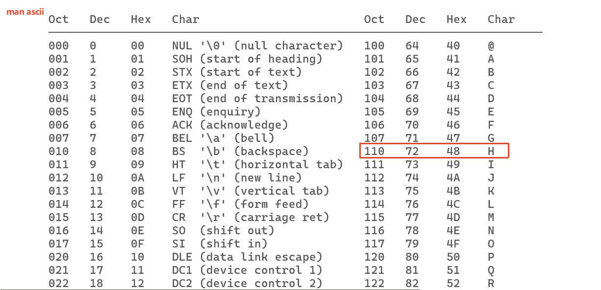

# ascii码

linux下通过`man ascii`查看



[exercise_01.ts](./code/exercise_01.ts)

```ts
// 字符H二进制的表示形式
let H_binary = 0b01001000;
console.log(H_binary); // 72

let H_hex = 0x48;
console.log(H_hex); // 72

// 对应为ascii码表 man ascii
const H_char = String.fromCharCode(H_binary);
console.log(H_char); // H

// 获得'H'的ascii码
const H_ascii = "H".charCodeAt(0);
console.log(H_ascii); // 72
```

# Unicode字符集

`ASCII` 是 `Unicode` 的一个子集。`Unicode` 包含了 `ASCII`，并在此基础上扩展了全球所有语言的字符。
`Unicode` 的目标是：**为全球所有语言的所有字符，分配一个唯一的编码**。

1. **它包含了 ASCII 的全部 128 个字符，且编码值完全一致**。
2. 它定义了超过 14 万个字符（涵盖几乎所有人类语言）。
3. 它使用 码点（Code Point） 来表示每个字符，通常写作 U+0048（对应 'H'）。

# UTF-8编码方案

1. `Unicode` = 字符集（定义有哪些字符，每个字符有个编号）
2. `UTF-8` = 编码方案（如何把编号存成字节）

## 为什么需要编码？

Unicode 码点大小是 1~4 字节不等。

1. `ascii`字符用一个字节编码就可以了
2. '深' 的码点是 U+6DF1，在 0x0000 ~ 0xFFFF 范围内，属于“基本多语言平面”（BMP），可以用 2 个字节存。
3. 但 '😊'（表情符号）的码点是 U+1F60A，需要 3 个字节（0x1F60A > 0xFFFF）。
4. 一些古文字或罕见字符的码点更高，需要 4 个字节。

**问题来了**：计算机在读取一个字符时，它怎么知道这个字符占 2 个字节还是 3 个字节？如果每个字符长度不固定，解析器就无法知道从哪里开始读下一个字符。

**一个简单的解决方案就是“定长”**：约定所有字符都用 4 个字节存。这样解析器每次读 4 个字节就行，很简单。但正如你感觉到的，这会浪费空间——'A' 从 1 字节变成 4 字节，'深' 从 2 字节变成 4 字节。

所以，“固定 4 字节”是一种**为了简化解析而牺牲空间的方案**，但它在工程上并不划算，尤其对于网络传输和存储密集型应用。

---

## UTF-8详细编码过程

UTF-8 的编码规则要求：解析器必须能够通过读取一个字节的前几位，就能立刻知道这个字符总共占几个字节。

| 字节模式      | 前缀位数 | 前缀模式 | 剩余数据位           |
| ------------- | -------- | -------- | -------------------- |
| 1字节 (ASCII) | 1位      | 0        | 7位                  |
| 2字节         | 3位      | 110      | 5 + 6 = 11位         |
| 3字节         | 4位      | 1110     | 4 + 6 + 6 = 16位     |
| 4字节         | 5位      | 11110    | 3 + 6 + 6 + 6 = 21位 |

**规律**：字节数每增加 1，前缀就增加 1 个 `1`，数据位就相应地减少 1 位。

**解析器的工作流程**:当解析器从头开始读数据时，它会看第一个字节的前几位：

1. 如果看到 `0xxxxxxx`（以 0 开头）→ 这是一个 1 字节字符（ASCII）。
2. 如果看到 `110xxxxx`（以 110 开头）→ 这是一个 2 字节字符。
3. 如果看到 `1110xxxx`（以 1110 开头）→ 这是一个 3 字节字符。
4. 如果看到 `11110xxx`（以 11110 开头）→ 这是一个 4 字节字符。

[exercise_02.ts](./code/exercise_02.ts)

```ts
// 字符 '深' 的 Unicode 码点（十六进制）
console.log("深".codePointAt(0)?.toString(16)); // 输出: "6df1"

// 从unicode码点获得字符
console.log(String.fromCodePoint(0x6df1)); // 输出: "深"

// '深' 在 UTF-8 编码下的字节（十六进制）
console.log(Buffer.from("深", "utf-8").toString("hex")); // 输出: "e6b7b1"
```

> 详细解析: '深'从 `UTF-8` 字节`E6B7B1`到Unicode码点`U+6DF1`

```txt

第一步：UTF-8 字节的二进制形式
E6 = 1110 0110
B7 = 1011 0111
B1 = 1011 0001

第二步：根据前缀识别结构
第1字节: 1110 xxxx   ← 只有低 4 位是数据（0110）
第2字节: 10xx xxxx   ← 只有低 6 位是数据（11 0111）
第3字节: 10xx xxxx   ← 只有低 6 位是数据（11 0001）

第三步：提取真正的数据位
第1字节数据位:    0110  (4位)
第2字节数据位:  11 0111  (6位)
第3字节数据位:  11 0001  (6位)
拼接顺序：第1字节数据位 + 第2字节数据位 + 第3字节数据位
0110  110111  110001
= 0110 1101 1111 0001
= 0x6DF1

第四步：得到码点
0x6DF1 就是字符 '深' 的 Unicode 码点（即 U+6DF1）。
```

# Buffer属于堆外内存

避免 V8 GC 压力：大型二进制数据（如图片、文件、网络数据包）如果放在 V8 堆中，会频繁触发垃圾回收，影响性能。堆外内存不受 GC 直接影响。

高效 I/O 操作：堆外内存可以直接与操作系统交互（通过 read()、write() 系统调用），无需在 V8 堆和本地内存之间复制数据（零拷贝）。

与底层系统交互：Node.js 的底层（libuv）和 C++ 扩展需要操作原始内存，Buffer 提供了这样的接口。

# Buffer的内存结构

```sh
+-------------------+
|   V8 堆内存        |  <- JavaScript 对象（{ }, [ ], 字符串）
|   (受 GC 管理)     |
+-------------------+
|   Buffer 对象      |  <- 这是一个小的 JavaScript 对象，包含指针
|   (在 V8 堆中)     |  <- 它指向堆外的一块内存
+-------------------+
         |
         v
+-------------------+
|   堆外内存块       |  <- 实际的二进制数据存储位置
|   (由 C++ 管理)    |  <- 通过 `malloc` 或 `alloc` 分配
+-------------------+
```

# 编码解码

用Buffer
