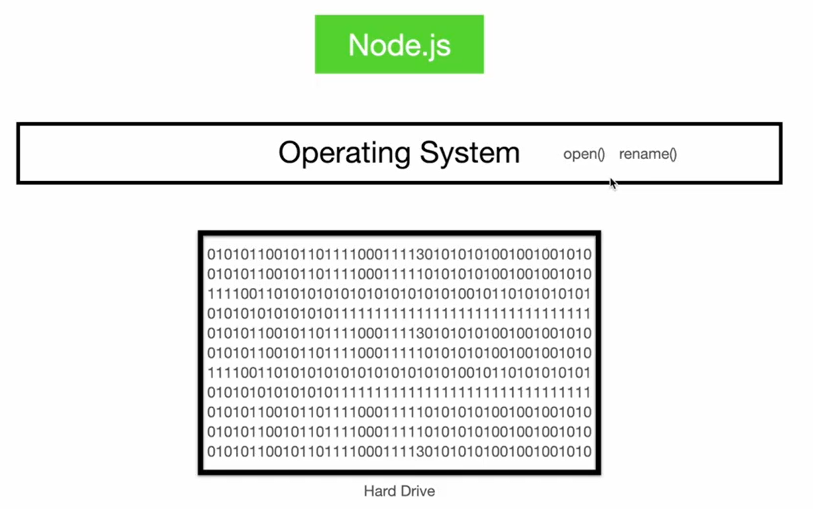

# 读取文件

读取一个文件获得的是二进制数据

[exercise_01.ts](./code/exercise_01.ts)

```ts
import fs from "node:fs";
import type { Buffer } from "node:buffer";

const content: Buffer = fs.readFileSync("./messages.txt");
console.log(content); // <Buffer 43 61 6e 20 79 6f 75 20 68 65 61 72 20 6d 65 2e>
console.log(content.toString("utf-8")); // Can you hear me.
```



# node操作文件的三种方式

1. **Callback API**：最原始的非阻塞 I/O 方式，实现简单，但容易造成“回调地狱”。
2. **Synchronous API**：阻塞式 I/O，代码线性，适合简单脚本，但会阻塞事件循环。
3. **Promises API**：基于 `async/await` 的现代异步方式，代码风格优雅，错误处理统一，是当前推荐的实践。

[exercise_02.ts](./code/exercise_02.ts)

```ts
// ********************Promises API********************************
import * as fs_promises from "node:fs/promises";

(async () => {
  try {
    await fs_promises.copyFile(
      "./resources/poem.txt",
      "./resources/poem_promises.txt",
    );
  } catch (err) {
    console.error(err);
  }
})();

// ********************Callback API********************************
import * as fs from "node:fs";

fs.copyFile("./resources/poem.txt", "./resources/poem_callback.txt", (err) => {
  if (err) {
    console.log(err);
  }
});
// ********************Synchronous API********************************
fs.copyFileSync("./resources/poem.txt", "./resources/poem_sync.txt");
```

# 监听文件变化

[exercise_03.ts](./code/exercise_03.ts)

通过编辑[command.txt](./code/command.txt)程序会一直监听这个文件的变化

```ts
import fs from "node:fs/promises";

async function monitorFileChanges(path: string) {
  const watcher = fs.watch(path);
  // 会在这个循环中监听事件
  for await (const event of watcher) {
    if (event.eventType === "change") {
      console.log(event);
    }
  }

  console.log("File watcher closed.");

  //   保持程序一直运行
  //   await new Promise(() => {});
}

monitorFileChanges("./command.txt");
```
