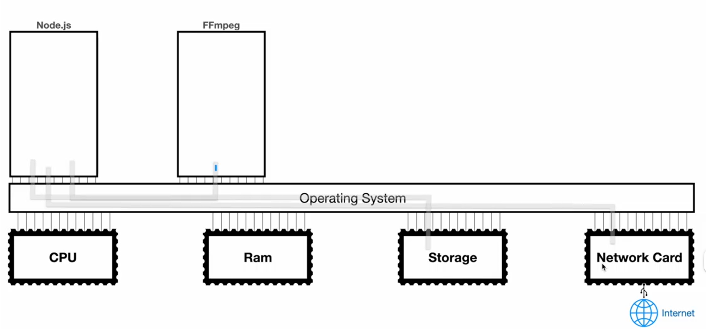
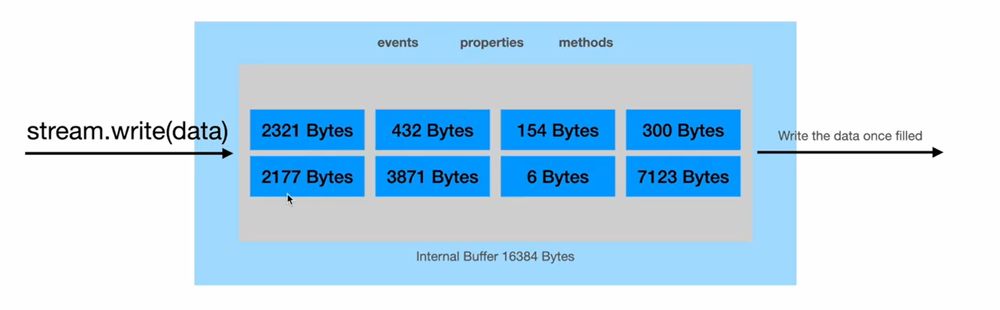
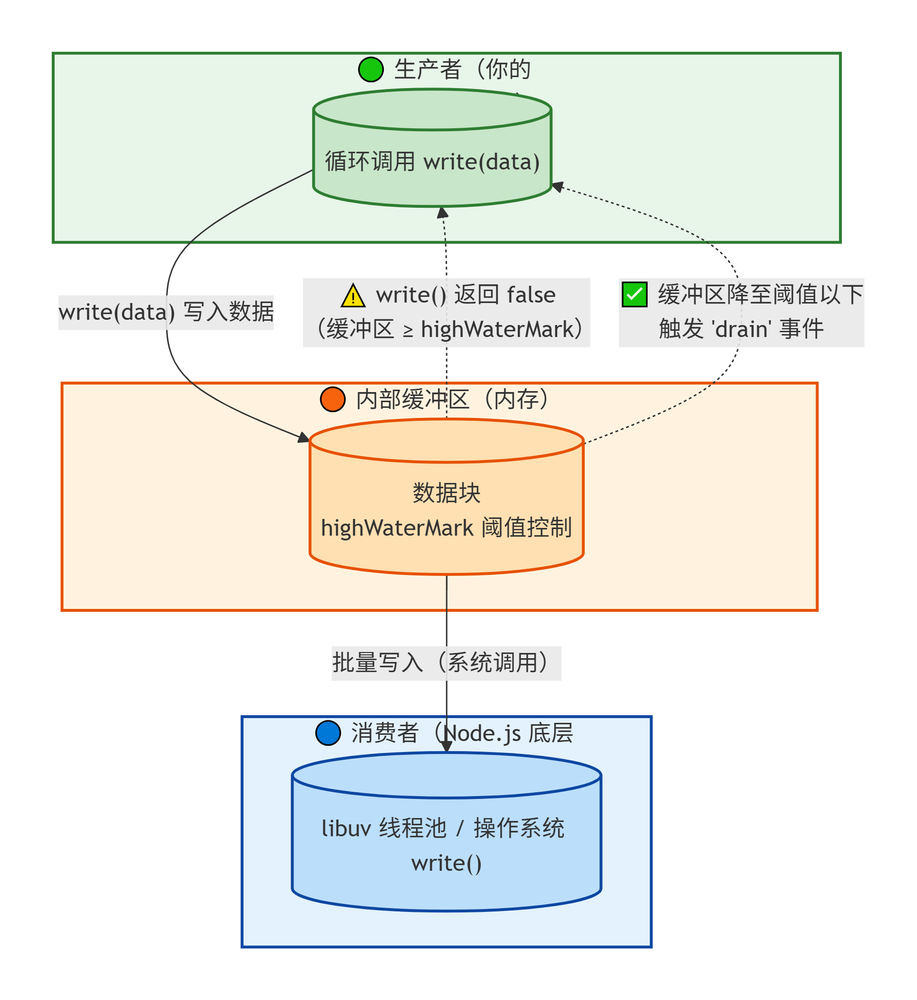
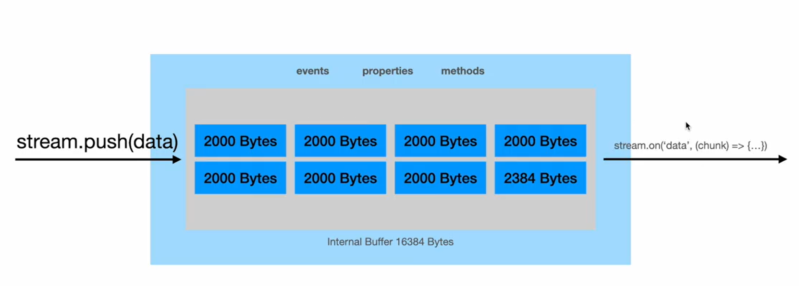

# Stream

**Stream**: an abstract interface for working with **streaming data** in Node.js



**流水的背后，本质上就是分块处理**

1. 分块处理（Chunking）：是 Stream 的工作方式（How）。它把数据切成一块块（Chunk），逐块处理。这是技术实现。
2. 流水模式（Streaming）：是分块处理带来的宏观效果（What）。因为分块足够小、处理足够快，从宏观上看，数据就像“连绵不断的水流”。这是你感受到的体验。

# WritableStream

Stream 性能高的根本原因，本质上是通过减少系统调用和内存占用，并利用流水线模式，实现了对系统资源的最大化利用。

（补充：这里的减少内存占用是指，Stream 真正的对比对象是：全部加载到内存再处理，比如为了复制一个10GB的文件，全部加载到内存，直接干报废。）



## Stream 提供的背压(backpressure)控制

**Backpressure（背压）**：可写流的一种自动调节机制——当生产者写入速度超过消费者处理速度时，通过 write() 返回 false 暂停生产者，待缓冲区排空后触发 drain 事件恢复写入，确保内存占用可控。

`false + drain` 机制就是 `Stream` 提供的背压控制，目的是防止内存被撑爆。因为当你写入的数据量到达`highWaterMark`的时候，仍然可以继续写，此时内存会扩张，最后导致内存会撑爆。

`highWaterMark` 是 Node.js 给你的一根“水位警戒线”。它告诉你：“嘿，水位到这里了，建议你暂停一下。” 但如果你不听，水（数据）还是会继续往池子里倒（缓冲区会继续扩张），直到池子彻底溢出（内存耗尽）。



`write()` 的返回值表示的是 “写入缓冲区之后，缓冲区是否还有剩余空间”

| 返回值  | 含义                                                                                  |
| :------ | :------------------------------------------------------------------------------------ |
| `true`  | 数据已写入缓冲区，且**缓冲区尚未达到水位线**，你可以继续放心地写入。                  |
| `false` | 数据已写入缓冲区，但**缓冲区已达到或超过水位线**，你应该暂停写入，等待 `drain` 事件。 |

```ts
/*******************************************
writableHighWaterMark;              // 水位线
writableLength;     // 当前缓存区已经写入了多少
********************************************/

import fs from "node:fs/promises";
import { Buffer } from "node:buffer";

const fd = await fs.open("./dist/test.txt", "w");
const writableStream = fd.createWriteStream();

// 查看水位线
console.log(writableStream.writableHighWaterMark); // 65535

// 往stream的buffer写入6个字节
const buffer = Buffer.from("123456");
writableStream.write(buffer);
console.log(writableStream.writableLength); // 6
```

无论从时间（批量写）还是从空间占用内存角度，以下代码都是相比于[性能对比](./性能对比.md)的几个案例，最优的解

[exercise_06.ts](./code/exercise_06.ts)

```ts
/******************************************************
 *  Node.js Stream 的背压机制在底层是按
 * “缓冲区满 → 写入磁盘 → 清空 → 触发 drain” 这个循环工作
 ******************************************************/

import fs from "node:fs/promises";

console.time("writeMany");
const fd = await fs.open("./dist/test.txt", "w");
const writableStream = fd.createWriteStream();

// 查看水位线
const highWaterMark = writableStream.writableHighWaterMark;
console.log(highWaterMark); // 65535

const TARGET = 1_000_000;

let _idx = 0,
  count = 0;
const writeMany = () => {
  while (_idx < TARGET) {
    const val = writableStream.write(`${_idx} `);
    _idx++;
    if (!val) {
      // 此时到达水位线，消费不过来了，先停止生产
      break;
    }
  }

  if (_idx === TARGET) {
    console.log("准备关闭stream");
    writableStream.end();
  }
};

writableStream.on("drain", () => {
  // 缓存区已经清空，继续恢复生产者
  writeMany();
  count++;
});

writableStream.on("finish", async () => {
  console.log("已经全部写入", `其中缓存区一共清理${count}次`);
  console.timeEnd("writeMany");

  const size = (await fd.stat()).size;
  console.log("生成文件大小", size, "bytes");
  // 计算应该与count一样
  console.log(Math.floor(size / highWaterMark) === count);
});

writeMany();
```

# ReadableStream



## 读取数据

```ts
import fs from "node:fs/promises";

const fdReader = await fs.open("./dist/test.txt", "r");

const readableStream = fdReader.createReadStream();

let count = 0;
readableStream.on("data", (chunk) => {
  // 'data' 事件的触发，与你是否处理完当前数据块无关。
  // 它会按照底层数据到达的频率持续触发，如果你处理得太慢，
  // 数据块会在内存中堆积，直到你的程序被撑爆。
  count++;
  console.log(`---------第${count}次 读取了 ${chunk.length} bytes----------`);
});

/**output
---------第1次 读取了 65536 bytes----------
...
---------第106次 读取了 7610 bytes----------
 */
```

'data' 事件的触发，与你是否处理完当前数据块无关。它会按照底层数据到达的频率持续触发，如果你处理得太慢，数据块会在内存中堆积，直到你的程序被撑爆。

当你监听 'data' 事件时，你在对 Node.js 说：“只要有数据，就立刻塞给我，不管我有没有消化完。”

1. 底层（libuv）从磁盘读取到一块数据（Chunk）后，就会**立即**触发 'data' 事件。
2. 事件循环将这个事件交给你的回调函数执行。
3. 在你执行回调函数的这段时间里，**底层不会停下来等你**。它会继续读取下一块数据，并准备下一次 'data' 事件。

**如果你的回调函数处理得慢，而磁盘读取得快，就会发生“数据堆积”**。

模拟撑爆内存的情形：

```sh
磁盘读取速度：      每 1ms 读出一块数据
你的回调处理速度：  每 10ms 处理完一块数据

时间线：
0ms  → 读出 Chunk1 → 触发 'data' → 开始处理 Chunk1（耗时 10ms）
1ms  → 读出 Chunk2 → 触发 'data' → 此时 Chunk1 还没处理完！Chunk2 被放入内存队列，等待处理。
2ms  → 读出 Chunk3 → 触发 'data' → Chunk2 还在排队，Chunk3 也进入队列。
...
10ms → Chunk1 处理完毕 → 开始处理 Chunk2
11ms → 读出 ChunkN → 继续排队...
```

### 高性能处理大文件

读取一个大文件，并且写入一个文件（也是一个大文件），但是内存占用率非常低，Stream的优势就体现出来了

[exercise_07.ts](./code/exercise_07.ts)

```ts
import fs from "node:fs/promises";

const fdReader = await fs.open("./dist/test.txt", "r");
const fdWriter = await fs.open("./dist/dest.txt", "w");

const readableStream = fdReader.createReadStream();
const writableStream = fdWriter.createWriteStream();

readableStream.on("data", (chunk) => {
  const val = writableStream.write(chunk);
  if (!val) {
    // 读取太快，处理不过来，先停止读取
    readableStream.pause();
  }
});

writableStream.on("drain", () => {
  // 写缓冲区已经清理，可以继续写了
  // 恢复生产，继续读获取数据
  readableStream.resume();
});

readableStream.on("end", () => {
  // 在 readableStream.on("end", ...) 回调执行之前，
  // 所有 data 事件的回调都已经执行完毕。
  // 这是由 Node.js 事件循环的队列顺序保证的。
  // 所以可以放心关闭
  writableStream.end();
});

writableStream.on("finish", async () => {
  console.log("✅ 所有数据已写入磁盘");
  // 此时可以关闭文件描述符
  await fdReader.close();
  await fdWriter.close();
});
```

# 扩展

1. Java 是“装饰器模式”：通过层层包装类来组合功能。它的优点是很直观，你可以看到每一步的“包裹”，但代价是代码很长，类名也很长。

2. Node.js 是“工厂模式 + 管道模式”：它不让你层层包裹对象，而是通过 .pipe() 方法将不同的流实例连接起来。它的目标是让代码更简洁、更符合“流水线”的直觉。

从功能上讲，readable.pipe(writable) 其实就是 Java 中 new BufferedReader(new FileReader(...)) 的 Node 版写法。
